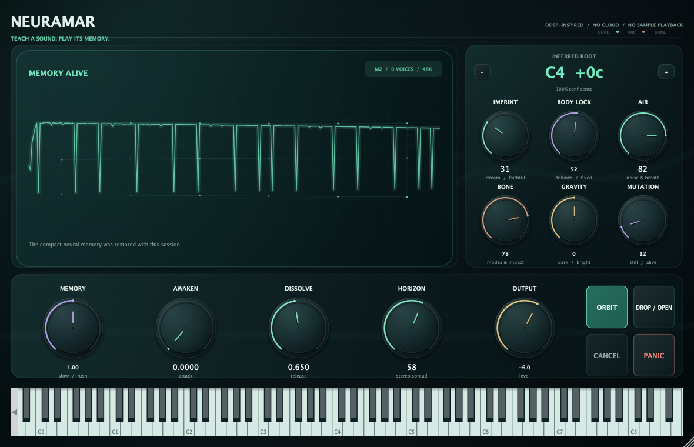
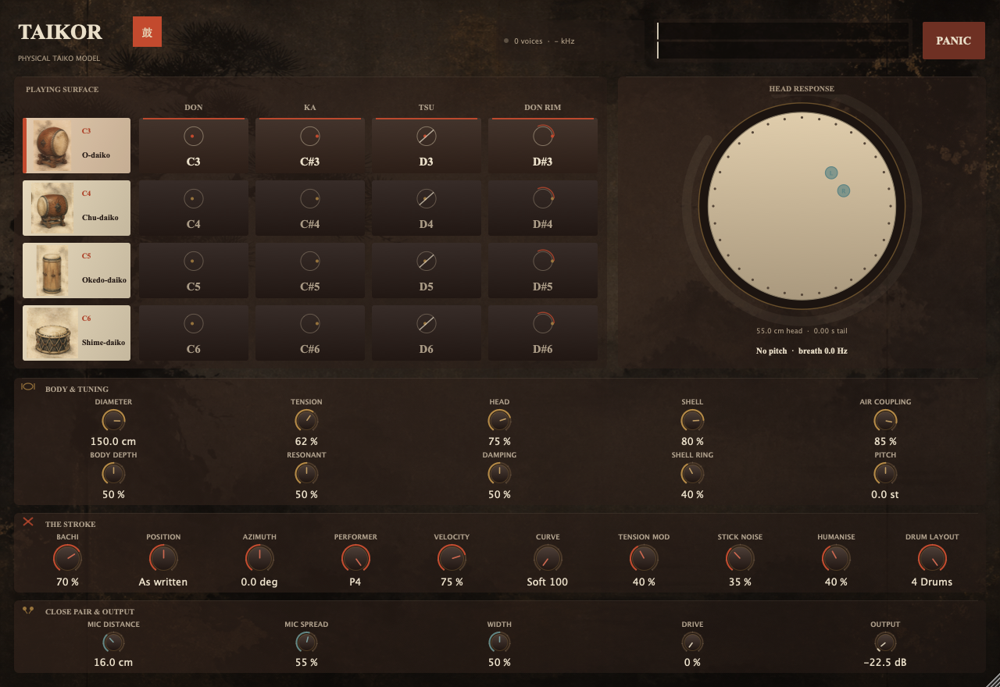

# VST Instruments

[](https://github.com/voho/vst-instruments/actions/workflows/ci.yml)
[](https://github.com/voho/vst-instruments/actions/workflows/nightly.yml)

A collection of original macOS virtual instruments (VST3, Audio Unit, and Standalone) built with C++20 and JUCE 8.

---

## [Vocalor](vocalor/)

[](vocalor/README.md)

Source-filter vocal and choir synthesizer with an LF-style glottal source, a continuous morphable vowel space, formant shifting independent of pitch, and legato phrasing across solo, ensemble, and chord modes. Vowel transitions run on articulator timescales, F1 tracks the fundamental once pitch climbs past it, the singer's formant is a resonance cluster, and a nasal branch allows humming. Formants sound from the first sample, velocity sets attack speed (9.3 ms to 86.4 ms), vibrato operates at 5.7–6.8 Hz with 3 dB AM, and spatial ensemble positioning places singers at 1.5 to 6 m with individual propagation delays and early reflections.

- **Downloads**: [macOS & Windows Nightly Releases](https://github.com/voho/vst-instruments/releases/tag/nightly)
- **Documentation**: [Vocalor README](vocalor/README.md) · [Rendered Demos](vocalor/Docs/audio/README.md)

---

## [Drumalor](drumalor/)

[](drumalor/README.md)

Thirteen-voice procedural drum synthesizer with struck-membrane modal models, velocity-dependent timbre, per-voice level/pan/choke mixing, humanised organic variation, a shared drive and compression bus, and GM-oriented MIDI mapping. Membrane banks bend with head tension estimates, repeated strikes absorb energy from ringing heads, snare responds to strike position with rimshots and cross-sticks, hi-hat follows a continuous CC 4 pedal, and Kit Bleed couples the kit through sympathetic snare and tom beds. Cymbals feature Hertzian contact dynamics, membrane tails warble via split degenerate mode pairs, and pitch glides scale naturally with blow strength.

- **Downloads**: [macOS & Windows Nightly Releases](https://github.com/voho/vst-instruments/releases/tag/nightly)
- **Documentation**: [Drumalor README](drumalor/README.md) · [Rendered Demos](drumalor/Docs/audio/README.md)

---

## [Neuramar](neuramar/)

[](neuramar/README.md)

Drop in a monophonic sound, infer its root, and fit a compact local DDSP-inspired neural synthesis model — with fitted stiff-string inharmonicity, formant shifting, and velocity-driven timbre — whose harmonic Core, noisy Air, and resonant Bone remain playable across pitches. Harmonic analysis is solved jointly over a 40 ms aperture; the body carries 16 Air bands and 12 Bone modes across 16 voices. Features Core-targeted register normalisation, fixed note-on voice placement, forward golden-ratio Orbit looping with level normalization, frequency-dependent Dissolve damping, key-tracked model clocking, and velocity-varied strike dynamics.

- **Downloads**: [macOS & Windows Nightly Releases](https://github.com/voho/vst-instruments/releases/tag/nightly)
- **Documentation**: [Neuramar README](neuramar/README.md) · [Rendered Demos](neuramar/Docs/audio/README.md) · [Resynthesis Benchmark](neuramar/Docs/resynthesis-quality-benchmark.md)

---

## [Electry](electry/)

[](electry/README.md)

Oversampled physically modeled Drop-E eight-string guitar: eight dual-polarisation waveguides, fitted stiff-string dispersion, sympathetic strings, continuous palm mute, induced-EMF pickups, modal body loss, Mono/divided-pickup Stereo, two independent keyswitch banks (three pick strokes against seven play styles allocated by a fretting hand with position and reach), pitch wheel vibrato bar, resonance wheel feedback, and a 4x-oversampled amplifier with supply sag, output transformer, and modeled cabinet. Velocity controls pick deflection across an 18.2 dB range; pick contact position/force varies per stroke; dual-coil humbucker spacing places notches at 3046–5508 Hz; vibrato redraws per cycle across stopped strings; strummed chords propagate with string-to-string delays (14.7 to 10.1 ms); and fingered strings exchange energy through a shared bridge.

- **Downloads**: [macOS & Windows Nightly Releases](https://github.com/voho/vst-instruments/releases/tag/nightly)
- **Documentation**: [Electry README](electry/README.md) · [Rendered Demos](electry/Docs/audio/README.md)

---

## [Taikor](taikor/)

[](taikor/README.md)

Physically modeled taiko drum suite: struck circular membranes solved from Bessel-zero modes with air loading, two heads coupled through an enclosed body, a thin-cylinder wooden shell, and Hertzian stick contact scaling duration with impact speed. Features 16 pads covering four distinct instruments (ō-daiko, chū-daiko, okedo, shime) with authentic head tension, diameter, body depth, hide, and shell characteristics across 4 octaves (from C3). Don, Ka, Tsu, and Don Rim strokes per drum, near-field decay stereo positioning, stiff membrane tension glide, head stroke damping, preload-threshold byō tack line, and authentic ghost strokes.

- **Downloads**: [macOS & Windows Nightly Releases](https://github.com/voho/vst-instruments/releases/tag/nightly)
- **Documentation**: [Taikor README](taikor/README.md) · [Rendered Demos](taikor/Docs/audio/README.md)

---

## [YouKnow106](youknow106/)

[](youknow106/README.md)

Circuit-modelled six-voice DCO polysynth: integer-divided note timers with true pitch quantisation, scanned control converter with per-hold slew and 7-bit patch digitisation, firmware envelopes with exponential decay into a measured quasi-linear amplifier, four-pole transconductor filter with implicitly solved resonance loop, input-side resonance compensation, non-stealing key assigner, and an uncompanded two-line bucket-brigade chorus with authentic saturation and MN3009 noise. Features balanced dual-nonlinearity resonance, filter-output DC block, LFO delay width pulse holding, rate-independent 34.48 °C warm-up model, and optional velocity-to-filter envelope routing.

- **Downloads**: [macOS & Windows Nightly Releases](https://github.com/voho/vst-instruments/releases/tag/nightly)
- **Documentation**: [YouKnow106 README](youknow106/README.md) · [Rendered Demos](youknow106/Docs/audio/README.md) · [Circuit Research](youknow106/Docs/circuit-modelling-research.md)

---

## macOS Gatekeeper Note

Nightly builds are ad-hoc signed. If macOS Gatekeeper prevents opening a downloaded build, clear the quarantine attribute:

```bash
xattr -dr com.apple.quarantine \
  ~/Library/Audio/Plug-Ins/VST3/*.vst3 \
  ~/Library/Audio/Plug-Ins/Components/*.component \
  /Applications/*.app
```
