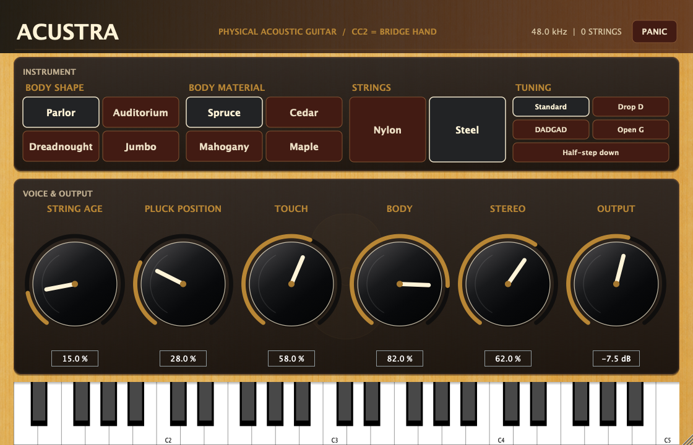

# Acustra

[](Docs/screenshots/acustra-standalone.png)

Acustra is an acoustic-guitar instrument for VST3, Audio Unit and Standalone
hosts. It synthesises every note in real time from six physical string models,
a passive measured bridge and a measurement-derived guitar body. The plug-in
contains no sample player and no recorded note audio.

Start with Guitar, Picking and Capture: four construction presets, finger,
pick or thumb, and stereo or individual body microphones, saddle piezo or a
steel-string magnetic pickup. Shape and Material directions, steel or nylon
strings, String Age, Tuning, Pluck Position, Touch, Body Amount, Stereo Width
and Output remain directly accessible. Bridge-hand damping and legato are playing gestures
rather than settings, so they arrive on CC2 and CC68 and cost the panel
nothing, and the fretting hand's own sounds - the hammer-on's strike and the
lift that lets a released string ring open - come from note-on and note-off
velocity. "Top of market"
remains the goal, not a validated claim; controlled listening against real
guitars and leading instruments is still required.

Shape, Material, Strings and Tuning use directly visible button groups;
the continuous sound controls remain knobs. The Picking tooltip names CC2 as
the bridge hand, CC68 as legato and note-off velocity as finger lift. Existing
saved sessions retain their original parameter IDs and default sound.

## Audio demos

These PCM16 stereo WAVs are rendered deterministically by
[`Tools/RenderDemos.cpp`](Tools/RenderDemos.cpp) through the same JUCE-free
`AcustraEngine` used by the plug-in. Each file receives one whole-file peak
normalisation after rendering. There is no external post-EQ, compression,
reverb, room effect or recorded-note layer.

- [Steel sustain range](Docs/audio/01-steel-sustain-range.wav) — isolated held
  notes from open E2 through B5.
- [Nylon fingerstyle](Docs/audio/02-nylon-fingerstyle.wav) — two overlapping
  fingertip arpeggios.
- [Shape and material anchors](Docs/audio/03-shape-material-anchors.wav) — the
  same chord at the Parlor/Jumbo and Cedar/Maple endpoints.
- [String age](Docs/audio/04-string-age.wav) — the same steel phrase with fresh
  and fully aged settings.
- [Alternate tunings](Docs/audio/05-alternate-tunings.wav) — Drop D, DADGAD and
  Open G partial chords.
- [Playing behaviours](Docs/audio/06-playing-behaviours.wav) — a chord change
  over a still-ringing chord, CC2 bridge-hand damping, then two natural
  harmonics above the fretted range.
- [Fretting hand](Docs/audio/07-fretting-hand.wav) — under CC68, hammer-ons at
  two velocities and a pull-off; then one fretted note released three ways by
  its note-off velocity: the finger staying on the string, a brisk lift that
  leaves the open string ringing, and a full pull-off to open.
- [Strummed chords](Docs/audio/08-strummed-chords.wav) — chords sent on one
  sample swept as alternating strums, then one chord eight times hand-damped,
  no two strokes the same take.
- [Recuerdos de la Alhambra](Docs/audio/09-recuerdos-de-la-alhambra.wav) —
  Tárrega's tremolo study, bars 1–12 on nylon: the thumb keeps an arpeggio
  while three fingers repeat one melody note on one string, ten strokes a
  second, each landing on a string the last stroke left ringing.
- [Lágrima](Docs/audio/10-lagrima.wav) — Tárrega, bars 1–8 on the same
  guitar played slowly, where the sustain and the beating between coupled
  strings carry the piece rather than the attack.
- [Picking techniques](Docs/audio/11-picking-techniques.wav) — identical notes
  and velocity with Finger, Pick and Thumb, first steel, then nylon.
- [Capture types](Docs/audio/12-capture-types.wav) — the same steel performance
  through stereo, treble and bass microphones, saddle piezo, then magnetic
  pickup. Native relative levels are retained; pickup sensitivities are
  normalized model units, not measurements of hardware gain.

<!-- peaks-table-begin: regenerated by AcustraRenderDemos; edits between the markers are overwritten -->
| File | What it is | Length | Rendered peak | Normalisation |
| --- | --- | ---: | ---: | ---: |
| `01-steel-sustain-range.wav` | Steel sustain from open E2 to B5, one held pluck at a time | 9.5 s | −14.6 dBFS | +11.6 dB |
| `02-nylon-fingerstyle.wav` | A fingertip nylon arpeggio with overlapping held notes | 4.2 s | −20.0 dBFS | +17.0 dB |
| `03-shape-material-anchors.wav` | One chord: Parlor/Jumbo, then Cedar/Maple anchor settings | 13.7 s | −8.4 dBFS | +5.4 dB |
| `04-string-age.wav` | The same steel phrase with fresh strings, then fully aged strings | 6.5 s | −7.4 dBFS | +4.4 dB |
| `05-alternate-tunings.wav` | Drop D, DADGAD and Open G chords | 12.3 s | −10.6 dBFS | +7.6 dB |
| `06-playing-behaviours.wav` | A chord change over a ringing chord, CC2 bridge-hand damping, then two natural harmonics above the fretted range | 10.7 s | −11.0 dBFS | +8.0 dB |
| `07-fretting-hand.wav` | Hammer-ons at two velocities and a pull-off under CC68, then one fretted note released three ways by its note-off velocity | 8.8 s | −13.2 dBFS | +10.2 dB |
| `08-strummed-chords.wav` | Same-sample chords swept as alternating strums, then one chord eight times hand-damped, no two strokes the same take | 6.9 s | −3.7 dBFS | +0.7 dB |
| `09-recuerdos-de-la-alhambra.wav` | Tarrega, Recuerdos de la Alhambra, bars 1-12: a nylon tremolo over a thumb arpeggio | 31.6 s | −14.0 dBFS | +11.0 dB |
| `10-lagrima.wav` | Tarrega, Lagrima, bars 1-8: a sung nylon melody over held bass | 26.0 s | −19.6 dBFS | +16.6 dB |
| `11-picking-techniques.wav` | Finger, pick and thumb on steel, then on nylon; same notes and velocity | 10.6 s | −16.6 dBFS | +13.6 dB |
| `12-capture-types.wav` | Stereo, treble and bass microphones, saddle piezo, then steel magnetic | 12.2 s | −18.6 dBFS | +15.6 dB |
<!-- peaks-table-end -->

## Real dry-note benchmark

The physical fit is compared with 115 real, dry guitar-note recordings. The
frozen report separates 83 training examples, 24 development-validation
examples, and 8 independent flat-top examples; it measures attack, harmonics,
tuning, early pitch trajectory, decay rate, body spectrum, and dynamics. Lower
is better, but the absolute score depends on analysis settings, so only paired
comparisons over identical notes support a decision. Against the reproducible
neutral calibration — re-rendered on the current engine, so the pairing is
same-note and same-engine — the shipping calibration changes the three scores
by -26.4%, -20.1%, and -13.3%, respectively. These are engineering descriptors,
not a listening preference or a claim of perceptual equivalence.

The renderer also emits matched `*-sample-v1.json` manifests for the frozen
first-version sample player. Its scores are 1.2080, 1.4437 and 0.1286 on those
splits, but they are a pipeline control rather than a product win: that player
is replaying the same captured zones used as targets. The result measures its
attack envelope, interpolation and stereo playback path; it says nothing about
uncaptured notes, transitions or performances. Keeping this control beside the
physical result prevents the misleading claim that a source-recording replay
is an independent realism benchmark.

Run `python3 Tools/SummarizePhysicalBenchmark.py` to print the compact split
table, historical sample-player control and five retained realism paths from
the committed
[`physical-fit-report.json`](Docs/physical-fit-report.json). The full renderer
and scoring protocol remain in [`PhysicalFitRenderer.cpp`](Tools/PhysicalFitRenderer.cpp)
and [`FitPhysicalModel.py`](Tools/FitPhysicalModel.py).

For a new engine build, `FitPhysicalModel.py candidate.json --compare baseline.json`
checks target audio SHA-256 hashes, note identities, dynamics groups and analysis
settings before reporting paired changes by descriptor and string material.
Render manifests record the actual calibration vector and controls; model-only
re-renders update that vector. Microphone targets do not establish pickup
realism, and this corpus does not identify pick and thumb technique separately.

A separate [GuitarSet](https://zenodo.org/records/3371780) performance audit
compares 72 seconds of real microphone audio with string-aware renders of
315 annotated notes: six players, three comping and three solo takes of the
same phrase. Velocity is fixed at MIDI 91 because the annotations contain no
measured note dynamics. The first baseline averages 14.88 dB of multiscale log
spectral error, 0.903 spectral convergence and 0.312 chroma cosine distance.
These expose substantial remaining mismatch. The recording uses a different
body, microphone and room, and GuitarSet timing statistics previously informed
the engine, so this is not an untouched holdout or a perceptual ranking.
Signed octave-band diagnostics locate that mismatch: after whole-clip RMS
matching, the baseline averages 16.2 dB less energy at 80–160 Hz and 9.5 dB
less at 2560–5120 Hz, with excess energy in the intervening low-mid bands.
These are spectral differences on these recordings, not additional score terms.

[`BenchmarkPerformances.py`](Tools/BenchmarkPerformances.py) fixes the six
excerpts before scoring, verifies the published archive checksums, preserves
annotated timing and quiet frames, and exports paired WAVs matched by whole-clip
RMS. Its report retains input, executable and scorer hashes, individual metrics
and listening trims. The committed report's `performance_benchmark_2026_09_05`
entry retains this baseline without distributing the source recordings.
The adjacent `performance_spectral_diagnostic_2026_09_05` entry uses exactly
the same audio bytes and leaves all three baseline distances unchanged.

The optional measured Fylde bridge gives the following paired results with
identical recordings, calibration and macOS arm64 build. Lower descriptor
distances mean closer to these recordings; they are not perceptual ratings.
All nylon renders remain byte-identical.

| Comparison | Original bridge | Fylde bridge |
| --- | ---: | ---: |
| Dry training loss, 83 notes | 6.113884 | 5.958960 |
| Dry development loss, 24 notes | 6.074618 | 5.741121 |
| Dry flat-top loss, 8 notes | 8.076845 | 7.434877 |
| Performance log spectral error, dB | 14.875729 | 14.903526 |
| Performance spectral convergence | 0.903121 | 0.848586 |
| Performance chroma distance | 0.311951 | 0.244766 |

The performance log error rises slightly while the other descriptors improve.
The report's `measured_steel_bridge_2026_09_05` entry retains the individual
results, provenance and exact input/model hashes.

The same six performances also have simultaneous magnetic recordings: a mono
mix of six Ubertar single-coil pickups on nickel-wound steel strings. Against
that reference, the Original bridge's magnetic output scores 17.591981 dB log
error, 0.788438 spectral convergence and 0.268841 chroma distance. The Fylde
bridge changes these to 17.433659, 0.805354 and 0.263927, respectively. After
RMS matching, Original averages 3.95 dB less energy at 80–160 Hz and 12.44 dB
more at 5120–10000 Hz. This identifies a substantial remaining pickup mismatch.
Cross-capture controls disagree too: the microphone model has lower log error
against the pickup recording, while the magnetic model has lower spectral
convergence. These descriptors therefore cannot rank pickup realism by
themselves. The committed `magnetic_performance_benchmark_2026_09_05` entry
retains both bridges, the four microphone/pickup pairings and source hashes;
no parameters were fitted to these results. Coil position, field response,
loaded electronics and per-string gains are undocumented in GuitarSet.

An independent exploratory audit adds 344 recordings from Mohammed Alkooheji's
[Acoustic Guitar Notes v3](https://www.kaggle.com/datasets/mohammedalkooheji/guitar-notes-dataset):
a Walden G551E on steel and Yamaha CM-40 on nylon. Before inspecting audio,
the tool selects two recordings at every pitch from D2 to G♯5 for each material
and the pick/finger labels. The author warns that technique labels vary and
combines finger with thumb; capture, velocity and fingering are undocumented.
No parameters are fitted to this corpus. On steel, Original → Fylde changes
attack-band MAE from 9.63 → 8.87 dB, harmonic-level MAE from 9.16 → 8.78 dB and
tuning MAE from 7.88 → 7.69 cents, while pitch-trajectory MAE worsens from
1.41 → 1.56 cents. These comparisons use identical available elements.
Missing model decay measurements fall from 22 to 2 of 2662 target elements;
the resulting decay MAEs have different coverage and cannot establish a paired
improvement or regression. All 86 nylon renders remain identical. The report's
`independent_technique_note_audit_2026_09_05` entry retains every recording's
descriptors, availability counts and source/model hashes; these are descriptive
results on another guitar, not controlled technique validation or a realism rank.

A private listening reference compares both Acustra bridges with the installed
NI Strummed Acoustic 1.1.0 library in Kontakt 7.10.6: four bars of C major at
120 BPM, eighth-note strums, stereo capture, and EQ, compression, reverb and
doubling disabled. Ten-second auditions share the same crop and match whole-file
stereo RMS to −24 dBFS. NI chooses recorded voicings, accents and microtiming;
Acustra receives explicit open-C note events. This matches harmony and nominal
rhythm, not identical performances, and establishes no product ranking.
The report's `commercial_listening_reference_2026_09_05` entry preserves the
protocol, state/input/audio hashes and repeatability evidence. Commercial audio
and opaque plugin states remain private; reproduction needs the installed library.

## How it works

### Six-string performance model

MIDI first selects one of six guitar strings. Each string covers its open note
plus twenty frets. The allocator replucks a note on the string still sounding
it once its key is up, as a guitarist does, then prefers a free string
requiring the lowest valid fret, preserves duplicate-note ownership, and steals
deterministically only when all playable strings are occupied. Before the
first of those rules a repeated E4 hopped across five strings, one per repeat,
and left every one of them ringing. Standard, Drop D, DADGAD, Open G and
half-step-down tunings change those six physical constraints rather than
transposing the final mix.

Alternate steel tunings retain each string's standard linear mass and derive
the new tension from its tuned open frequency. Drop D therefore loosens the
same low-E string instead of silently substituting a heavier string at standard
tension.

Above the twentieth fret the instrument still reaches, through the natural
harmonics of its open strings. A note there is played as a light touch at a
node if some string has an integer multiple of its open pitch within 25 cents,
and stays silent otherwise, so the requested pitch alone decides and no
keyswitch is offered: the seventh harmonic is 31 cents flat and is excluded by
the same tolerance that admits the second through sixth and the eighth. The
touch is the exact node-mode projection — the released shape averaged over its
n cyclic shifts, which passes every multiple of n at unit gain and cancels
everything else — so the surviving modes keep precisely the amplitude the pluck
gave them, and a harmonic comes out quieter than the stopped note rather than
louder.

CC68, MIDI's Legato Footswitch, is the fretting hand. While it is down, a note
a sounding string can already reach is hammered on rather than replucked: the
string keeps what it holds and only its length changes, on the same slew a
slide uses, and the finger's strike is added to it. A finger driven down onto
a string drags a V-shaped dent whose flanks have slope v/c, so when the string
meets the fret crown, the action height below the old line, the dent is a
triangle of half-width c·h/v moving down at the finger's speed; relative to
the new segment's own rest line that is a released triangle with its apex at
that half-width plus a uniform velocity across it. Note-on velocity sets the
finger's speed through the pluck's own velocity law: a hammer-on at a velocity
carries the string energy a pluck at that velocity would. Equal energy is not
equal loudness, because the dent narrows as the finger speeds up and the
loop's upper-partial loss discards that brightness within the second: over
one second a hammered note sits within +7 and −15 dB of the pluck and spans
only 1 to 3 dB of its own from velocity 0.3 to 1.0 on ordinary intervals,
getting brighter rather than louder, as a real one does; the quiet extreme is
a semitone onto the first fret, where the string has almost no clearance to
fall through. (The equality asks for finger speeds up to 62 m/s on steel and
43 m/s on nylon at the top of the range, far faster than a hand moves. The
published stopping finger — Bilbao and Torin, DAFx-14 — has been checked
against the whole fretboard and is rigid everywhere the engine reaches, so it
cannot supply this bound; the open question is a measured fingertip speed
against playing dynamic, in Known gaps.) Releasing that note pulls
off to whatever else the hand is still holding
on the string, up to eight notes deep, plucked by the leaving finger as fast as
note-off velocity says it left. A hammer-on only goes up, because the way down
on a guitar is a pull-off, which is a note-off here for the same reason. The switch exists because the model alone cannot tell a
hammer-on from a strum — one note arriving over a held string is one, six
arriving together are the other, and note-on carries no lookahead — so the
choice belongs to the player. Up, which is the default, is an exact no-op: the
committed demos render byte for byte identically with the switch pressed and
released first.

CC2 is continuous bridge-hand pressure: the heel of the picking hand resting
by the saddle, a soft lossy absorber whose loss rate adds to the string's own,
darkening the note as it shortens it. It is a playing gesture rather than a
construction setting, so it stays a controller and the panel keeps its ten
controls; a pressure of zero is an exact no-op, proven by 71 bit-identical
corpus renders.

Note-off damps a fretted note over 160 ms and an open note over 1.25 seconds,
and that loss is a gain per round trip: the loop slews the gain it applies
toward the requested one across one round trip, in either direction, because
applying the whole of it to the first sample after the key came up stepped the
wave the junction reads by up to a third on a low fretted note, and the bridge
and body rang on that step as a thump 4.6 to 8.6 dB above the note's own level
at that moment. Nothing about a lifted key now peaks above the held note it
interrupts, at 44.1, 48 or 96 kHz.

Note-off velocity is the fretting finger leaving the string. MIDI's default
when a keyboard does not sense it is 64, so 64 and below is the finger staying
on the string - exactly the release every host sent before - and above it the
finger lifts, to a full pull-off at 127. The string was pressed to the fret by
the action height there, a triangle over the segment it now belongs to; the
whole string follows the rising finger through that triangle and leaves it at
the rest line carrying the finger's velocity, the vibration the stopped segment
held goes on over the new length, and the finger, still touching until it has
risen clear, damps it for h/v with the hand's own 160 ms contact. If the lift
carries at least the pressed triangle's elastic energy the finger is gone
before the string moves and the shape is released whole. The action heights
are the published set-up dimensions - 3/32" bass and 1/16" treble over the
twelfth fret for a steel-string, 4 and 3 mm for a classical, with 0.5 and
0.7 mm over the first fret, on the line a straight neck puts between them - and
the lift's speed comes from the same velocity law as the pluck's, so the only
convention is where the finger stops staying: at MIDI's own unsensed value.
Because a pressed treble string at a low fret stores little elastic energy,
release velocity is a two-region control: on a steel high E at the second
fret the finger follows the string only from release velocity 65 to about 77
and every faster release lets the whole shape go identically, while the
switch sits near 92 on the low E at the third fret and near 90 on a nylon
high E. A gentle sensed release at about 70 leaves the open string ringing
12.5 dB (steel) or 16.5 dB (nylon) under the note's own first second, and
above the switch on steel about 6 dB under it, so a keyboard that senses
release will ghost open strings unless the player holds the key to the end
or damps with CC2. A string lifted to open is nobody's: it rings on in the junction with no key and
no hand on it until it has died away, and the next note on it lands the hand
on it first.

A chord that arrives on one sample, which is what a sequencer sends and no
hand can play, is swept as a strum: the strings are all taken and fretted at
that sample, and each is released when the pick reaches it, the k-th string
k string-spacings later at the pick's speed, low to high on a downstroke and
back on the return, so consecutive strums alternate, and a rest of more than
two seconds restarts with a downstroke. The spacing is the set-up dimension
at the saddle; the pick's speed is a player's map of velocity, 0.5 m/s for
the softest strum to 3 m/s for the hardest, set by ear and written beside
the code. Chords whose notes arrive spread in time are played as sent. And
no two plucks land in the same place: each draws its own point within ±0.02
of the string length, the take-to-take spread the reference recordings'
round robins show, which is what makes a repeated stroke a new take rather
than a copy.

Taking a still-sounding string for any note — what every chord change and
every repeated note does — carries its vibration into a damped tail rather
than deleting it. That tail uses the picking hand's own contact time, about
10 ms — Laurson, Erkut, Valimaki and Kuuskankare, CMJ 25(3) 2001, "Simulation
of Playing Styles": "the gain of the loop filter of the current string is
lowered to zero in a very short time (typically around 10 msec)", independently
bracketed by Erkut, Valimaki, Karjalainen and Laurson, AES 108th Convention,
Paris, Feb 2000, preprint 5114, Sec. 3.2 "Repeated Plucks", whose analysis of
recorded samples puts the same finger-on-string contact regime at 20 to 60 ms
— rather than the fretting finger's 160 ms, which does not apply here: a
string is taken by the picking hand, not the fretting hand. A regression holds
the captured tail's energy 60 ms later under 1% of what it started with, at
three sample rates. It rides in the junction as a second wave on its string.
Measured on a chord change 0.6 seconds after the first chord, the strings
still hold 25% of their initial energy and an earlier build discarded all of
it. A held note
replucked goes through the same hand: projecting its stored shape onto the
modes with a node at the pluck point in one sample, as the build before this
did, clicked into the limiter and let the near-node modes pile up pluck after
pluck, a held G2 replucked six times at 250 ms peaking 15 dB above its first
pluck where it now peaks 3 dB above it with nothing on the first samples.
The sustain pedal defers the hand's damping until pedal-up. A channel's pitch
bend is a slide — the fretting hand moving along the neck, so the sounding
length changes and the tension does not — and it changes the active string
length without replaying the pluck. An MPE member channel's own bend is a
different gesture: one finger pushing a single stopped string across the
fret at the length the fret fixes, so it goes through the string's tension by
Grimes' law (PLoS ONE 9(7):e102088, 2014, Eq. 6), which moves the
inharmonicity (bending stiffness B goes as 1/T) and the bridge-junction
impedance the string presents (Z = sqrt(T·mu)). The port is followed sample
by sample, because the junction sums all six strings' impedances every
sample; measured against Grimes over a 0-200-cent bend on four steel strings,
pitch error is 0.0002 cents and the twelfth partial's stretch moves within
0.15 cents of what the bent tension predicts. The MPE manager's zone-wide
bend stays a slide. Nylon's three wound basses have no measured axial
stiffness and keep the length (slide) convention for a member bend too.

CC1, the modulation wheel, is the fretting hand's vibrato: an axial tension
modulation at fixed length (Grimes Sec. 0.3; Erkut, Valimaki, Karjalainen and
Laurson, AES 108th Convention, Paris, Feb 2000, preprint 5114, Sec. 3.3), so
the same tension route that carries a member bend also carries the vibrato,
moving the sounding pitch, the inharmonicity and the junction port together —
an earlier build moved only the last two and left the fundamental fixed,
which review caught. It is one-sided upward from the note's own pitch,
converges over a 0.5 s onset, and runs from Erkut's measured 4.9 Hz
fast-and-shallow to his 1.4 Hz slow-and-deep as the wheel opens; full-wheel
depth is an authored 20 cents (no source gives guitar vibrato depth in
cents), measured in the rendered pitch at 20.0 to 20.1 cents and never
falling below the note's own pitch by more than 0.06 cents. An open string
gets none, since no finger is stopping it. Like CC2 and CC68 it is one
gesture across the instrument, not per channel.

Conventional MIDI is the default: all sixteen channels are independent and
channel 1 is not implicitly global. A lower MPE zone is created only by RPN 6
on channel 1. Channel 1 then manages the contiguous member channels above it;
its bend and sustain are global to that zone, while bend and sustain remain
scoped to each member channel. RPN 0 sets 0--96-semitone bend sensitivity, with
MPE defaults of 2 semitones for the manager and 48 for members. A released MPE
tail freezes its member bend so reuse of that member channel cannot retune the
old string, while subsequent manager bend remains live. MPE Timbre (CC74) sets
a member channel's own pluck point for the note it carries, after Traube and
Smith's plucking-point estimation (Proc. COST G-6 DAFx-00, Verona, Dec 2000,
153-158), and moves only that voice's own comb nulls; MPE channel pressure
biases that channel's vibrato depth down toward half its unbiased value (never
above the wheel's own ceiling) and is not otherwise wired to a pull-off's
release energy, which an earlier attempt found could manufacture up to 1.6
times the correct radiated energy. An opt-in string-per-channel mode — MIDI
1.0's own Mono Mode On (CC126, value = string count) / Poly Mode On (CC127)
on the basic channel, the standard spelling of a one-string-per-channel
layout such as a hexaphonic pickup or a guitar-to-MIDI converter might send —
puts each of the six channels onto its own string, bypassing the allocator;
no control-surface driver on hand is confirmed to transmit CC126 itself, so
today the mode is reachable through a MIDI editor or a host's own CC tools.
Upper-zone MPE is not implemented.

### Pluck and strings

Each audible string path is a full-round-trip stiff-string waveguide. A note
begins as a triangular string displacement released from rest. A finite spatial
aperture rounds that shape, and a short deterministic noise burst adds the
release detail; the bridge-local direct path's fitted gain is zero, so the
measured body is the only radiator. Pluck Position moves the
displacement point; Touch and MIDI velocity alter its aperture, level and
brightness. A fitted register law broadens the effective low-note contact and
narrows it in the upper register, correcting a repeatable corpus-wide spectral
slope without applying note-dependent body EQ. The fitted exponent continues
past the pitch-independent point, so low-note contact is broader and high-note
contact narrower than in the earlier model.

Transverse motion stretches the string, and the tension that adds can also be
represented as a longitudinal wave with the string's own axial
resonances, at `c_long/2L` with `c_long = sqrt(EA/mu)`. For this steel set that
is 1.5 to 3.9 kHz and for plain nylon 1.18 kHz, both computed from the same
construction data the transverse model uses, with the wound steel basses taking
their axial area from the published core diameter. The first and third
fixed-fixed axial modes per string can be driven by DAFx-26's `EA/(2L)` times the
mean square slope, through the same
displacement scale the attack-pitch surrogate is calibrated with. That path is
kept at zero in the shipping calibration: without a measured radiation level,
its narrow onset sounds like a pitched water drop rather than a string pluck.
Because the drive is a square it carries the products of the transverse
partials, so what
the resonators pass are sum and difference phantom partials rather than an
added tone, and it grows faster than the note that made it: 4.3 dB of extra
1.5--4 kHz energy at a quarter velocity against 11.1 dB near full. It radiates
one-way, outside the junction. Nylon's three wound basses are left out of it:
their published density is an effective composite figure that is right for
transverse mass and wrong for axial stiffness, so nothing here fixes their
longitudinal speed.

Steel and nylon use separate scale, diameter, tension or density, and Young's
modulus data. The loop reads its fractional delay through a second-order
Thiran allpass held inside a fixed fractional band (Laakso, Valimaki,
Karjalainen and Laine, IEEE Signal Processing Magazine 13(1), 1996, 30-60,
Eq. 86), not an interpolated read: an allpass has magnitude exactly one at
every frequency, where the read it replaced lost up to 0.7 dB per round trip
at a half-sample fraction, so a string's upper partials used to decay at a
rate set by the accidental fraction of its loop length (a 47:1 range in loss
per round trip across nine notes); it is now a smooth 1.8:1 rise with the
partial's own frequency, and no note's H8 partial varies by more than 13%
across 44.1, 48 and 96 kHz. Frequency-dependent losses make upper partials
decay faster, and a second-order allpass follows the stiff-string
inharmonicity law, collocated at H1, H7 and H11.5 and re-solved at the tap the
delay currently occupies so a bend or vibrato's slewing fractional part does
not stall the solve. String Age lowers the high-frequency cutoff and
increases loss. A shared fitted cutoff scale of 2.286 reduces excess
upper-partial damping found across both materials; a regression proves that it
does not move the requested fundamental T60 or compensated pitch. A second,
orthogonal polarisation loop is detuned from the first by an end correction
at the string terminations rather than by the body: Woodhouse (Acta Acustica
90 (2004) 945-965, Sec. 4.3) measured the polarisation parallel to the
soundboard as about 0.8 mm longer, in 650 mm, than the perpendicular one — "a
more significant influence... than that coming from the body admittance
matrix" — and calls the exact size tentative ("would require detailed
computation"), so it ships as a single published length, bounded to one
string diameter and frozen rather than fitted (the corpus's own lever on it
is weak, but it prefers the published value on every split). On steel this
second loop also feeds the bridge junction and the attack-pitch surrogate
below through its own slope energy, alongside the first.

Steel attack pitch uses a bounded Kirchhoff--Carrier energy surrogate. The
released waveguide displacement supplies its slope energy; string axial
rigidity converts that energy into extra tension, and the existing loss makes
the resulting sharpened pitch fall monotonically toward the settled pitch. The
single displacement calibration is 0.007736 m and the excursion is bounded to
20 cents. The last mechanism-specific interaction sweep selected it on
training total and improved early-pitch trajectory on both splits; at that fit
stage, the development-validation aggregate was 0.0215 lower when it was
disabled, and that tradeoff is retained explicitly in the fit report. The same
mechanism failed the nylon training gate, so nylon keeps the exact earlier 3-cent,
velocity-squared and Touch-scaled cue with a 75 ms
decay. It is an authored cue, not a nonlinear-string claim. A separate fitted
steel fret-decay slope of -0.0598 lengthens T60 with fret number; nylon retains
its prior +0.018 fret law.

### Bridge, sympathetic strings and body

The original model's played strings drive a two-point positive-real bridge, fitted
through 10 kHz from both of the archive's bridge ends (Method.pdf's hammer
positions between B3/E4 and between E2/A2, each with its own accelerometer).
Each string terminates at its own point along the saddle, at a lever arm
`u = (i - 2.5)/2` for string `i`; each mode keeps one pole pair and a residue
matrix `[[heave, cross], [cross, rock]]`, so a string at `u` sees
`heave + 2u*cross + u^2*rock`, matching the measured treble driving point at
`u = +1` and the measured bass one at `u = -1` by construction. Holding every
residue matrix positive semidefinite keeps each string's own combination
positive real, so the junction stays passive: it can redistribute or
dissipate string energy but cannot create it. Above the frequency where the
archive's two records of the bass-to-treble transfer differ by as much as the
transfer itself — 2245 Hz on steel's guitar, 5657 Hz on nylon's — there is no
reciprocal 2x2 left to fit, so every string above that corner reads the mean
of the two ends and no mode there carries a cross or rocking residue. Steel's
bank keeps 47 modes (30 of them rocking), nylon's 46 (40 rocking). A bank with
no rocking mode at all falls back to the single-point port every string
shared before; the engine suite asserts both original banks carry at least one.

**Fylde bridge / steel**, in the Guitar menu, selects a separate 44-mode passive
bridge fitted to the first instrument in [Carcagno et al.'s steel-guitar
measurements](https://doi.org/10.1121/1.5084735): a custom Fylde Falstaff with
Sitka spruce top and Brazilian rosewood back and sides. Its normal bridge
velocity/force was measured with the strings damped, between strings 5 and 6.
The fit retains measured SI gain and has 0.230 relative complex error and
0.98 dB median magnitude error over 60 Hz–10 kHz. The
[generator](Tools/GenerateMeasuredSteelBridge.py) verifies the source hash,
fits only the measured response, and records the inferred phase alignment.
There is no measured rocking or microphone response in this dataset: all six
strings share its scalar bridge, and microphone radiation still comes from the
existing body bank. This is a measured bridge alternative, not a complete Fylde
replica. It retains the current string calibration and anchor model; nylon and
the default sound are unchanged. The host's appended `bridgeModel` parameter
preserves this choice in sessions, with Original as the missing-state default.

The model represents each short segment behind the saddle as a spring between
the bridge and ground. All six are there whether or not
anyone is playing them, and springs in parallel add, so the anchor the
junction sees is one constant of the instrument rather than a function of how
many notes are held — but because each stub now stands at its own string's
point on the saddle, it is a 2x2 stiffness matrix
`[[sum K, sum uK], [sum uK, sum u^2 K]]` rather than one scalar sum: a string
near the middle of the saddle finds nearly the whole set, one at the end
finds it softer, since it can rock the bridge against the others. The
saddle-to-anchor length is DAFx-26's own attachment, the 3.25 mm stub that
`xi_b = 0.995` leaves on a 650 mm scale, bounded from there to 60 mm.
Summing only the played strings instead made the port stiffen with every
voice, and a note inside a chord then rang 2.15 times longer than the same
note alone. A chord-pull sweep over five chords was re-run on the two-point
bridge and settles only that an anchor is needed, not which length: 3.25 mm
loses the late window to an 8 mm stub (3.8 against 2.4 cents) and loses the
exactly-coincident-partial column outright (58.1 against 28.2 cents); the
3.25 mm stub ships because it is DAFx-26's own published dimension and the
bound's floor, not because a tracker reading picked it.

The junction turns those displacement waves into bridge velocity and force
with finite differences, so anything that moves a wave without the bridge
moving must not be differenced. A pluck is a release from rest: its shape was
standing on the string before the finger let go, and filling a delay line with
it is not motion. The release and bridge-hand losses are the same — a hand
damping a string does not displace the bridge. Both re-reference the
differences across the sample they land on, which is what keeps a note started
over a ringing chord peaking like the same note on a silent instrument.

That modal fit reproduces the measured mobility magnitude but loses the
conductance a real top plate keeps between its high modes, where modal overlap
is dense; a plate's driving-point mobility tends to a real constant there. One
over-damped positive-real section restores that floor, with real poles at a
fitted lower corner and a fixed 16 kHz upper limit, so it adds conductance
across the top of the band and vanishes below. It is passive like the measured
modes, and a zero plateau reproduces the previous build exactly. This is what
sets how much faster a string's upper partials decay than its fundamental: with
the bridge disconnected the junction supplies 30.3 dB/s of extra decay over
400--600 Hz but only 1.1 dB/s over 3000--4500 Hz, and that collapse is why the
model's upper partials formerly rang about 7 dB/s too long against the
reference recordings.

Every string on the bridge is a member of that junction whether or not it is
played: F_b = Σ Z_i (2a_i − x_b) and x_b = Y_b F_b, summed over all six. An
idle string on a moving bridge carries a wave, and at its resonance it
presents thousands of times its characteristic impedance, which pins the
bridge there and bounds the sympathetic energy the way a real bridge does.
Driving the idle strings from the bridge while leaving them out of the sum,
as the engine did before, let their reaction grow without limit: ten
hand-damped repeats of one note pumped the idle string 7 dB above the note,
and open-string partials sat 15 dB under a played fundamental where the
recordings sit 25 to 40 dB under. A released string is handed back to the
allocator when its release damping has run its time, keeping whatever it
still carries as an idle string's wave.

Bridge force (the heave coordinate) then excites the measured body modes for
whichever guitar the string material selects: 96 modes on steel's g21
flamenca blanca (measured in a semi-reverberant music room), 103 on nylon's
g34 classical (measured anechoic). Their independent complex residues
reproduce the two microphone paths of the same measured guitar, so stereo
comes from body radiation rather than artificial delay or reverb. Those two
microphones are close ones: the archive placed them in the near field, 10 cm
above the top plate and 20 cm apart, one each side of the bridge, with a floor
absorber under the guitar and the room's first reflections 12 ms or more away
on g21, so the stereo image is a spaced pair of close microphones on a real
guitar. Its third microphone, 20 cm toward the neck, is the
bridge/twelfth-fret placement; the decision log records that pair as a
listening question. The fit found no held-out benefit from the optional
bridge-local direct branch, so the shipping calibration disables it. A shared
calibration broadens the measured modal poles and restores the two existing
85--145 Hz body/air modes; both corrections independently improved training
and held-out recordings. The measured Q values are what a fixed 3000-sample
window resolves for a record made in a room (g21's own first reflection
already falls inside it) or the shortest of 3000/6000/12000/24000/48000
samples at which every mode below 700 Hz holds its Q within 10% of its value
at twice that window for an anechoic record (12000 samples for g34); whether
the body should carry its resolved damping beyond that is an open listening
question recorded in the decision log. The body's own high-frequency residual
— what a hybrid model would convolve in above the modal fit's ceiling — was
measured rather than built: against the archive's own microphone signal,
every whole auditory-filter (ERB) band from 5 kHz to the fit's 10 kHz ceiling
holds within 0.62 dB, so no convolution stage was added; below 5 kHz, where
the modes are still separable, the same comparison reaches about 2 dB and
that miss is left as pole placement, not a statistical residual (Known gaps).
Body Amount scales measured radiation, Stereo Width moves its two channels
toward mono, Output applies final gain, and a headroom-only limiter remains
linear through -1 dBFS.

### Construction controls

The construction controls are deliberately bounded directions around the
measured reference guitar, not claims that one measurement identifies several
distinct instruments.

The Guitar menu applies construction controls together, using the documented
body families as starting points: Dreadnought / Martin style (spruce and steel,
as in the [D-28](https://www.martinguitar.com/guitars/standard-series/D-28.html)),
Auditorium / Taylor style (spruce and steel, the
[Grand Auditorium family](https://blog.taylorguitars.com/buyers-resources/an-introduction-to-taylor-acoustic-guitar-body-shapes)),
Parlor / Fender style (spruce and steel, as in the
[PS-220E](https://www.fender.com/products/ps-220e-parlor)), and Classical nylon
(Auditorium/Cedar/Nylon). These reuse the bounded construction directions;
they are not independently measured models of those manufacturers. The menu
changes Shape, Material and Strings with host automation gestures, leaving
tuning and output where the player set them. Other combinations show Custom
construction.

| Control | Audible behavior |
| --- | --- |
| **Shape** | Parlor, Auditorium, Dreadnought or Jumbo air-mode, modal-scale, bass and radiation direction. |
| **Body Material** | Spruce, Cedar, Mahogany or Maple bounded modal frequency, damping, brightness and radiation direction; not wood-species identification. |
| **String Material** | Selects the dedicated nylon or steel geometry, impedance, stiffness, loss and fitted calibration. |
| **Tuning** | Changes the six open-string/fret constraints. |
| **Picking** | Finger retains the original full Touch range; Pick selects its narrower-contact half and Thumb its broader-contact half, including MIDI velocity response. |
| **Capture** | Stereo microphones, individual treble/bass microphones, ideal saddle-force piezo or local steel-string-velocity magnetic pickup. |
| **String Age** | Lowers the string cutoff and increases frequency-dependent loss. |
| **Pluck Position** | Moves the physical pluck point from bridgeward toward the neck. |
| **Touch** | Changes displacement aperture, transient colour and brightness within the chosen picking range. |
| **Body Amount** | Scales microphone radiation; pickup observations have their own signal path. |
| **Stereo Width** | Blends the measured stereo pair toward mono; individual microphones and pickups are mono. |
| **Output** | Final gain; exactly linear through −1 dBFS, then bounded by a headroom-only safety limiter. |

The individual microphone modes expose the existing measured treble and bass
paths. Piezo observes net saddle force before body radiation; magnetic observes
local string velocity through two displacement-wave taps and the engine's
sample-rate-normalized derivative. Neither feeds back into the instrument.
Capture changes crossfade on the existing parameter smoothing, preserving
ringing notes. The ideal magnetic pickup is silent on ordinary nylon strings,
so its menu entry is disabled with nylon; host automation still retains the
requested capture, with the same physical silence.

## Why this architecture

The 2026
[measurement-informed nonlinear guitar model](https://dafx26.mit.edu/assets/papers/DAFx26_paper_40.pdf)
motivates Acustra's measured bridge compliance, measured force-to-pressure body
radiation and physical EJ45 construction data; its one-way treatment of idle
strings has been replaced by a two-way six-string junction. Acustra keeps a
waveguide string solver for present realtime use; it
does not yet implement that paper's full geometrically exact nonlinear string.

The 2026
[differentiable Karplus--Strong study](https://dafx26.mit.edu/assets/papers/DAFx26_paper_38.pdf)
shows how delay, frequency-dependent loss and pluck geometry can be matched with
multi-scale spectral objectives. Acustra applies that idea offline to bounded
physical parameters while retaining its stiff-string and measured bridge/body
solver at runtime.

The 2010
[passive admittance-matrix guitar model](https://www.dafx.de/paper-archive/2010/DAFx10/BankKarjalainen_DAFx10_P60.pdf)
motivates a future measured 2-D bridge. Acustra does not invent the missing
cross-axis measurement: a passive rotated scalar approximation improved a
coarse aggregate score but worsened held-out two-stage decay, so it is not in
the shipping topology.

The 2024
[real-time nonlinear guitar study](https://www.dafx.de/paper-archive/2024/papers/DAFx24_paper_50.pdf)
demonstrates a stable geometrically nonlinear string with fretboard, fret and
stopping-finger contact. Those mechanisms inform the roadmap, but Acustra does
not mislabel its present bounded pitch glide as that solver. A 2025
[three-dimensional string-motion measurement](https://www.mdpi.com/1424-8220/25/21/6514)
also observes vibration evolving across both transverse planes; this reinforces
the requirement for measured reciprocal 2-D bridge data before the silent
second axis is promoted.

## Recordings are calibration references only

The separate `AcustraReferenceBank` contains 321 CC0 regions over MIDI 38--84:

- 41 FreePats Spanish classical-guitar regions for nylon;
- 272 Shinyguitar acoustic-microphone regions for steel: 17 roots, four
  velocity layers and four round robins;
- 8 Eastman E1D finger-plucked anchors for reproducible evaluation.

Only the offline physical-fit renderer and reference-bank tests link this
target. The plug-in links `AcustraDSP` alone, so none of the recorded audio is
present in or playable by the runtime instrument.

Training uses 83 of those regions and development validation 24, and the eight
Eastman E1D regions are a third split that is rendered, scored and reported but
never fitted and never used to gate anything. They matter because of what they
are: the only flat-top steel acoustic in the bank, while the whole steel
calibration is fitted against a miked archtop. Their absolute score is not
comparable with the other two splits — different rows, as always — but the same
eight rows scored on two builds are comparable with each other, which is the
use. Two caveats travel with them. Eight rows at one captured dynamic leave the
dynamics term empty, and the guitar was tuned about four cents sharp of A440
across them, from -0.5 to +10.3 cents by its own settled-H1 roots, so part of
that split's tuning term is the recording's tuning rather than the model's. Nylon has one
captured dynamic per region, so notes are its only axis; training takes every
nylon region playable on the six modelled strings, 29 of the 41 the bank holds,
because seven nylon parameters against the previous ten rows left that stage
close to unidentifiable.

The fitter renders the physical engine deterministically and compares it with
those references using seven weighted robust terms: attack spectra, harmonic
envelopes, settled tuning and inharmonicity, early pitch trajectory,
partial/band decay, body spectrum and velocity dynamics. The decay term
compares decay rates in dB/s rather than log2(T60), because what a decay error
does to a note is a level difference and after t seconds that difference is
exactly the rate error times t; the relative form scored the same 1.4x error
identically whether it meant 25 dB or 3 dB after one second. The trajectory
term measures common H1--H8 pitch movement over 20--100, 80--200 and
180--400 ms relative to settled partials. The calibration stores 29 bounded
values; 27 are active. The unidentifiable optional direct branch is fixed off,
and the string-polarisation end correction ships as Woodhouse's published
0.8 mm rather than a fitted value, because the corpus's own lever on it is
weak. It does not copy audio or fit an arbitrary playback filter.

That loss reduces each partial to one robust log2(T60), which is why
[`Tools/AuditDampingCurve.py`](Tools/AuditDampingCurve.py) exists alongside it:
it pools per-partial early decay rates by absolute frequency and reports dB/s,
so a damping error can be located on the frequency axis rather than averaged
into one number per partial.

Lower is better in the robust descriptor score:

| Split | Rows | Neutral baseline | Fitted | Shipping | Change |
| --- | ---: | ---: | ---: | ---: | ---: |
| Training | 83 | 8.299141 | 5.662377 | 6.111540 | −26.36% |
| Development validation | 24 | 7.597316 | 5.893771 | 6.072344 | −20.07% |
| Flat top (reported only) | 8 | 9.315695 | 6.913712 | 8.073304 | −13.34% |

The one split that answers whether the refit generalises is the frozen test
split, which no fit, screen or refit has ever rendered: 188 archtop regions on
the sixteen roots the fit uses. It is scored once per release and never fitted.
The refit moves it from 6.324463 to 5.728151, 9.4% better, and every one of its
seven terms improves — attack 8.110 to 6.870, harmonics 8.205 to 8.122, tuning
3.019 to 2.311, pitch trajectory 0.315 to 0.275, decay 4.421 to 3.929, body
11.506 to 10.504, dynamics 0.0945 to 0.0188. That is the evidence against
reading the flat top's 1.6% regression as overfitting: on the larger unseen
split the refit is better everywhere, and the flat top is eight rows of one
guitar tuned about four cents sharp.

The shipping column is not the fitted one. The Fitted column is what the
bounded pattern search of 2026-09-04 converged on by itself; the user heard it
against the calibration that shipped before it, level-matched with the letters
unread, and chose it by ear, which is what licensed the direction. It did not
license the vector: the search had run two values onto bounds that contradict
what this repository has measured, and both are pinned back in what ships —
`bridgeMobilityScale` to the archive's own measured mobility, and the
saddle-to-anchor length to DAFx-26's published 3.25 mm stub. That pinning is
what the two columns differ by, and it costs 7.9% on training, 3.0% on
development validation and 16.8% on the eight flat-top rows. The five values
an earlier listener moved off the fit's answer on 2026-08-31 — the body's
low-mode gain and residue tilt, steel's fundamental T60 and frequency loss,
and the plate conductance floor — are still frozen at that verdict, as is the
axial resonators' gain switched off by ear on 2026-09-01, so the search never
saw any of the six. `Docs/decisions.md` records both verdicts as verdicts.
Read the whole table as a snapshot rather than a constant: every column moves
on every engine change, and the comparison that means anything is paired,
same-note and same-engine.

The neutral column moves with the engine, not only with the calibration, so it
is re-rendered rather than carried: the two-point bridge, nylon's measured
classical body and the lossless fractional-delay read all landed while it
stood at 8.768535, 8.145301 and 9.309315, which is what it read on the engine
of 2026-09-02. On that engine the constant six-string anchor scored 8.768535
and 8.145301 where the played-subset anchor scored 9.671509 and 9.277751 on
the same rows; `Docs/decisions.md` records that trade, the gate clause it
fails, and why the change ships regardless.

Read those figures as a paired measurement, not as constants. Halving the decay
descriptor's analysis window, which no result should depend on, moves the
development-validation score by 0.9% and its decay term by 6.2%. The shift is
common-mode, so differences between two builds scored the same way survive it —
the plate conductance floor wins its ablation at both resolutions and from both
starting points — but an absolute score is only comparable against another taken
over identical rows with identical settings, which is why development validation
stays at the same 24 rows even when the training corpus grows.

The neutral baseline uses unity scales, direct branch off, velocity-brightness
depths zero, aperture exponent one, low-body gain one, steel nonlinear
displacement off, the legacy +0.018 steel fret-decay slope, a shared high-loss
cutoff scale of one, a plate conductance floor of zero and a 20 mm
saddle-to-anchor length. It is re-rendered on
the current runtime and re-scored under the current descriptors, so it is
comparable with the fitted column beside it rather than with the earlier
26-mode-bridge figures. Every term improves against it on both splits. These
measurements establish a repeatable movement toward the reference corpus, not
perceptual equivalence to a guitar.
The held-out split is
a development validation set used to gate promotions; it is not an untouched
final test. A new captured blind set and controlled listening remain necessary.

## Verification

The JUCE-free suites cover:

- distinct microphone/pickup observations, physical magnetic nodes, fixed
  sensor geometry under tension bends, moving string geometry under slides,
  capture switching and channel-scoped silence at 44.1, 48 and 96 kHz;
- pick/thumb excitation and exact preservation of ringing notes, hammer-ons
  and finger lifts when the picking tool changes;
- six-string bounds, deterministic allocation and block partitioning;
- tuning, pitch bend, duplicate ownership, note-off and sustain behavior;
- release-from-rest onset, settled pitch, physical decay and stiff-string
  dispersion across steel, nylon, notes and sample rates;
- exact complex sample-rate conversion of the 48 kHz body residues, tested
  body-only from 44.1 to 384 kHz so a direct path cannot mask drift;
- stiff-string dispersion below 3.0 cents over H2--H12 across the tested
  material, note and sample-rate matrix (worst case 2.98, a nylon top-fret
  treble), using H1/H7/H11.5 phase collocation
  (above the last anchor the single allpass delivers 60 to 75% of the
  stiff-string stretch: steel E2 −4.6, −14.5 and −29.6 cents at H16, H20 and
  H24 against +35, +54 and +76, a Known gap);
- fitted register-dependent pluck aperture with an exact legacy identity point,
  a tested negative-exponent continuation and held-out spectral improvement;
- a bounded, monotone steel Kirchhoff--Carrier pitch surrogate across velocity
  and 8--384 kHz, plus exact retention of the authored nylon cue after its
  physical candidate failed the training gate;
- the fitted steel fret-decay slope, with regressions proving that it changes
  fretted steel loop gain without changing open steel or nylon;
- the fitted shared upper-loss cutoff, with nylon/steel regressions proving
  that it changes 8 kHz loss while preserving fundamental T60 and pitch;
- the plate conductance floor, proven to shorten the 2--4 kHz tail by more than
  2 dB while leaving the 80--200 Hz tail within 1.5 dB, to be exactly inert at
  a zero plateau whatever its corner, and to leave the measured modal weights
  scaling exactly with bridge mobility;
- independently ablated body-mode broadening and calibrated 85--145 Hz modal
  balance, followed by a joint bounded refit;
- alternate steel tunings that preserve physical linear mass and change
  tension, impedance and inharmonicity together;
- passive bridge branch balance, measured-body output and selective audible
  sympathy: an E3/low-E harmonic match changes the 0.30--4.00 s tail by 0.805
  of its RMS, 6.28 times the adjacent F3 case, and raises resonant tail RMS by
  7.26 dB;
- the bridge port: no transient erupts from a decaying chord left alone for
  three seconds, and a note after a two-, four- or eight-second silence peaks
  within a factor of two of the same note on a fresh engine;
- natural harmonics: they sound above the fretted range, stay quieter than
  the highest stopped note, land within 20 cents of the requested pitch, remain
  finite and inside headroom, and leave silent every pitch no open string can
  produce, including everything below the lowest open string;
- bridge-hand pressure: exactly no-op at zero, monotonically shortening the
  1--2 s tail and darkening the 2--6 kHz attack across four pressures, never
  louder than open, finite and inside headroom, and reaching the engine from
  CC2 through the wrapper;
- selective audible sympathy, where the ceiling on the resonant share of the
  tail is a bound on balance rather than on coupling — it moves 0.806 to 0.927
  with body tilt alone and only 0.806 to 0.819 with a doubled low-mode gain —
  and the assertions that make it a sympathy test are the off-resonant share
  under 0.30 and a resonant share above five times it;
- the longitudinal path: its band grows faster than the note that drives it,
  by more than 3 dB between a quarter velocity and near full on two notes, it
  is exactly inert at a zero gain, and it stays out of the idle-string
  accumulator so the sympathetic bypass is still exactly zero;
- legato: the switch is an exact no-op while it is up, even after being
  pressed and released; with it down a hammered note moves the string to the
  new pitch and off the old one, arrives below twice the level the string
  already had rather than like a pluck, returns to the held note when it is
  released, and stays finite and inside headroom at 44.1, 48 and 96 kHz;
- the constant six-string anchor: a note's own decay stays within a quarter of
  its rate whether it sounds alone, beside a neighbour too quiet to hear, or
  inside a six-string chord, where the played-subset anchor moved it 2.15x;
- released shapes and release losses that are not bridge motion: a note started
  beside a held neighbour, on a string taken from another note, over a
  six-string chord and over a released one peaks within twice the same note on
  a silent engine, at 44.1, 48 and 96 kHz, measured below the safety limiter,
  and switching the string set or the tuning under a ringing chord stays within
  twice the chord it lands on;
- the stolen-string tail: a chord change keeps more than half the taken
  string's stored energy, never more than it held, decays it below 1% within
  half a second, starts no tail when the same note is replucked, stays finite
  and inside headroom from 44.1 to 192 kHz, survives forty chord changes at
  100 ms spacing at 44.1 and 384 kHz, and is silenced by All Sound Off;
- audible construction controls, bounded fitted calibration, finite hostile
  inputs and a final limiter that leaves ordinary output linear;
- finite output across 44.1--384 kHz and a measured six-string runtime ratio of
  about 0.06× realtime against a 0.25× gate;
- the fractional-delay read: a slewing bend never clicks above 14 kHz and its
  per-round-trip loss stays within a factor of 2.5 across the fretboard at
  44.1, 48 and 96 kHz;
- the two-point bridge: every fitted residue matrix stays positive
  semidefinite, every one of the six string positions' own combined residue
  stays non-negative, both shipped banks carry at least one rocking mode, and
  a rocking-free bank falls back to the exact one-point port algebra;
- the two string polarisations: the published 0.8 mm end correction moves an
  open nylon B by 2.13 cents and an open steel E by 2.14 cents, matching the
  geometry exactly, while the untouched polarisation is bit-identical;
- MPE per-note pitch bend as a string tension bend: pitch and the twelfth
  partial's stretch track Grimes' published law within 0.001 cents and 0.08
  cents respectively over a whole-tone bend at three sample rates, and a
  bend on one member channel retunes only that channel's string;
- the vibrato wheel: rate and depth stay inside Erkut's published ranges at
  three sample rates, the sounding pitch never dips more than a bound below
  the note's own, CC1 at zero is bit-identical to no vibrato at all, and an
  open string gets none;
- MPE Timbre (CC74) moves only its own voice's comb nulls, member channel
  pressure never changes a pull-off's radiated energy (measured bit-identical
  across a full lift sweep at three sample rates against no pressure at all),
  and a same-sample chord swept in string-per-channel mode lands each channel
  on its own string;
- the repluck/cut-short tail: its captured energy is below 1% of what it
  started with 60 ms later, at three sample rates;
- a lifted key only removes energy: with and without the note-off, the same
  low fretted notes and a six-string chord in both materials at three rates
  peak no higher after the release than the held note, and add nothing above
  it, where the previous engine failed all eighteen cases;
- the fretting hand: hammer-ons and lifts at 0.3 to 1.0 carry the energy of a
  pluck at the same velocity within 6 to 8 dB and never fall as velocity
  rises, a lift leaves the open pitch sounding and a pull-off the held one,
  neither steps on its first sample, lift zero is bit-identical to the plain
  note-off, and the wrapper maps release velocity 64, an unsensed release and
  a Note On at velocity zero to that plain note-off while 127 lifts;
- replucks: a held note replucked six times at 250 ms neither climbs above
  1.5 times its first peak nor clicks on its first samples, and a note three
  strings can reach, repeated after its key came up, stays on one string at
  one level.

The physical-fit scorer has a synthetic closeness self-test. Its C++ renderer
also smoke-tests manifest/file consistency and verifies that model-only updates
cannot modify reference targets.

The wrapper suite additionally checks that CC68 reaches the engine as legato,
sample-accurate MIDI, canonical
same-time chord order, conventional channel isolation, lower-zone MPE setup,
RPN 0/RPN 6 ranges and lifecycle, frozen member-tail bends,
panic/controller-reset behavior, state migration and editor rendering.
VST3, Audio Unit and Standalone targets are built from the same engine.

## Known gaps

- Capture choices provide measured microphone positions and ideal pickup
  observables. No measured piezo capacitance/load, magnetic field map, coil
  resonance, or named microphone electronics is included. GuitarSet's
  simultaneous microphone/magnetic audit exposes a response mismatch; captures
  with documented pickup geometry, loading and channel gains are still needed
  to identify the response and sensitivity. Piezo has no matched reference yet.
  Pick and Thumb are ranges of the existing fitted contact model, not separate
  measured finger dimensions or a beam/friction plectrum solver. Matched
  technique recordings are needed to benchmark these choices independently.

  [`PrototypePlectrumContact.py`](Tools/PrototypePlectrumContact.py) audits
  Perng's published two-dimensional beam/string contact geometry offline.
  With the stated rectangular geometry, the paper and thesis force laws fail
  near the rounded tip. A separately derived virtual-work tip force reaches
  the prescribed 90-degree boundary, but still exerts about 149 N against a
  135 N string and retains pick energy: physical detachment is unvalidated.
  Four rates leave 0.94–4.22% of grip work lost to substep averaging, so the
  string field is not fully converged either. The tool records those limits
  and both displacement and velocity; it changes no runtime excitation.

- The highest steel partials still vary with host rate. The loop-loss filters
  now map the calibrated 48 kHz transfer to the host rate, preserving the
  existing 48 kHz sound; bilinear frequency warping leaves H8 decay spread of
  4.1–12.8% across MIDI 76–84 at 44.1, 48 and 96 kHz. This is improved from
  18.8–32.9% with the former host-dependent cutoff, but is not rate invariance.
  The previously reported 1.87–2.78% fundamental spread was a measurement
  error: the estimator mistook tension-glide detuning for amplitude loss.
  Following each window's partial peak puts H1 below 0.21% and restores its
  original 1.5% test bound. The test disables bridge coupling, so body Q and
  bridge conductance were not the cause. Closing the remaining high-partial
  gap requires less warping while retaining the calibrated 48 kHz loss curve.

- The bridge mobility the corpus wants is not the mobility that was measured.
  The 2026-09-04 pattern search drove `bridgeMobilityScale` to its 0.25 floor,
  a quarter of the archive's own value, and that rail was worth 3.9% of
  training and 11% of the flat-top rows. It is not what ships: at the floor a
  nylon hammer-on gets *quieter* as it is played harder, by 0.35 dB per
  velocity step at all three rates, so the measured 0.754677154 is restored
  and the fit's preference is recorded rather than taken. What the corpus is
  buying with that rail — less bridge damping, or something the modal fit
  above 10 kHz does not carry — is the open question.

- The fretting hand's energy law implies finger speeds up to 62 m/s on steel
  and 43 m/s on nylon at the top of the hammer-on velocity range, far above
  what a hand does, so the top of that map is louder than the mechanism it
  claims. The obvious bound — a published stopping finger, mass-spring on the
  dent — has been tried and does not supply it: Bilbao and Torin's finger
  (DAFx-14, Erlangen 2014, Fig. 4: mass 5e-3 kg, contact stiffness K = 1e10,
  exponent 2.3, the same finger DAFx-24's real-time guitar reuses) is rigid at
  every operating point this engine reaches — the contact's own rise is at
  most 57% of the dent's descent, and K would need to be 3.7x softer before
  its compliance shaped anything — and the finger's damping has no published
  value at all (the paper states its own worked example lossless). What is
  missing is a measured fingertip speed against playing dynamic; Kinoshita,
  Furuya, Aoki and Altenmüller 2007 (JASA 121:2959) does not report one, and
  Heijink and Meulenbroek, J. Motor Behavior 34(4) 2002, 339-351, is the
  nearer source, unread here. Nylon's action heights are converted to wave
  units with the steel displacement scale because nylon has no fitted scale
  of its own; the conversion cancels in the energy equality but not between a
  true height in metres and nylon's pluck amplitude, so nylon pull-off levels
  and both switch thresholds carry that error.
- Repeated strums with identical MIDI differ by their stroke, their pluck
  points and the strings' state, and by nothing else: the timing and force
  variability of a strumming hand is not measured here (the corpus has no
  strums), so a sequencer's humanise remains its source, and the sweep only
  touches chords that arrive on one sample. Same-direction strokes of one
  chord still correlate 0.93 on a bass-first downstroke and 0.995 on a
  treble-first upstroke, because a pluck point moves a treble string's
  waveform far less than a bass string's.
- What this session's audit measured, on the shipping build against the
  corpus, and did not close. Velocity barely reaches the attack: from the
  archtop's softest to its loudest layer the recordings' attack centroid
  rises by about 1,900 cents and the model's by 96, and at the loudest layer
  H4--H12 sit 12 to 21 dB short - about 4 dB of that at every velocity is the
  residue tilt chosen by ear on 2026-08-31 (−1.0 against the fitted +1.86 dB
  per octave), and the rest, 1.3 dB at the softest layer to 7.6 dB at the
  loudest, grows with velocity and so is not the linear chain but the
  excitation, blocked on a same-instrument controlled-pluck capture;
  audio-rate tension modulation was built and
  is inert at the fitted displacement (the decision log says by how much). A
  finite plectrum release — the string held by a rounded tip of radius r
  advancing at the pick's speed, so the corner is spread over c·t_release of
  string rather than let go instantly — was tried since and rejected on
  measurement, not shipped: on the archive's two lowest roots it does what
  the physics says, but above about the twelfth fret c·t_release exceeds the
  sounding length itself, so both velocity layers lose their upper partials
  and the model's already-small velocity-to-brightness rise inverts sign
  rather than growing toward the recordings' nine decibels, and the corpus
  gets worse at every published tip radius. The attack noise has the recordings'
  level (percussive-to-harmonic −15 dB against −14) but not their spectrum
  (its centroid 380 Hz against the archtop's 1,090 and its share above 3 kHz
  0.2% against 2.6%), and Touch is inert on it: the plectrum's click is
  missing. Sustained radiation above 5 kHz is 6 to 13 dB weak on steel and
  15 to 34 dB weak on nylon. Nylon's bending stiffness now comes from
  Woodhouse's per-string measured table (Acta Acustica 90 (2004) 945-965,
  Table I) rather than a fitted diameter-based formula; the corpus's own
  audio-fit inharmonicity estimator is not a usable reference for the fit's
  own accuracy here (its target B is 10 to 26x Woodhouse's published values,
  which would put a classical high E about 126 cents sharp at the twelfth
  harmonic), but the engine's post-change per-string bending coefficient,
  computed from the table plus this engine's own tensions, sits within about
  14% of Woodhouse's own values on every string. The body's fitted Q scale,
  halved to 0.053 by the 2026-09-04 refit, puts 77 of steel's 96 measured
  modes and 80 of nylon's 103 on the Q=4 floor, where the 0.098 that shipped
  before it put 29 and 30 — every mode below 500 Hz among them either way — so
  the fine modal structure the measurement has above 300 Hz (4.6 dB of
  standard deviation after octave smoothing) the model does not (0.8 dB,
  measured at the older and higher Q scale); and the measured Q values
  themselves are the generator's 62.5 ms window on g21, not the guitar's:
  resolved from the same record with a 250 ms window the low modes are two to
  four times sharper (91 Hz Q 7 to 19, 209 Hz 15 to 39),
  every candidate that keeps them scores worse on the corpus but moves the
  partial-level fine structure toward all three real guitars, and the choice
  is a listening set with the user (the decision log has the letters). Real nylon and flat-top fundamentals beat at about
  1 Hz and 5 dB, a doublet 5 to 9 cents wide, which the single radiating axis
  cannot make; the model's 2 to 3 dB modulation is idle-string beating. And
  the nylon and flat-top targets carry 11 to 12 ms of pre-roll that the
  scorer charges to every such row's attack term as a constant the model
  cannot remove.
- The loudest layer's missing brightness has been split between two owners
  by measurement. A geometrically exact (non-linear) string solver, driven by
  the engine's own string data, supplies between nil and about 58% of the
  recordings' loud-layer harmonic-balance rise — the span reflecting a loud
  displacement known only to within a factor from the recordings' own pitch
  excursion, not any uncertainty about the mechanism — and about 4% of their
  attack-centroid rise, so the centroid deficit belongs to the excitation
  (items above), not the string. It has not been built into the engine: doing
  so is an L-effort project of its own, and the measurement was made with an
  offline solver instead. Nylon's own bending stiffness in that solver, and
  the reference recordings' own excitation, still leave the top of the
  velocity map short of real.
- Winding-friction squeak on a fretting-hand slide is not modelled, and the
  data that would license a level for it is not settled: measured against
  GuitarSet's acoustic (not hex-pickup) stream with a band that excludes the
  note's own harmonics, solo slides on wound strings show a real, moderately
  elevated broadband-excess ratio (about 1.4x, a dozen usable slides), but
  that statistic conflates the wrap-wire friction pulse with other
  position-change noise a mono room microphone also hears, so it is not
  specific enough to license a shipped gain. A close-miked solo slide/bend
  capture built to isolate the mechanism would close it.

- Apart from bridge-hand damping, legato, natural harmonics and the fretting
  hand's strike and lift, version 0.1 is sustain-only. Fret and finger noise,
  the squeak of a hand sliding on a wound string, buzz, artificial and pinch
  harmonics, body knocks and pick direction are absent. The hammer-on's strike
  is the string's, driven onto the fret; the finger's knock on the fretboard
  itself is not modelled, and the sideways flick a player adds to a pull-off
  beyond the finger's lift is a player's choice no measurement here supplies,
  so a pull-off is as loud as its note-off velocity says the finger left and
  no louder. A harmonic's sounding partial runs a few cents sharp of equal
  temperament, which is the stiff string's own inharmonicity plus the model's
  partial-placement residual, and is not corrected. The bridge hand does not
  reach a tail left by a taken or replucked string, whose loop is not
  reconfigured while it rings out; at 10 ms (the picking hand's own measured
  contact time, Laurson et al. 2001) that is an even smaller exception than
  before.
- The finger that keeps touching a string it has just lifted from damps it
  with the one 160 ms contact the model has for a hand stopping a fretted
  string (Bilbao and Torin's Hunt-Crossley finger states a loss term but
  never gives it a published value, and its real-time reuse in DAFx-24 has
  none at all). A lifting finger does not keep the pressure it had, which is
  not measured here, so it uses the one rate that is calibrated.
- The instrument repeats a pluck exactly, and none of its excitation controls
  can express the variation real takes show. Across the reference corpus's
  round robins — the same root at the same captured velocity, played again —
  attack spectral centroid ranges by a median 287 cents over the first 40 ms.
  Measured against the model's own sensitivities, reproducing that would take
  30 mm of pluck-point movement on an 85 mm pluck distance, 14 dB of plucking
  force, or a 111% change in release aperture. All three are an order of
  magnitude beyond anything a player does, so the model's attack colour is
  locked to note and velocity for a reason its excitation parameters cannot
  reach. The plucking angle is the mechanism this points to, and expressing it
  needs the two radiating axes the scalar bridge above does not have: changing
  the angle here only moves energy into the silent polarisation, scaling the
  note rather than colouring it. Level spread cannot be read from that corpus,
  whose per-zone playback trim normalises it, and its settled-pitch spread sits
  below the analysis resolution.
- The string waveguides remain linear apart from the bounded steel
  Kirchhoff--Carrier energy surrogate. Nylon uses an authored pitch cue. The
  full geometrically exact nonlinear string and finger/fret collision model
  are not implemented. An isolated local-slope/SAV nylon solver passed a
  five-second 5.39e-12 energy invariant and exact-pole checks, but worsened the
  frozen public guitar-49 nonlinear profile by 7.30% at 2.4 mm and 7.74% at
  3.6 mm, produced non-monotone velocity/pitch motion and failed its DC gate.
  It was stopped before TRAIN, validation or blind scoring and is not shipped.
- Above H12 the loop's single second-order allpass is not collocated at all,
  and drift there reaches 29.6 cents by H24 on an open steel low E. A
  multi-biquad cascade sized by the published group-delay-area method (Abel
  and Smith, DAFx-06) was built and re-solved on the loop's own collocation;
  it reaches 1.7-1.8 cents worst case, still short of the 1.2-cent target and
  costing about two orders of magnitude more design time per note on the
  audio thread, so it is not shipped. Nylon's damping above 3 kHz was tried
  against Woodhouse's own published loss law (Acta Acustica 90, 2004) for a
  classical string set and rejected: it fixes 180-900 Hz but over-damps
  2-6.8 kHz by up to 40%, and a bounded scale on the bending-loss term cannot
  buy it back without moving worse than the shipping loss everywhere else.
- The measured bridge is scalar and radiates one transverse string axis, and
  what that costs has been corrected. Woodhouse, who measured the full 2x2
  bridge admittance matrix on a guitar and synthesised with and without the
  second string polarisation, reports that including it "makes rather little
  difference" to the damping factors, and that across every note to the twelfth
  fret on each string of his test guitar there was no convincing example of
  double exponential decay. Two-stage decay is a piano behaviour, and the
  second axis is not the route to it here. What he does report is that plucks
  parallel to the soundboard have significantly lower levels, and that where a
  string peak splits into a doublet the normal pluck excites the upper member
  and the parallel pluck the lower — an effect on angle and colour, which is
  what this instrument's own take-to-take measurement pointed at. The gap
  stays, for that reason rather than for sustain. Two things the same source
  settles: such a matrix has been measured and published, by Woodhouse and
  earlier by Lambourg and Chaigne, and in a modal expansion the two direct
  admittances and the cross admittance all follow from each mode's normal and
  tangential components, so a passive 2x2 on the existing measured body needs
  one extra number per mode rather than a second measurement of everything.
  A proper second axis requires that number;
  the tested arbitrary rotation did not generalise and is not shipped. The
  corpus's clearest signature of angle-selected doublet members is the
  archtop's open E2 at the softest layer, whose H2 is a resolved doublet
  about 0.8 Hz wide whose dominant member switches across the three round
  robins, on a partial with no open-string unison partner. Two
  independent lines now raise its priority rather than lower its bar: no
  excitation control can reach the take-to-take attack variation real recordings
  show, which points at the plucking angle, and the established physically
  modelled acoustic guitar on the market states that it models both transverse
  axes. Both argue for acquiring the measurement, not for approximating it
  again. This
  also costs the instrument its plucking angle: with one radiating axis, angle
  moves energy into the silent polarisation and scales a note instead of
  colouring it, which is why no excitation control can reach the take-to-take
  attack variation measured below. Two substitutes for the measurement were
  tried and rejected: terminating the silent polarisation on the two-point
  bridge's own rocking mobility (h^2 times a measured moment admittance) renders
  60 dB or more below the shipping engine at any plausible saddle height, and
  a doublet-ratio extraction of the plucking angle from the reference
  recordings' round robins is noise-limited (a take-to-take spread the same
  size as the within-take scatter). Neither substitutes for the missing
  tangential admittance per body mode.
- The two-way junction and the stub anchor are calibrated around a
  one-way, 17 mm-spring engine. The open-string partials now sit 21 to 25 dB
  under a played fundamental against the recordings' 25 to 40, and the
  played strings' own damping, which the idle halo used to fill in, shows: on
  the finger-played flat-top rows the fundamental decays at about 15 dB/s
  against the recordings' 6, and the benchmark reads 6.111540, 6.072344 and
  8.073304 against the previous engine's 6.835, 6.824 and 5.655, better on
  the picked splits and worse on those eight rows. A staged refit around the
  new termination was run twice. The first, with a one-sided-derivative
  solver, was rejected on a held-out miss. The second, with a bounded compass
  search, converged and beat the shipping calibration on all four splits, but
  it doubles the open low E's own fundamental decay rate away from its
  recorded target and fails eleven engine regressions, so it was held back
  for the ear rather than adopted (Docs/decisions.md).
- Chords still pull. The worst note in E, G, Am, D and C chords sits 9 cents
  off equal temperament early and 5 cents late on steel (7 and 7 on nylon)
  where it sat 23 and 10 (23 and 28); the remaining pulls are the anchor's
  resonance at 306 and 668 Hz coupling E4 and E5 to their coincident
  partials, and coupled doublets at exact coincidences (E3 on the low E's
  second partial sits on the lower member, −1.5 cents). A matched bridge
  mobility for a steel-string and a classical body, measured strung, is what
  would remove the artefact rather than move it.
- Shape and Body Material morph whichever measured body the string material
  selects — the g21 flamenca on steel, a 1971 Manuel Contreras classical
  (g34) on nylon — and are not separate measurements of four guitar sizes or
  four woods. The original steel bank adapts a nylon-strung flamenca blanca;
  the archive lists Savarez Tomatito strings for g21. The optional Fylde bridge
  adds actual steel-guitar mobility, but a matched steel microphone-radiation
  measurement remains missing.
- The band audits now measure a distance the build chose rather than an error
  it is trying to close. With the body moved by ear toward the flat-top rows,
  the model over the first 350 ms carries 4.0 dB more energy than the archtop
  references over 160--320 Hz, matches to 0.1 dB over 320--640 Hz, and carries
  7.1 dB less over 640--1280 Hz, 7.8 dB less over 1280--2560 Hz, 3.8 dB less
  over 2560--5120 Hz and 10.5 dB less over 5--10 kHz. Nylon reads +13.5 dB over
  80--160 Hz, +1.0 over 160--320, +0.5 over 320--640, +4.4 and +4.3 over the
  two bands above that, and −4.2 and −6.2 dB over the top two. Steel's
  80--160 Hz band is not reported at all: the archtop puts almost no attack
  energy there, so the reading is its neighbour's leakage skirt and moves 19 dB
  with one sample of window length.
  [`Tools/AuditAttackBands.py`](Tools/AuditAttackBands.py) measures each band at
  two window lengths and withholds any that disagree.
- Whether that darkness is a dreadnought or an overshoot is the open question,
  and it is the one the outstanding bracket asks. The listener who chose the
  direction also called its full extent "a bit too dull", and what shipped is
  the middle of the range the two verdicts describe, not that extent. Against
  the archtop it is 10.5 dB down at 5--10 kHz, and against a real flat-top
  nothing here can say, because the flat-top evidence is eight notes and was
  used to choose the direction.
- The decay audit moved with it. Steel now decays 6.4 dB/s too fast at
  80--120 Hz and 8.7 dB/s too fast at 180--270 Hz against the archtop, but
  4.4 and 4.6 dB/s too slowly over 270--600 Hz; nylon 8.5 dB/s too fast at
  270--400 Hz and 7.4 at 400--600 Hz. The 80--120 and 180--270 Hz excesses
  are the fitted anchor spring; the rest are g21's own modes, and only those
  need a matched measurement or an invented conductance.
- The steel calibration corpus is a miked archtop, while nylon has one captured
  dynamic/take per region. Both limit how literally the current fit can describe
  a flat-top steel or another classical guitar. None of the 321 real-note
  regions was recorded from the g21 guitar that supplied the measured bridge
  and body, and none includes calibrated pluck force or bridge motion. A
  decisive end-to-end fit therefore needs same-instrument controlled plucks,
  reciprocal two-axis saddle admittance and microphone paths for one nylon and
  one flat-top steel guitar. The flat-top split now says what that costs, on
  eight rows nothing fits or gates on: the body term reads 14.73 there against
  12.99 on development validation, and the body is the largest term in both.
  Eight rows cannot become a corpus, and their score is not comparable with the
  other splits' — different rows — but the same eight rows on two builds are.
- Damping a note or a chord no longer makes a sound of its own. The release
  loss is a per-round-trip gain, and applying the whole of it to the first
  sample after a key came up drove the junction filter with a step; a chord
  release peaked 0.83 times the chord's own level, but a single low fretted
  note - the case the chord measurement hid - peaked 4.6 to 8.6 dB above what
  it had at that moment. Slewing the gain across one round trip leaves every
  release below the note it ends. Moving the loss to what the loop stores
  instead only delays the same step by a round trip and was measured worse
  again. A 96-semitone pitch bend, where the delay line clamps, still peaks
  above the chord; two semitones does not.
- The by-ear plate conductance floor (0.011 m/s/N) is not the measured plate
  constant. Measured from the same g21 record it extrapolates — the
  sliding-window mean mobility over 2-10 kHz (Elie, Gautier and David, JASA
  132(6), 4013-4024, 2012, Eq. 25) — the conductance the bridge fit is
  missing is about 0.0015 m/s/N (measured against the 50-mode single-point
  fit that shipped when the reading was taken), a seventh of the shipping value; even the
  whole measured mean mobility of that plate over the band is less than half
  0.011. Substituting the measured value trades one band for another: it
  brings 2-4.5 kHz decay closer to the recordings but over-damps 4.5-6.8 kHz
  by nearly 13 dB/s, so the by-ear floor is standing in for a loss whose
  frequency dependence a plate resistance does not explain (the modal fit's
  10 kHz ceiling, string-side high-frequency loss, or radiation, are the
  candidates). A bridge mobility measurement of the modelled instruments, or
  an accounting of that missing loss, would close it.
- Nylon paid for its upper band. Against the recordings the current build is
  4.2 to 5.2 dB/s closer over 2000--6800 Hz than the build before the plate
  floor, but 0.8 to 3.3 dB/s further away over 270--2000 Hz, where it now
  decays too fast. Ten nylon training rows against seven nylon parameters
  leave that stage close to unidentifiable, and its fit stalled without
  improving in two of the three runs here.
- The remaining damping error is at the low end. Steel still decays about
  7.8 dB/s too fast at 80--120 Hz and 10.1 dB/s too fast at 180--270 Hz, and
  nylon 8.5 dB/s too fast at 270--400 Hz and 7.4 dB/s at 400--600 Hz. The two
  steel bands are the fitted anchor spring's resonances at 102 and 233 Hz (the
  bullet above); the rest are g21's own modes - the bridge's 412 Hz Q 38
  beside the body's 406 Hz, and its 591 Hz Q 75 and 656 Hz Q 65 - and the
  nylon 147 and 196 Hz fundamentals, which decay at 15 to 21 dB/s with any
  anchor, so those cannot be corrected without either a matched measurement
  or an invented conductance.
- The gated loss and the damping audit used to disagree about the upper band,
  and no longer do. Re-run at three cutoffs, every band the audit will report
  prefers the fitted 2.170 except steel's 2000--3000 Hz, which prefers 1.2 by
  1.3 dB/s out of 27 — against nylon's 18.5 dB/s the other way. The loss and
  all three splits agree with it. The bands above 4.5 kHz that were the grounds
  for "opposite corrections" are withheld by the audit's own stability guard at
  every cutoff for steel, so there is nothing there to disagree about.
- A dry six-string audit still finds the nylon fundamental too weak and the
  early spectrum about 4.34 dB/octave too bright. A passive finite-release
  initializer improved both but failed the predeclared decay-balance and
  nylon-treble gates; a smoother half-cosine release also improved nylon but
  failed aggregate, harmonic and treble gates. Bridge-stage telemetry has since
  shown that the extreme low-E loss is a frequency-specific bridge/body effect;
  removing its 82.764 Hz bridge mode helped low E but worsened nylon and
  harmonics overall. Eight alternate public measured-body banks also lost on a
  mixed-material training screen when paired with the current g21 bridge. A
  raw-phase modal replacement and an exact 3000-tap, two-microphone FIR were
  both materially worse on the full training split, without clipping; neither
  was allowed to open validation or blind data. The next justified work is
  therefore a richer, simultaneously measured
  bridge/contact/body model followed by measured per-string damping; more
  sympathy, a scalar darkening filter, a note-specific body correction and a
  phase-only body substitution are not the first fixes.
- The training corpus and a flat-top guitar want opposite instruments, and the
  build now follows the flat-top rows rather than the corpus on five values.
  Six parameters swept one at a time, all three splits rescored: against the
  fitted corpus the model wants less bass, a brighter body, more string loss
  and shorter sustain, and against the eight flat-top rows it wants the
  opposite of all four. No single move improves all three splits, so the fit is
  at a real local optimum on the corpus it was given and the distance to a
  flat-top is not closed by fitting harder — which is why this was put to a
  listener rather than to the optimiser. Both directions remain defensible on
  their own evidence: 107 rows of real recordings on one side, eight rows of the
  right kind of guitar and one listening verdict on the other.
- The bridge mobility scale improves training all the way to its 0.25 lower
  bound — 6.1266 training and 6.2146 development validation against the fitted
  6.4414 and 6.4278 — while the flat-top rows are worst there. That is a real
  improvement the staged optimiser never reaches, and it is deliberately not
  taken: it buys training score by scaling a measured bridge three times away
  from its measurement, in the direction that moves the flat-top evidence the
  wrong way.
- Nylon was carried along by a decision made on steel evidence through a shared
  body, and paid much less for it than the band numbers suggest. Its
  80--160 Hz attack went from +0.9 dB against the classical reference to
  +13.5 dB, but that band sits 47 dB below the reference's own total — a nylon
  guitar puts almost nothing there — so the aggregate barely moves: nylon's
  training score goes 8.4087 to 8.6722, 3.1% worse, while its held-out score
  goes 7.8169 to 7.6228, 2.5% better. Term by term it moves 0.4 to 6.2%. Steel
  carries the whole trade instead: 5.8249 to 6.3053 on training and 5.9964 to
  6.7997 held out, with attack 14.9% and body 11.7% worse. That is the material
  whose corpus is the wrong instrument, which is where the cost belongs. What
  remains unvalidated for nylon is a direction, not a regression: nothing has
  confirmed that a classical guitar wants the body a dreadnought wants.
- Fret collision is absent, and it is not because it would be inert. A rigid
  barrier at the published action line plus published neck relief (Martin's
  and Taylor's own set-up specifications) was built and measured: read from
  the string's own d'Alembert swing, a released triangle does reach the
  frets, and the barrier does fire — an open low E at full velocity crosses
  the crowns of frets 2 and 3 by up to 0.04 mm, and a fretted note starts
  buzzing at about half velocity. It is passive (zero energy added in any
  gesture at three sample rates) but does not ship, because the pluck gives
  every string at every fret the same released peak while the clearance one
  fret above a stopped note is only 0.13 to 0.24 mm, so the fitted corpus
  moves against it on both splits (+2.4%) even though the reported-only
  flat-top rows improve (-4.2%), and three measured engine gates break. What
  is missing is not the collision model but a displacement measurement on
  the instrument: the displacement scale it reads against is fitted to the
  attack-pitch glide, not measured as a physical displacement. Nylon's three
  wound basses also sit outside the longitudinal path, because their
  published density is an effective composite figure that is right for
  transverse mass and wrong for axial stiffness, so nothing here fixes their
  axial speed. A per-string core diameter for the nylon set would close it.
- Two listening questions are outstanding, each a set with the user and a
  key unread by design, and each a choice between options that are defensible
  on their own physics and disagree with the corpus: the close-microphone
  pair (the shipping bridge pair against the treble-bridge/upper-bout pair of
  the same measurement), the body's low-mode damping (the shipping window
  against the header's own Q and the 250 ms resolved header, with and without
  the by-ear low-mode gain). The bridge-anchor and two-way-junction sets of
  2026-09-02 were overtaken by a measurement: chord tuning, which decided
  both (decision log). A verdict for any letter but A on the two remaining
  sets moves a calibration value or a header, re-pins the regression it
  trips, and is recorded as chosen by ear; a tie keeps A.
  The body direction chosen earlier stands: a symmetric bracket around it
  found the letter half way back clearly worst and the letter half way
  further indistinguishable from what ships.
- A mechanism-level scan of what else exists puts one gap ahead of the others.
  Applied Acoustics Systems' Strum GS-2, the established physically modelled
  acoustic guitar, states that it models the vertical *and* horizontal
  vibrational motion of each string, along with an acoustic body and its air
  cavity. A recent finite-difference academic prototype pairs a collision-capable
  string with an impulse-response body and offers sustain, palm mute, tapping,
  slapping, sliding, legato, natural harmonics and both fingerpicking and
  plectrum modes. Against that list Acustra has sustain, bridge-hand damping,
  natural harmonics, continuous finger-to-pick contact through Touch, slides —
  pitch bend retunes a sounding string without replaying it, verified by the
  delay line moving 276.4 to 245.6 samples for two semitones and back — and, on
  CC68, legato. It lacks tapping, slapping and buzz, and it radiates one
  transverse axis where
  the commercial instrument states two. Its measured-body and published-fit
  approach has no counterpart in either. The second axis is the same gap its own
  measurements reached independently through the plucking angle. This is a
  reading of what those products say they model, not a listening comparison.
- No controlled expert study has compared this build with real guitars and
  leading commercial instruments. “Top of market” remains the target, not a
  validated product claim.
- MPE support is lower-zone-only: member/manager pitch bend and sustain, plus
  member CC74 (per-note pluck point) and member channel pressure (vibrato-depth
  bias only), all scoped to the zone's member channels. Upper-zone MPE, and
  per-note aftertouch beyond that one bias, remain absent.
- A note held in a chord no longer rings longer than the same note alone, but
  what closed it was a magnitude, not the derivation. The lumped anchor is
  summed over all six strings, as the derivation always said it should be, and
  its stiffness now comes from a fitted saddle-to-anchor length rather than
  from the 3.2 mm stub `xi_b = 0.995` happens to leave. The earlier attempt
  kept the stub and so made the anchor six times stiffer than any single note
  had seen, which is what the corpus rejected. The audit's verifier then
  showed the fitted spring is a corpus-fitted low-frequency shield wearing a
  bridge dimension's name: its series resonance with the body's inter-modal
  reactance gives the strings 78 times the bridge's conductance at 233 Hz and
  10 times at 102 Hz, which is where every doublet the audit listed came
  from (sympathy off, early decay of the named partial, dB/s, recording |
  shipping | no spring | 3.25 mm stub: flat-top A#2 H2 8.0 | 79 with a ±40 c
  split | 14 | 8.2; flat-top A#3 H1 17.8 | 78 | 15 | 8.3; nylon G2 H1 6.2 |
  63 | 23 | 15; nylon A3 H1 18.5 | 82 | 24 | 15; steel A3 H1 8.1 | 30 | 29 |
  8.3; and the low E, where no spring exposes the flamenco body's own 83 and
  91 Hz modes, 4.5--8.6 | 10 | 68 with a split | 7.8). The halo of the
  one-way idle strings masks most of it today. Scores: no spring 6.8723,
  6.8800 and 5.8989; the stub 6.4921, 6.4762 and 6.5464 - 5% better on the
  picked splits and 16% worse on the flat-top rows. The chord-tuning
  measurement then decided it (decision log): the stub ships.
- Starting a note while the instrument is sounding no longer clicks, and the
  port impedance was not the reason it did. That step is real but small: with
  the bridge's immediate admittance at 0.00305 and a string impedance of
  1.0371, the junction's `1 + Y_b*sum(Z)` moves only from 1.0032 to 1.0114
  between one string and six. What made the noise was differencing a released
  shape. On this build a note over a six-string chord peaks 0.0162 against
  0.0169 for the same note on a silent engine, and always on its own attack
  rather than the first sample. A repluck of a note already sounding on its
  string now lands the hand on it first, and its first samples sit 25 dB and
  more below its own attack.
- None of the three faults above could be seen by the reference corpus, which
  renders one note on a fresh engine and never releases it. A benchmark of
  single notes cannot measure a polyphonic error of any size, and this
  instrument is played in chords. There is no held-out evidence for any of
  these corrections: they are gated by derivation and by regressions that
  assert the behaviour directly.

## Release history

A concise ledger of the changes that move what Acustra sounds like or how it is
controlled. Pure refactors, deduplications and test-coverage additions are in
git history rather than here.

### 2026-09-05

- Added stereo and individual microphone capture, saddle piezo and steel-only
  magnetic pickup, with smooth switching during sustained notes.
- Added Finger/Pick/Thumb contact ranges and construction presets for
  Martin-style dreadnought, Taylor-style auditorium, Fender-style parlor and
  classical nylon. A compact setup row keeps the existing sound controls
  visible; prior sessions retain their default sound and automation IDs.
- Added paired recording comparisons that verify reference identity and
  report material-specific changes; render manifests retain calibration values.
- Added picking and capture audio demonstrations.
- Added a six-player, 315-note real-performance benchmark with fixed excerpts,
  descriptor scores and reproducible, level-matched listening exports.
- Added an optional measured Fylde steel bridge in the Guitar menu. Paired dry
  descriptor losses improve 2.5% on training, 5.5% on development and 7.9% on
  flat-top recordings; original sessions and nylon remain unchanged.
- Corrected string-loss filter conversion between sample rates, retaining the
  exact 48 kHz sound. Pitch-tracked upper-partial decay spreads fall from
  19–33% to 4–13% across 44.1/48/96 kHz; residual frequency warping remains.

### 2026-09-04

- **The calibration the listener chose ships.** A bounded pattern search over
  the 115-note benchmark converged on a new vector; rendered level-matched
  against the shipping build with the letters unread, the user chose it by
  ear. Two of its values are pinned back to what the repository measured
  rather than to what the search wanted — the bridge mobility to the
  archive's own measured value, and the saddle-to-anchor length to DAFx-26's
  published 3.25 mm stub — and the pinning costs 7.9%, 3.0% and 16.8% of the
  three splits against the free fit. The audible consequences it does carry:
  the body's Q scale halves, so 77 of steel's 96 measured modes sit on the
  Q=4 floor where 29 did, and the steel attack-pitch cue rises from 4.0 to
  7.8 cents at full velocity.
- Benchmark: training 6.319236 → 6.111540, development validation 6.327235 →
  6.072344, flat top 7.948337 → 8.073304 — better on both fitted splits, 1.6%
  worse on the eight flat-top rows, which are reported and never fitted.

### 2026-09-03

- **Nylon's bending stiffness is Woodhouse's own measured per-string table**
  (Acta Acustica 90, 2004, Table I), not a fitted diameter-based formula; the
  engine's post-change per-string bending coefficient sits within about 14%
  of his published values on every string.
- **Nylon plays a measured classical guitar, not the flamenca blanca.** A
  1971 Manuel Contreras (measured anechoic) supplies nylon's bridge and body;
  steel keeps the flamenca (g21), adapted to steel strings. The earlier claim
  that g21 itself was steel-strung was incorrect.
- **Strums draw one shared pick-speed per stroke** rather than independent
  per-string release jitter, so a strum's strings can no longer cross order
  mid-stroke; the level jitter is retuned to the corpus's own measured
  spread.
- **The string loop reads its fractional delay losslessly**, through a
  second-order Thiran allpass rather than an interpolated read. This removes
  a loop-length-dependent upper-partial decay rate that used to range 47:1
  in loss per round trip across the fretboard; it is now a smooth 1.8:1 rise
  with the partial's own frequency, and no note's decay varies more than 13%
  across sample rates.
- **The bridge has two ends.** Each string now terminates at its own point
  along the saddle on a two-degree-of-freedom (heave + rock) bridge model,
  fitted from both of the archive's bridge-end measurements instead of the
  treble side alone, and the six saddle-to-anchor stubs form a matching 2x2
  stiffness matrix instead of one scalar sum.
- **The string's two transverse polarisations split by the measurement.**
  Woodhouse's published 0.8 mm end correction, not an authored guess, so
  every note settles about 0.3 cents closer to its requested pitch.
- **A repluck or cut-short string is damped by the picking hand's own
  measured contact time, about 10 ms**, not the fretting finger's 160 ms.
- **CC1 (the modulation wheel) now moves the sounding pitch.** It previously
  modulated only the inharmonicity and the bridge-junction impedance and left
  the fundamental fixed; review caught it. An MPE member channel's own pitch
  bend is now a real string-tension bend (Grimes' published law) rather than
  a slide; the zone manager's bend and a conventional channel's bend remain
  slides.
- **MPE gains per-note pluck point (CC74) and channel pressure** (a
  vibrato-depth bias, never a pull-off's release energy), and an opt-in
  string-per-channel mode (MIDI Mono Mode On / Poly Mode On on the basic
  channel) for hexaphonic-pickup-style controllers.
- Benchmark: training 6.606652 → 6.319236, development validation 6.521525 →
  6.327235, flat top 8.120169 → 7.948337.

### 2026-09-02

- **The guitar plays in tune in chords.** The B string in an E chord read 23
  cents sharp for half a second and the worst note in five common chords 23
  cents off; both were the fitted 17 mm anchor spring resonating with the
  body between its modes. The anchor is now DAFx-26's 3.25 mm stub, the
  length at which chords pull least: the worst note sits 9 cents off early
  and 5 late on steel, 7 and 7 on nylon, and the low E decays at 7.9 dB/s
  inside the recordings' 4.5 to 8.6.
- **Idle strings load the bridge.** Every string is a member of the
  six-string junction, so sympathetic energy is bounded the way a real
  bridge bounds it: ten hand-damped repeats leave the idle string 44 dB under
  the note where it sat 7 dB over, open-string partials move 4 to 10 dB
  toward the recordings, a note no longer drifts sharp as its halo takes over
  (E5 at 1 s: +0.5 against +4.9 cents), and a taken string's tail rides in
  the junction. The picked benchmark splits improve to 6.607 and 6.522; the
  eight finger-played flat-top rows, whose over-damped strings the halo was
  masking, worsen to 8.120 (Known gaps).
- **Same-sample chords are strummed.** A chord on one sample used to pluck
  all six strings at once and identically, stroke after stroke (repeats
  correlated 0.98). The engine can now schedule a pluck: the string is taken
  and fretted at the chord's sample and released when the pick reaches it,
  bit-identical to a note-on issued then. The plug-in sweeps every group of
  three or more notes on one sample, low to high then back, at the pick's
  speed for the velocity, and restarts with a downstroke after a rest.
- **Every pluck lands in its own place**, within the ±0.02-of-length spread
  the reference recordings' round robins show, so repeated notes and strums
  are takes rather than copies; consecutive strokes now correlate −0.16.
  Every single note on a fresh engine moves with it: the three benchmark
  splits read 6.8066, 6.8697 and 5.7034 against 6.8353, 6.8238 and 5.6547,
  a random pluck point's worth either way.
- **An eighth demo**, strummed chords, and the other seven re-rendered.

### 2026-09-01

- **Gave the fretting hand its own sounds, from the MIDI a player already
  sends.** A hammer-on under CC68 now strikes: the finger drives a dent down
  onto the fret whose width the finger's speed sets, and note-on velocity sets
  that speed through the pluck's own velocity law, so a hammered note lands
  within +7 and −2 dB of a pluck at the same velocity where it arrived at 1 to
  6% of it before. Note-off velocity lifts the finger: above MIDI's unsensed
  64 the pressed string follows the rising finger and rings on at its new
  length, louder and brighter the faster the lift, to a full pull-off to open,
  reached on most strings well below 127;
  64 and below is the finger staying on the string, exactly as every note-off
  was. Pull-offs under CC68 are plucked by the leaving finger the same way.
  The heights are the published set-up dimensions and the speeds come from
  the energy law the pluck already obeys; the one convention is where the
  finger stops staying, and it is MIDI's own default. The corpus, which never
  releases a note, is bit-identical.
- **Every note-off stopped thumping.** The release loss now slews in over one
  round trip instead of stepping the wave the junction reads, which had let a
  low fretted note peak 4.6 to 8.6 dB above its own level as the key came up.
- **Repeated notes stopped clicking, piling up and wandering.** A held note
  replucked lands the picking hand on the string before the new pluck, through
  the same tail a taken string uses, where the one-sample contact projection
  had clicked into the limiter and let the near-node partials grow 15 dB over
  six replucks; and a note repeated after its key came up is replucked on the
  string still sounding it instead of hopping to another free string that
  could also reach it and leaving both ringing.
- **Added the fretting-hand demo.** `07-fretting-hand.wav` plays the
  hammer-ons, the pull-off and the three releases.
- **Corrected the benchmark record.** The committed report and its summary
  still quoted the scores of the longitudinal path at gain 0.025 after that
  gain had been set to zero; they now carry the shipping engine's own:
  6.8353, 6.8238 and 5.6547 on the three splits (the benchmark table's
  shipping column had been missed by that correction and now agrees).
- **Removed the pitched drip from string attacks.** The unmeasured axial-mode
  radiation was a narrow resonant ping at every pluck. Its mechanism remains
  available to calibration and measurement tools, but its shipping gain is
  now zero so the displacement release defines the attack without an
  artificial water-drop tone.

### 2026-08-31

- **Restored the next observable axial string mode.** The integrated extension
  drive projects onto the odd fixed-fixed longitudinal modes, so each string
  now carries its first and third axial resonances rather than truncating that
  wave after one pole pair. Rebalancing the shared longitudinal gain from
  0.030 to 0.025 improved the identical 115-note benchmark on all three splits:
  training 6.7685 to 6.7679, development validation 6.7750 to 6.7683, and the
  independent flat-top rows 5.6454 to 5.6139.

- **Gave the strings their longitudinal wave.** Stretching a string adds
  tension, and that tension resonates at the string's own axial modes — 1.5 to
  3.9 kHz for this steel set, computed from the construction data already in
  the model rather than chosen. Driven by the squared slope, what it adds are
  the sum and difference phantom partials, growing 7.3 dB faster than the note
  between a quarter velocity and near full. It is the first change today that
  improves all three splits at once: training 6.836184 to 6.768470, development
  validation 6.823805 to 6.774969 and the flat-top rows 5.655082 to 5.645406.
  Nylon's wound basses are excluded, because their published density is a
  transverse figure and does not fix their axial speed.
- **Settled how far, by ear.** A symmetric bracket around the adopted point
  found the letter half way back toward the fitted calibration clearly worst —
  a third independent confirmation of the direction — and the letter half way
  further indistinguishable from what ships. The corpus broke that tie in
  favour of not moving, since spending 3% of its score buys nothing the ear can
  hear.
- **Followed the flat-top rows on the body, by ear.** A listener heard the
  fitted build against the direction the eight Eastman flat-top rows prefer and
  reported the fitted one as the less realistic of the two, with the full
  flat-top direction a little too dull. Five values moved to the middle of that
  range: the body's low-mode gain 4.07 → 7.5 and residue tilt +1.86 → −1.0,
  steel's fundamental T60 1.267 → 1.53 and frequency loss 0.597 → 0.52, and the
  plate conductance floor 0.0063 → 0.011. Bassier, darker and longer-ringing;
  6.1% further from the corpus it was fitted to and 23.9% closer to the only
  flat-top guitar the bank holds. Recorded as chosen by ear, because it was.
- **Added legato on CC68.** A note a sounding string can reach is hammered on
  rather than replucked, and releasing it pulls off to what the hand is still
  holding. MIDI's own Legato Footswitch is the switch, so the panel is
  unchanged and the default is an exact no-op. What the switch settles is the
  one thing the model cannot: a lone note over a held string is a hammer-on and
  six arriving together are a chord, and note-on has no lookahead to tell them
  apart.
- **Made a chord decay like a chord.** The lumped anchor behind the saddle was
  summed over the played strings only, so the junction stiffened with every
  voice held and a note inside a chord rang 2.15 times longer than the same
  note alone - including beside a note too quiet to hear. It is now the
  constant every string's anchor actually presents, summed over all six, with
  the saddle-to-anchor length a bounded fitted parameter instead of the 3.2 mm
  stub the DAFx-26 attachment point happened to leave. Held voices now change a
  note's own decay by 1%.
- **Stopped every note-on after the first from clicking.** Starting a note
  while the instrument was sounding put a whole released shape into the
  junction's wave variables in one sample, and the finite differences that make
  bridge velocity read that as motion: an impulse about ten times the note it
  belonged to, buried under the safety limiter where it measured as a loud
  note. Releasing a chord did the same at 20.8 times its own background, and
  switching the string set under one did it at 26 times. A note over a
  six-string chord now peaks like the same note on a silent instrument.
- **Measured the instrument against a flat-top guitar for the first time.** The
  eight Eastman E1D regions - the only flat-top steel acoustic in the reference
  bank, while the steel fit is against a miked archtop - are now a third split
  that is scored and reported and never fitted.
- **Refit and level.** The bounded refit that pays for the new anchor moves the
  demo renders 0.9 to 2.2 dB quieter at the same public default gain; Output
  covers it.

## Build

The DSP core, physical-engine tests, offline reference-bank tests and renderers
require CMake 3.22 and a C++20 compiler; they do not require JUCE:

```sh
cmake -S . -B build-dsp -DACUSTRA_BUILD_PLUGIN=OFF -DCMAKE_BUILD_TYPE=Release
cmake --build build-dsp --parallel
ctest --test-dir build-dsp --output-on-failure
./build-dsp/AcustraRenderDemos Docs/audio
```

Render the demos from a Release build, which is what CI does. On one platform
a clean Release build reproduces its own WAVs byte for byte - two independent
Release builds here agree exactly - while an unoptimised one does not, because
the arithmetic contracts differently. Across platforms it no longer holds: the
committed files come from CI, and a local render of the same source differs
from them by up to 981 of 32767 on the polyphonic demo and by 9 on the
single-note one. The instrument has become chaotic enough - a junction that
couples six strings and a squared-drive longitudinal path - that a last-bit
rounding difference grows over seconds of chords, and it grows with how
polyphonic and how hard-played the passage is. Treat the committed WAVs as
CI's, not as a cross-platform checksum.

The plug-in build fetches pinned JUCE 8.0.14 unless `ACUSTRA_JUCE_PATH` names a
local checkout:

```sh
cmake -S . -B build -DACUSTRA_BUILD_PLUGIN=ON
cmake --build build --config Release --parallel
ctest --test-dir build -C Release --output-on-failure
```

macOS builds VST3, Audio Unit and Standalone targets; other supported desktop
platforms build VST3 and Standalone. Universal arm64/x86_64 macOS output is on
by default. The release scripts build, validate, ad-hoc sign and package all
three formats:

```sh
./scripts/build-macos.sh
./scripts/sign-and-package-macos.sh
```

To run the bounded offline fit after building the JUCE-free tools:

```sh
python3 Tools/OptimizePhysicalModel.py \
  ./build-dsp/AcustraPhysicalFitRenderer /tmp/acustra-physical-fit
```

The output directory must not already exist. NumPy and SciPy are required.

To reproduce the fixed performance benchmark with the published GuitarSet
`annotation.zip` and `audio_mono-mic.zip` archives in one directory:

```sh
python3 Tools/BenchmarkPerformances.py \
  --dataset /path/to/guitarset \
  --renderer ./build-dsp/AcustraPerformanceRenderer \
  --output /tmp/acustra-performances
```

The output directory must be new. `--bridge-model fylde`, `--capture` and
`--picking` can evaluate explicit alternatives. To compare with the simultaneous
magnetic recording, download `audio_mono-pickup_mix.zip` instead of the microphone
archive and add `--reference-capture magnetic_pickup --capture magnetic`.
The tool verifies only the selected audio archive plus the annotations and
records both the reference transducer and model capture. Scores against a
microphone recording cannot validate a pickup's response.
`--self-test --renderer ./build-dsp/AcustraPerformanceRenderer`
checks the scoring, string scheduling and renderer without downloading audio.
For dry-note comparisons, add `--bridge-model fylde` after the optional
`--models-only`/`--smoke` mode and before the output directory in
`AcustraPhysicalFitRenderer`; the same 29 calibration arguments follow.
The selected bridge is recorded in each model manifest.
For an explicit performance event file, `AcustraPerformanceRenderer` also
accepts trailing `--string-material steel|nylon` and `--tuning standard|drop_d`
options. String/fret validation uses the selected tuning; omitting these
options preserves the original steel/Standard render.

The independent technique-note audit needs the published v3 archive
(`4563a70d5dd9a14919171d103f10f6731fd78e63f1498dd11047bfea471f6a6d` SHA-256):

```sh
python3 Tools/BenchmarkTechniqueNotes.py \
  --archive /path/to/guitar-notes-v3.zip \
  --renderer ./build-dsp/AcustraPerformanceRenderer \
  --output /tmp/acustra-technique-notes
```

Add `--bridge-model fylde` for the alternative. The output must be new;
`--self-test` checks selection, fingering and missing-feature accounting without
the recordings. Keep the downloaded archive and emitted audio out of git.

An optional host renders installed VST3 instruments from their normal saved
states. Enable it in a JUCE/plugin build and build its target:

```sh
cmake -S . -B build-reference -DCMAKE_BUILD_TYPE=Release \
  -DACUSTRA_BUILD_PLUGIN_REFERENCE_HOST=ON
cmake --build build-reference --config Release --target AcustraPluginReferenceHost
```

The executable is under `build-reference/AcustraPluginReferenceHost_artefacts/Release/`.
Its `editor PLUGIN OUTPUT.state [INPUT.state]` command opens the ordinary plugin
editor; closing the window saves a new state file. Then use
`render PLUGIN STATE MIDI OUTPUT.wav BPM SECONDS` for a fresh-process render.
The host uses 48 kHz stereo float audio, 128-frame blocks and explicit 4/4
tempo/PPQ transport. Existing outputs, silent renders and failed renders are
rejected. Its bounded loading wait is not a general sample-readiness guarantee;
verify repeated fresh-process renders for each reference instrument.

Two audits read a rendered fit corpus and compare the model with the recordings
where the fitted score cannot say where a difference sits: one along the
frequency axis for decay, one band by band for the attack. Both withhold any
band whose answer moves with the analysis window, printing that instead of a
number, and both carry a self-test:

```sh
python3 Tools/AuditDampingCurve.py /tmp/acustra-physical-fit
python3 Tools/AuditAttackBands.py /tmp/acustra-physical-fit
python3 Tools/AuditDampingCurve.py --self-test
python3 Tools/AuditAttackBands.py --self-test
```

For a generated-note bridge audit, the probe writes headerless 48 kHz
little-endian float32 stereo audio plus a companion with five interleaved
channels: main reaction force, body force, tail force, bridge velocity and
sympathetic radiation force. The analyser reports matched-window magnitudes
and each signal's intra-signal harmonic phase relative to its H1; those phases
are not cross-stage transfer phase:

```sh
./build-dsp/AcustraBridgeProbe /tmp/e4.f32 nylon on 0.5 auditorium 64
python3 Tools/AnalyzeBridgeProbe.py --midi 64 \
  /tmp/e4.f32 /tmp/e4.f32.telemetry.f32
```

To regenerate the offline reference bank from separately downloaded source
archives:

```sh
python3 Tools/GenerateSampleBank.py \
  --freepats /path/to/SpanishClassicalGuitar-SFZ+FLAC-20190618 \
  --eastman /path/to/acoustic-guitar-eastman-e1d \
  --shiny /path/to/karoryfer.shinyguitar
```

To reproduce the measured g21 coefficient tables from the separately
downloaded CC BY 4.0 Mores archive, including the passive bridge and stereo
body-fit regression gates:

```sh
python3 Tools/GenerateMeasuredBridge.py \
  --raw-mat /path/to/qualified_selected_impulses.mat --check
python3 Tools/GenerateMeasuredBody.py \
  --raw-mat /path/to/qualified_selected_impulses.mat --check
```

To preflight a commissioned calibration pilot or full standard-tuning delivery
without modifying it:

```sh
python3 Tools/ValidateCapture.py /path/to/pilot-delivery
python3 Tools/ValidateCapture.py --full /path/to/full-delivery
python3 Tools/ValidateCapture.py --self-test
```

## Licensing

Acustra's original source is MIT-licensed; see [`LICENSE`](LICENSE). The
FreePats, Shinyguitar and Eastman E1D recordings in the offline reference bank
are dedicated under CC0 1.0 and are not linked into the plug-in. The measured
bridge/body coefficient tables are adapted from Robert Mores' archive under CC
BY 4.0; the DAFx-26 EJ45 construction data is also used under CC BY 4.0. JUCE is
a separate dependency offered under AGPLv3 or a commercial JUCE licence. See
[`THIRD_PARTY_NOTICES.md`](THIRD_PARTY_NOTICES.md) and the files in
[`ThirdParty`](ThirdParty) before distributing a combined plug-in or app.
