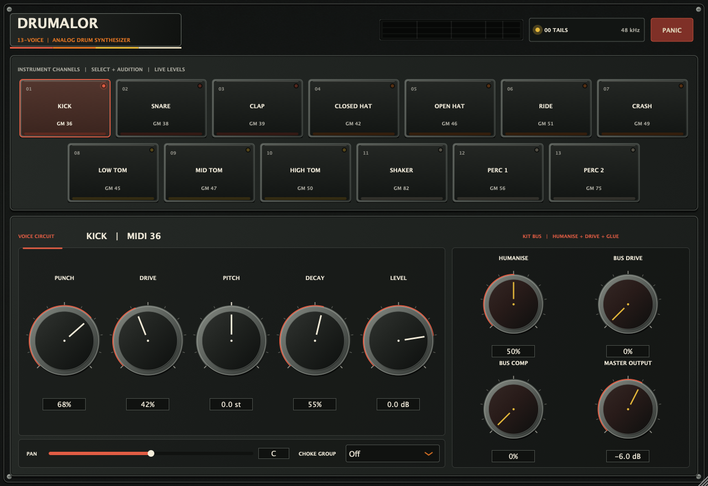

# Drumalor

Drumalor is a real-time procedural drum instrument for macOS. It uses classic
analogue-drum synthesis techniques as a starting point, then generates every
hit locally from oscillators, noise, filters, envelopes, resonators, and
circuit-inspired nonlinear shaping. It does not load samples, copy a ROM,
emulate a particular branded machine, or contact a service while rendering
audio.



The screenshot is the actual Standalone application, captured from the version
1.0 build; the 1.1 editor adds the kit mixer, kit bus deck, and metering
described below and has not been re-captured, because that requires a macOS
build. The VST3 and Audio Unit use the same resizable JUCE editor.

Drumalor provides **13 separately playable synthesized voices**: Kick, Snare,
Clap, Closed and Open Hats, Ride, Crash, Low/Mid/High Toms, Shaker, and two
percussion voices. Each has its own MIDI mapping, synthesis character, pitch,
and decay controls.

> **Listen first.** Seven [rendered demonstrations](Docs/audio/README.md) cover
> the full thirteen-voice kit one hit at a time, programmed grooves with
> ghost notes, snare velocity dynamics, toms and cymbals, the Humanise control
> and the kit bus. They are rendered by the shipping engine, so they cannot
> drift from what the plug-in does.

The project builds three products from one JUCE codebase:

- VST3 instrument for hosts such as Ableton Live, REAPER, Cubase, and Bitwig
- Audio Unit v2 music device for Logic Pro and GarageBand
- Standalone application for direct MIDI-pad and on-screen-pad testing

> **Just want to try it?** The scheduled Nightly workflow publishes the latest
> successful universal build from `main` to the rolling
> [nightly release](https://github.com/voho/vst-instruments/releases/tag/nightly).
> The bundles are ad-hoc signed and not notarized; check the repository's Nightly
> badge for the latest workflow result.

## Voices, MIDI notes, and controls

The primary note map follows General MIDI percussion assignments. MIDI velocity
controls both hit strength and timbre.

Each voice has seven automatable controls, and the kit adds four more, for
**95 host parameters** in total: 91 voice parameters plus the kit bus.

| Per-voice control | Range | Default |
| --- | --- | --- |
| Character A | 0-100% | per voice |
| Character B | 0-100% | per voice |
| Pitch | -24 to +24 st | 0.0 |
| Decay | 0-100% | per voice |
| Level | -24 to +6 dB | 0.0 dB |
| Pan | L100 to R100 | original kit position |
| Choke Group | Off, A, B, C | A for both hi-hats, Off elsewhere |

| Kit control | Range | Default |
| --- | --- | --- |
| Kit Humanise | 0-100% | 50% |
| Bus Drive | 0-100% | 0% |
| Bus Compression | 0-100% | 0% |
| Output | -24 to +6 dB | -6.0 dB |

| Voice | GM note | General MIDI assignment | Character A | Character B | Default pan |
| --- | ---: | --- | --- | --- | --- |
| Kick | 36 | Bass Drum 1 | Punch | Drive | C |
| Snare | 38 | Acoustic Snare | Wires | Snap | C |
| Clap | 39 | Hand Clap | Spread | Tone | C |
| Closed Hat | 42 | Closed Hi-Hat | Metal | Tone | R16 |
| Open Hat | 46 | Open Hi-Hat | Metal | Tone | R20 |
| Ride | 51 | Ride Cymbal 1 | Bell | Tone | R27 |
| Crash | 49 | Crash Cymbal 1 | Spread | Brightness | L27 |
| Low Tom | 45 | Low Tom | Punch | Skin | L20 |
| Mid Tom | 47 | Low-Mid Tom | Punch | Skin | C |
| High Tom | 50 | High Tom | Punch | Skin | R20 |
| Shaker | 82 | Shaker | Density | Color | R12 |
| Perc 1 | 56 | Cowbell | Ratio | Drive | L12 |
| Perc 2 | 75 | Claves | Hollow | Click | R12 |

Common kit-layout aliases are accepted too: 35 for Kick; 40 for Snare; 44 for
Closed Hat; 53 and 59 for Ride; 57 for Crash; 41 and 43 for Low Tom; 48 for Mid
Tom; 70 for Shaker; and 37, 76, or 77 for Perc 2. Other notes are silent.

**Choke groups** generalise the hi-hat pedal. Any voice can be placed in group
A, B, or C; triggering it then cuts every sounding voice in the same group with
a short 3 ms fade. Closed Hat and Open Hat share group A by default, so an
untouched kit behaves exactly as before, while a Ride and Crash, or two
percussion voices, can now be linked the same way. Each hit remembers the group
it was born into, so changing the control never strands a ringing tail. Voices
outside a group overlap and retrigger independently.

The labels describe musical intent rather than exposing implementation-specific
constants; hosts store the stable parameter IDs behind them for automation and
recall.

The version 1.0 parameter block is unchanged and still occupies host parameter
indices 0-52, so existing sessions and automation lanes keep working. Every
control added in 1.1 is appended after it and defaults to preserving the earlier
sound: unity channel level, the original kit pan positions, the original hi-hat
choke pair, a bypassed bus, and the Humanise setting that reproduces the
previous fixed variation depth sample for sample.

## Kit mixer and bus

**Level** and **Pan** turn the previously hard-coded kit balance into
automatable per-voice controls. Level is a clean gain applied to the voice, and
Pan is the same constant-power law the fixed positions always used, so a kit
left alone images and balances identically.

**Kit Humanise** scales how much of the modelled per-hit component tolerance
actually reaches each voice: pitch, decay, transient energy, tone, circuit drive
and bias. At 0% the kit is machine-tight and every strike is a deterministic
copy of the last; at 100% the drift is twice as wide. The 50% default is
numerically identical to the fixed depth the engine always had, and the
underlying drift sequence is untouched by the control, so a kit remains exactly
reproducible after reset at any setting.

**Bus Drive** and **Bus Compression** form a shared output stage after the mix
and DC blocker. Drive is a gain-matched asymmetric softener with the same
first-order ADAA used inside the voices, so it adds density and level dependence
rather than loudness. Compression is a stereo-linked peak-detecting glue
compressor with a 4 ms attack, a 140 ms release, an amount-dependent threshold
and ratio, and matched makeup; its gain law blends continuously between unity
and hard limiting so no per-sample transcendental is needed. Both stages are
fully bypassed at their 0% defaults - not almost bypassed, but skipped entirely,
which the regression suite verifies sample for sample.

Both bus controls are ramped at the master gain's 20 ms constant rather than
stepped once per block. Taking them straight from the block's parameter value
put a hard discontinuity into the mix whenever either was automated: on a
sustained 24 Hz kick, switching Bus Compression on between two blocks produced a
sample-to-sample jump 143 times the largest step anywhere else in that waveform,
and Bus Drive one 37 times as large. The ramp lands exactly on zero, so bypass
is still reachable and still skipped entirely.

Ramping Drive means its saturator's curvature is now swept continuously down to
zero, and that exposed a numerical fault in the antiderivative the stage's
antialiasing evaluates. Written the textbook way, as `x/c - log1p(cx)/c^2`, it
subtracts two quantities of size `x/c` to leave a result of size `x^2/2`, so
below a curvature of roughly 1e-3 the answer is pure rounding noise - and the
divided difference that follows divides it by a sample-to-sample step of about
1e-3 and amplifies it to full scale. Bus Drive reached that region on the very
first increment of its 0.1 % parameter grid, so this was never only a ramp
problem: on the engine as it stood before this fix, a kit held at a steady Drive
of 0.1 % already peaked at 0.92 with 0.80 sample-to-sample jumps, against 0.58
and 0.10 at bypass.
The stage now evaluates the algebraically identical `x^2 * h(c|x|)` with
`h(u) = (u - log1p(u))/u^2`, which has no such cancellation. Automating Drive
either way now leaves the mix within its own settled peak and its own largest
sample-to-sample motion at 44.1, 48, 96 and 192 kHz, where before the ramp down
to bypass produced about 80 ms of full-scale clipped noise - peak 1.0, jump 2.0
- a fifth of a second after the move.

## Sound engine

The JUCE-free C++20 DSP core combines short pitch envelopes and tuned bodies for
kick and toms, noise and resonant energy for snare and clap, inharmonic metallic
partials for hats and cymbals, and compact stochastic or resonant models for the
shaker and percussion voices. Voice-specific controls move several related
synthesis values together so each voice remains useful across the full range.

Toms and Snare are struck-membrane models rather than pitch-enveloped sines. The
stick contact excites a bank of circular-membrane modes at the ideal Bessel
ratios (1.000, 1.593, 2.135, 2.295, 2.653, 2.917), raised to an air-loading
exponent because the air column inside a shell pulls a real head's upper modes
down towards its fundamental. **Skin** moves that exponent, running each tom
from a tight, nearly harmonic head to a looser and clearly inharmonic one. The
modes ring down faster than the body, so they colour the attack and early
sustain without leaving an inharmonic tail behind. The toms also model tension
modulation: a displaced head is a stiffer head, so the pitch is highest while
the strike energy is still stored and settles as the drum rings out, on top of
the fast contact sweep.

The Snare adds a nonlinear wire model. Real snare wires only rattle while the
resonant head lifts them off their resting contact and damp it below that
threshold, so the wire noise here is gated by the instantaneous head
displacement instead of following a plain exponential envelope. Hard strikes
buzz; soft ones stay dry and damped, and the wire-to-body balance therefore
changes with velocity rather than only with level.

MIDI velocity is a timbre control across the struck voices, not only a VCA
level. A soft strike puts less energy into the high, heavily damped modes of a
real drum, so velocity scales the struck-timbre filters, the modal brightness
and the stick/contact content of Kick, Snare, Clap, both hi-hats, all three
Toms, Shaker and Perc 2. The curve is unity at full velocity, so the loud end of
the established voice design is preserved and quiet hits gain the extra realism.
Ride, Crash and Perc 1 are driven by free-running relaxation circuits rather
than by struck filters, so for them velocity keeps shaping contact and
excitation energy as before instead of moving a cutoff.

Each virtual channel has fixed per-unit component tolerances. Its metallic
Schmitt/RC oscillators keep running behind the VCA, so a strike samples the
circuit's current phase instead of restarting a waveform with newly randomized
parts. Triggers add only tightly bounded, slowly correlated variations to pitch,
envelope decay, transient energy, tone, circuit drive, and bias, scaled by **Kit
Humanise**. MIDI velocity also changes trigger energy before the resonators and
VCAs, not merely the final gain. Repeated equal-velocity notes therefore differ
without becoming random changes of kit, level, or timing. The sequence remains
deterministic after reset and independent of host block size.

A relaxation-oscillator bank contributes exactly zero through a closed VCA, so
the engine no longer advances one that no voice can observe. Observability is
evaluated per sample from a reference count that voice allocation and retirement
keep exact, and a frozen bank is restored analytically the moment the next
strike opens a VCA: short gaps are replayed substep-exactly, longer gaps advance
every phase, snap the capacitors onto their settled periodic orbit, and
re-render one full reconstruction history. Because the gap is an absolute sample
count, the result is independent of host block partitioning, and a bank frozen
behind an unrelated drum wakes into the same state as one frozen during silence.
The same reasoning retires each voice's modal bank once it has rung down past
-150 dB, far below the -100 dB at which the voice already counts as silent.
Together these remove most of the engine's fixed cost: a kit without hats or
cymbals stops paying for five metallic circuits, and long cymbal tails stop
paying for twelve resonators they can no longer excite.

Measured on one Linux x86-64 machine, rendering 45 seconds of 16th-note patterns
at 48 kHz in 128-sample blocks, comparing the 1.0 and 1.1 engines back to back
(lower is better; this is CPU time as a fraction of real time):

| Pattern | 1.0 | 1.1 | Change |
| --- | ---: | ---: | ---: |
| Kick, Snare, three Toms, Clap, Perc 2 | 16.0% | 10.7% | -33% |
| Kick, Snare, Closed and Open Hat | 13.9% | 8.4% | -39% |
| All thirteen voices | 28.8% | 22.2% | -23% |
| Kick only | 22.9% | 15.1% | -34% |
| Ride only | 60.3% | 36.8% | -39% |
| Aggregate of the five | 1.42 | 0.93 | -34% |

The 1.1 figures already include the added membrane models, so the saving from
the two gating changes alone is larger than the table shows. The absolute
percentages are specific to that machine and say nothing about a Mac; only the
before/after ratio is meaningful. The JUCE-free regression suite over the same
period went from 27.5 s to 17.5 s despite gaining ten new test groups.

A later pass measured the same dense thirteen-voice kit, ten seconds of audio at
48 kHz in 128-sample blocks, on one Linux x86-64 machine:

| Host FPU mode | Before | After | Change |
| --- | ---: | ---: | ---: |
| Denormals enabled (offline renderers, plain DSP use) | 11.10 s | 3.31 s | -70% |
| Flush-to-zero set by the host | 3.61 s | 3.36 s | -7% |

Most of that is the denormal floor described below; the remainder came from
resolving each voice's output-stage transfer curve once at note-on instead of
per sample, carrying the ADAA antiderivative forward instead of recomputing it
(one `log1p` per voice-sample instead of two), deriving the tonal oscillator's
two asymmetry harmonics from double- and triple-angle identities instead of two
further interpolated table reads, and skipping the RC integrators in the ride and
crash relaxation banks, whose mixes read only the Schmitt pulses. None of these
changes the audible signal.

Repairing the shaper antiderivative described under the kit bus gave part of
that back: it evaluates one double-precision `log1p` per call where the previous
form used a single-precision one, which on the same dense thirteen-voice
benchmark costs about 7% (3.47 s to 3.70 s, median of five runs with
flush-to-zero set). That buys a stage that is correct over its whole curvature
range instead of only above about 1e-3, and it is the same one `log1p` per
voice-sample, not two.

Because the old antiderivative was inaccurate wherever the curvature was small
relative to the signal, correcting it also moves every voice slightly. Nulled at
48 kHz against a reference build that evaluates the same antiderivative in long
double, the current engine is bit-identical for twelve of the thirteen voices and
-220 dB for the Ride; the previous engine sat -68 to -83 dB from that reference.
The audible signal is therefore unchanged - the whole difference is rounding
error being removed - but the earlier claim that seven voices null bit-exactly
against the 1.0 engine no longer holds. Against 1.0 the eleven voices that are
not deliberately changed now null at -68 to -83 dB RMS instead of at -70 to -86
or exactly; the Shaker still draws a different but statistically identical noise
realisation because it is the one voice that takes two noise samples per sample;
and Perc 1 sits at -23 dB, which is the deliberate Drive change and nothing else.
The only deliberately audible change at 48 kHz is still Perc 1's Drive. The JUCE-free regression suite went from 16.3 s to 9.8 s on the
same machine while gaining three test groups.

Each voice finishes through a lightweight asymmetric diode/transistor-style
transfer with a variable operating point and a virtual supply rail that sags
quickly on strong transients and recovers more slowly. First-order analytic
antiderivative antialiasing (ADAA) is applied to these nonlinear stages and the
stereo output shaper. Only the discontinuous metallic oscillator/ring-modulation
islands are adaptively oversampled and reconstructed before returning to the
host rate; the rest of the voice path is not multiplied in cost. The undelayed
linear component is preserved so quiet hits keep their transient definition.

Every noise layer in the kit - the kick click, the snare wires and snap, the
clap bursts, the hi-hat air, the stick skin on a tom, the shaker grain and the
Perc 1 click - is generated on a fixed 48 kHz grid and read with interpolation
rather than drawn fresh at the host rate. Those layers are all heard through
filters whose bandwidth is fixed in hertz, so what reaches the listener is the
noise's power *density*; a generator that spreads a fixed variance over the whole
Nyquist band loses 3 dB of it per doubling of the sample rate. Measured before
the change, the Clap lost 5.9 dB of level and the Snare's spectral centroid fell
from 1.9 kHz to 0.9 kHz between 44.1 and 192 kHz - the kit audibly thinned out
and darkened on a high-rate session. The fixed grid holds the audible band
constant instead, and because the grid rate is the reference rate, a 48 kHz
render is unchanged sample for sample.

The engine also flushes its own recursive states to zero at -600 dBFS. Every
envelope, resonator, biquad, DC blocker and detector decays geometrically for as
long as its voice lives, so without an explicit floor they all spend a stretch of
every note in the subnormal range, where x86 traps into microcode. A host that
sets flush-to-zero hides that; an offline renderer or a wrapper that does not
leaves the plug-in paying for it. On a dense thirteen-voice kit the engine used
to cost 3.1 times as much with denormals enabled as with them flushed - slower
than real time on the measuring machine. The sound can no longer depend on the
host's FPU configuration.

The Kick has a dedicated charged-energy model: a virtual capacitor discharges
into a contractive two-state resonator whose frequency and loss change with the
stored energy. Its default body settles around 48 Hz, while **Punch** controls
the initial pitch movement and contact noise and **Drive** moves the nonlinear
operating point, branch mismatch, harmonic density, and modest makeup gain. The
resonator update is an explicit rotation followed by contraction, so even rapid
pitch modulation cannot inject unbounded state energy.

Hats, Ride, Crash, and Perc 1 use persistent relaxation-oscillator banks. Exact
exponential RC charge/discharge curves, fixed threshold and tuning tolerances,
47.98%-centred duty cycles, fractional-edge PolyBLEP correction, and local
adaptive oversampling retain the unstable metallic detail with substantially
less aliasing than naive square waves or multiplied ideal sines. An
approximately 80 dB Kaiser-windowed reconstruction FIR precedes each adaptive
rate change. Perc 1 now derives its cowbell body from the familiar approximately
535/800 Hz Schmitt pair. Its **Drive** spans a wider circuit-drive range than its
neighbours and carries modest drive-dependent makeup, because the output stage's
exact 1/drive compensation otherwise cancelled almost all of it: the control used
to change the voice by 6.9 % over its whole travel, against a 90 % average for
the other character controls, and delivered that as a 0.9 dB level drop rather
than as saturation. Measured end to end over the control's whole travel, it now
takes 1.69 dB off the crest factor for a 0.15 dB level change; the regression
suite requires at least 1.4 dB of crest reduction and less than 0.5 dB of level
drift. Tonal snare and tom cores remain smooth resonators, but
add explicitly band-limited component asymmetry and subtle virtual-rail pitch
coupling instead of mathematically perfect table sines.

Ride and Crash keep a deliberately hybrid cymbal architecture. Their six-pulse
source feeds the 3.44/7.1/10.5 kHz analogue-style band structure. A separate
voice-local nominal 30 kHz clock quantizes a generated oscillator/noise composite
to 63 symmetric levels, then passes it through a reconstruction pole, adding the
grain and diffuse continuity of early PCM cymbals without loading a sample or
copying ROM data. At host rates below 30 kHz the clock is necessarily limited to
the host rate.

Short, high-spread acoustic modes supply stick/bell/body energy, while the long
tail comes from three independently weighted wash bands instead of continuously
driven low resonators. This removes the former hollow spectral gap and lingering
pitched “cling.” **Bell** preserves a broad Ride wash while bringing the body
forward; **Spread** moves Crash from coherent pulse metal toward a wider,
less-periodic tail. **Tone** and **Brightness** tilt the three bands rather than
moving a single narrow filter.

These are circuit-inspired behavioral models, not a claim of
component-for-component emulation of a TR-808, TR-909, or another specific
machine. No neural-network weights are needed, so the audio path stays
allocation-free, deterministic, and suitable for real-time use.

All synthesis happens in the audio callback without sample files. The engine is
prepared for the host sample rate, accepts sample-accurate MIDI event offsets,
and clears completed one-shot voices after their tails finish.

## Vintage interface

The editor uses a generated geometry-free powder-coat plate only as a restrained
material texture; all panel geometry is rendered by the responsive JUCE layout. A
compact equal-width channel grid, illuminated selection rails, separate Voice
Circuit and Kit Bus decks, scaled metal-collared Bakelite knobs, recessed value
readouts, bipolar Pitch indication, parameter-aware reset gestures, tooltips,
and clearer typography create a denser hardware hierarchy without losing
accessibility or resize support. Its near-black face, neutral hardware,
warm legends, and ordered red/orange/yellow/cream channel accents borrow the
colour rhythm associated with classic early-1980s rhythm composers while
retaining Drumalor's own branding and layout. The texture is compiled into the
plug-in as binary data, so there is no external image to install. The visual
direction is era-inspired rather than a copy of any historical drum machine's
panel or trade dress.

The panel is now also a meter bridge. Every channel pad carries a recessed
activity rail that fills with that voice's own measured level and leaves a
peak-hold marker behind, turning the thirteen-pad grid into a live channel
overview rather than a row of note-on flashes. A stereo bus meter in the header
shows the output with peak hold, silkscreen marks at -36, -24, -12 and -6 dB,
and a separate strip that grows leftwards with the bus compressor's gain
reduction. The Voice Circuit deck holds five knobs plus a horizontal Pan slider
and the Choke Group selector; the Kit Bus deck holds Humanise, Drive, Comp and
Output.

The presentation mathematics behind all of that - the decibel meter curve and
its exact inverse, the asymmetric attack/release/peak-hold ballistics, the
pad-grid geometry, and the colour-ramp curves - lives in the JUCE-free
`Source/DSP/UiMath.*` library and is unit-tested with the synthesis engine. The
JUCE layer only renders it.

**Note:** the screenshot above still shows the version 1.0 interface. It can
only be regenerated from a macOS build.

## Research influences and modeling scope

The implementation follows recent virtual-analog work where it fits a
self-contained real-time instrument:

- Gabrielli and Squartini's [2025 ADAA study](https://www.dafx.de/paper-archive/2025/DAFx25_paper_30.pdf)
  motivates antiderivative treatment of nonlinear stages as a lower-cost route
  to reduced aliasing.
- Pines' [2025 diode-VCA model](https://dafx25.dii.univpm.it/wp-content/uploads/2025/07/DAFx25_paper_44.pdf)
  motivates explicit fixed nonlinearities with variable operating points.
- Werner, Abel, and Smith's [physically informed bass-drum analysis](https://dafx.de/paper-archive/2014/dafx14_kurt_james_werner_a_physically_informed%2C_ci.pdf)
  and Germain's [time-varying numerical study](https://www.dafx.de/paper-archive/2021/proceedings/papers/DAFx20in21_paper_43.pdf)
  motivate charged state, resonant feedback, changing pitch/loss, and stable
  time-varying updates for the Kick.
- Werner, Abel, and Smith's [TR-808 cymbal circuit analysis](https://pureadmin.qub.ac.uk/ws/portalfiles/portal/125044847/tr_808_cymbal_a_physically_informed_circuit_bendable_digital.pdf)
  supplies the measured six-oscillator frequencies, pulse duty cycle, and
  multi-band filter structure used by the synthesized cymbal source. Olsen,
  Werner, and Germain's [network-variable-preserving oscillator study](https://dafx.de/paper-archive/2017/papers/DAFx17_paper_74.pdf)
  motivates combining relaxation-circuit state, accurate edge timing, and BLEP
  correction rather than choosing between physical modeling and antialiasing. The
  [TR-909 service notes](https://www.polynominal.com/site/studio/gear/drum/roland-tr909/roland-tr909-service-manual.pdf)
  document its real-cymbal PCM memories and envelope restoration; Drumalor
  models that early clock/DAC character with newly generated data rather than
  embedding the original recordings.
- Esqueda and Murai's [2025 antialiased recurrent model](https://dafx25.dii.univpm.it/wp-content/uploads/2025/09/DAFx25_paper_61.pdf)
  shows that compact learned state-space models can run in real time. Drumalor
  deliberately does not use one: without measurements from a defined target
  circuit, weights would be an uncalibrated black box rather than a more
  defensible analog model.

The result is a modern behavioral VA design with original sound architecture,
not a calibrated hardware replica. Listening comparisons and profiling on the
oldest supported Mac remain part of release qualification even though the
automated stability, performance, and spectral contracts pass.

## Requirements

- macOS 11 or newer for running the built products
- A current full Xcode installation selected for command-line use
- CMake 3.22 or newer
- Internet access for the default first configure, or a local JUCE 8.0.14
  checkout supplied through `JUCE_PATH` to the helper
  (`DRUMALOR_JUCE_PATH` when configuring CMake directly)

JUCE 8.0.14 is fetched at configure time and is not vendored into this
repository.

## Build on macOS

The helper creates an Xcode build, compiles universal `arm64`/`x86_64`
binaries, and runs both the DSP and JUCE processor-contract tests:

```bash
./scripts/build-macos.sh
```

Equivalent commands, useful when opening and developing in Xcode, are:

```bash
cmake -S . -B build-macos -G Xcode \
  "-DCMAKE_OSX_ARCHITECTURES=arm64;x86_64" \
  -DCMAKE_OSX_DEPLOYMENT_TARGET=11.0 \
  -DDRUMALOR_BUILD_UNIVERSAL=ON \
  -DDRUMALOR_BUILD_PLUGIN=ON \
  -DBUILD_TESTING=ON

cmake --build build-macos --config Release --parallel
ctest --test-dir build-macos -C Release --output-on-failure
open build-macos/Drumalor.xcodeproj
```

To avoid the FetchContent download, point the configure at a local checkout of
the exact JUCE release:

```bash
JUCE_PATH="$HOME/SDKs/JUCE-8.0.14" ./scripts/build-macos.sh
```

For a native-only development build, use `BUILD_UNIVERSAL=OFF`. Override
`BUILD_DIR`, `CONFIG`, or `MACOSX_DEPLOYMENT_TARGET` in the environment when
needed.

Release bundles are written to:

| Format | Build artifact |
| --- | --- |
| VST3 | `build-macos/Drumalor_artefacts/Release/VST3/Drumalor.vst3` |
| Audio Unit | `build-macos/Drumalor_artefacts/Release/AU/Drumalor.component` |
| Standalone | `build-macos/Drumalor_artefacts/Release/Standalone/Drumalor.app` |

## Run the DSP tests without JUCE

The synthesis core deliberately has no JUCE dependency. This provides a quick
test path on any C++20 development machine without downloading the framework:

```bash
cmake -S . -B build-dsp \
  -DCMAKE_BUILD_TYPE=Release \
  -DDRUMALOR_BUILD_PLUGIN=OFF \
  -DBUILD_TESTING=ON
cmake --build build-dsp --parallel
ctest --test-dir build-dsp --output-on-failure
```

The JUCE-free regression executable renders every voice from 8 to 192 kHz. It
checks finite, non-silent, bounded output, completed tails, hi-hat choking, all
four original controls on every voice, sample-rate consistency, saturated voice
stealing, and a generous offline performance guardrail. Organic-model contracts verify
that six equal strikes differ for all 13 voices while RMS, peak, and natural-tail
spread stay bounded; they also verify bit-exact reset replay and block-partition
invariance. A dedicated metallic-source contract verifies across all five banks
and three elapsed-time offsets that silence advances the free-running source
without leaking through closed VCAs, and that its reconstruction remains
independent of block partitioning. Restored-state and silent-automation checks
also keep the persistent bank controls synchronized. Kick-specific contracts
cover a 43–55 Hz settled body, dominant sub-100 Hz energy, controlled transient
and crest factor, Drive harmonics without excess settled energy above 8 kHz,
pitch tracking, DC safety, and consistency from 8 to 192 kHz. Cymbal contracts
reject hollow midrange gaps and sparse
ringing tails, require retained Ride wash at maximum Bell, verify directional
Tone/Brightness response, and keep Crash Spread diffusion level-matched.

Version 1.1 adds contracts for everything it introduces. The kit mixer is held
to a clean -6 dB gain law, a symmetric pan law, hard-panned channel isolation,
the original default positions, and bit-identical output at unity. Choke groups
are checked for the factory hi-hat pair, for arbitrary linked voices, for
independence between groups, and for tails that keep the group they were born
into. Humanise is verified to reproduce the historical fixed variation depth
exactly at its default, to order hit-to-hit spread across its range, and to stay
reproducible after reset at every setting. The kit bus is checked for exact
bypass at 0%, safe and level-matched saturation, real dynamic-range reduction,
released gain reduction, and block-partition invariance. Metering is checked for
attack, release, stereo placement and reset. Membrane contracts require audible
inharmonic head content at the strike that decays faster than the body, a Skin
control that actually moves the air loading, a level-dependent snare wire
rattle, and darker soft hits on all ten velocity-timbred voices. A dedicated
efficiency contract proves that a metallic bank frozen behind an unrelated drum
wakes into exactly the same state as one frozen during silence, and measures
that adding a hi-hat costs meaningfully more than the same kick alone, which is
only true while unobservable banks stay frozen. On x86 it also renders a busy
kit twice, once with flush-to-zero set and once without, and requires the two to
cost the same, which only holds while the engine floors its own recursive states.

Three further contracts guard the later pass. A noise-density contract holds the
kick click, the snare wires, the clap burst and the shaker grain to a flat
filtered level from 44.1 to 192 kHz - each of them moved by 2.9 to 6.4 dB before
the noise generator was moved onto a fixed grid. A bus-automation contract sweeps
Bus Drive and Bus Compression both on and off mid-tail over a sustained deep
kick, at 0.1 %, 50 % and 100 % and at 44.1, 48, 96 and 192 kHz, and requires the
boundary step, the peak and the largest sample-to-sample jump of the whole half
second that follows to stay within what that tail was already doing. The step at
the boundary used to be 24 to 143 times the waveform's own motion; the ramp down
to bypass used to put jumps up to 1800 times larger into the second after the
move, which watching only the boundary sample of only the off-to-on direction
missed entirely. And a Perc 1 contract requires its Drive to reduce the crest
factor while holding the level, which
distinguishes a saturation control from the level trim it had become. The presentation library gets
its own contracts for the meter curve and its inverse, ballistics, pad-grid
geometry, and sanitisation of invalid input.

Plug-in builds add a JUCE-backed processor contract suite for parameter defaults
and state, version-1.0 host parameter index stability, restoring a session that
predates the new parameters, sample-accurate MIDI, CC panic, the UI-trigger
lifecycle, and off-screen rendering of the embedded vintage editor. These checks
do not replace listening tests, host automation tests, or profiling on the oldest
supported Mac.

## Install locally

For per-user installation, copy only the formats you need:

```bash
mkdir -p "$HOME/Library/Audio/Plug-Ins/VST3"
mkdir -p "$HOME/Library/Audio/Plug-Ins/Components"

ditto build-macos/Drumalor_artefacts/Release/VST3/Drumalor.vst3 \
  "$HOME/Library/Audio/Plug-Ins/VST3/Drumalor.vst3"
ditto build-macos/Drumalor_artefacts/Release/AU/Drumalor.component \
  "$HOME/Library/Audio/Plug-Ins/Components/Drumalor.component"
```

Standard discovery locations are:

| Scope | VST3 | Audio Unit |
| --- | --- | --- |
| Current user | `~/Library/Audio/Plug-Ins/VST3/` | `~/Library/Audio/Plug-Ins/Components/` |
| All users | `/Library/Audio/Plug-Ins/VST3/` | `/Library/Audio/Plug-Ins/Components/` |

The standalone app can be copied to `/Applications` or launched directly from
the artifacts directory. Quit and reopen the host after installing. If Logic
retains an older AU during development, log out and back in or restart the
Audio Component Registrar before rescanning.

## Validate the plug-in

Run the DSP tests first, then check that each release executable is universal:

```bash
lipo -archs build-macos/Drumalor_artefacts/Release/VST3/Drumalor.vst3/Contents/MacOS/Drumalor
lipo -archs build-macos/Drumalor_artefacts/Release/AU/Drumalor.component/Contents/MacOS/Drumalor
lipo -archs build-macos/Drumalor_artefacts/Release/Standalone/Drumalor.app/Contents/MacOS/Drumalor
```

Each command should report both `arm64` and `x86_64`. After installing the AU,
validate its type `aumu`, subtype `Drm1`, and manufacturer `Dral`:

```bash
auval -v aumu Drm1 Dral
```

With [pluginval](https://github.com/Tracktion/pluginval) installed, validate
the VST3 at the highest strictness level:

```bash
/Applications/pluginval.app/Contents/MacOS/pluginval \
  --strictness-level 10 \
  "$HOME/Library/Audio/Plug-Ins/VST3/Drumalor.vst3"
```

Also exercise all 13 note mappings, velocity extremes, rapid retriggers, the
open/closed-hat choke, all 91 voice parameters and the four kit controls,
choke groups, project-state recall, sample-
rate changes, and buffer sizes from 32 to 2048 samples in at least two hosts.
A validator passing does not guarantee musical or host-level correctness.

## Sign, package, and notarize

For local testing, the packaging helper uses ad-hoc signing by default:

```bash
./scripts/sign-and-package-macos.sh
```

It stages the VST3, AU, and standalone app, verifies their signatures, and
creates a ZIP and installer package under `build-macos/dist/`. The default
universal build uses the `macOS-universal` filename suffix; a native-only build
is labelled with its actual architecture instead.

For public distribution, first import valid `Developer ID Application` and
`Developer ID Installer` certificates. Store notarization credentials once in
the login keychain; do not put credentials in this repository:

```bash
xcrun notarytool store-credentials drumalor-notary \
  --apple-id "developer@example.com" \
  --team-id "YOURTEAMID" \
  --password "APP-SPECIFIC-PASSWORD"
```

Then sign, package, submit, wait for Apple's result, and staple the ticket:

```bash
APP_SIGN_IDENTITY="Developer ID Application: Your Company (YOURTEAMID)" \
INSTALLER_SIGN_IDENTITY="Developer ID Installer: Your Company (YOURTEAMID)" \
NOTARY_PROFILE="drumalor-notary" \
./scripts/sign-and-package-macos.sh
```

With `NOTARY_PROFILE` set, the helper submits and staples the installer package.
The ZIP is still produced, but it is not the notarized distribution artifact;
publish the `.pkg`, or run a separate bundle/ZIP notarization workflow before
distributing the ZIP.

Before publishing, verify the package from a clean user account and inspect its
signature and Gatekeeper assessment:

```bash
pkgutil --check-signature build-macos/dist/Drumalor-1.1.0-macOS-universal.pkg
spctl --assess --type install --verbose=4 \
  build-macos/dist/Drumalor-1.1.0-macOS-universal.pkg
```

The bundle identifier `audio.drumalor.synth`, manufacturer code `Dral`, and
plug-in code `Drm1` are the host-facing identity. Confirm that the publisher
controls them before the first public release, then never change them: hosts
use these values to associate saved projects with the correct plug-in. Keep the
CMake project version and packaging-script version in sync for each release.

## Project layout

```text
Source/DSP/              JUCE-free synthesis engine, voice metadata, and UI maths
Source/PluginProcessor.* MIDI mapping, parameters, state, and audio bridge
Source/PluginEditor.*    Metered thirteen-pad editor, voice deck, and kit bus deck
Assets/                  Embedded geometry-free charcoal material texture
Docs/                    Real interface screenshot(s) used in this README
Tests/                   DSP and JUCE processor-contract regression tests
Presets/                 Preset guidance and future factory presets
scripts/                 macOS build and release helpers
```

## Licensing

The original Drumalor source is offered under the MIT License. JUCE is a
separate dependency and is not covered by that licence. JUCE 8 framework
modules are available under the AGPLv3 or a commercial JUCE licence.
Distributing a closed-source or otherwise AGPL-incompatible binary generally
requires an appropriate commercial JUCE licence. Confirm the current terms for
the publisher and use case before shipping; see `THIRD_PARTY_NOTICES.md` and
JUCE's official licence.

No drum samples, impulse responses, neural model weights, factory ROMs, or
third-party presets are included.
