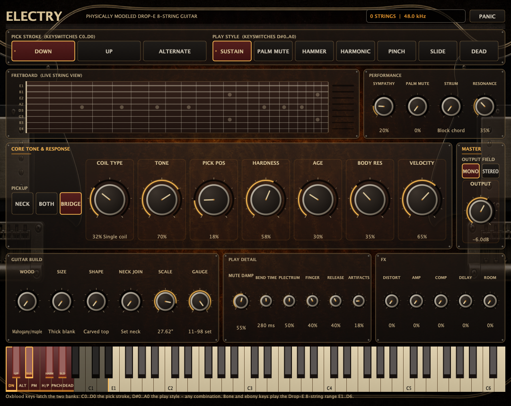

# Electry

Electry is an original, physically modeled dry electric guitar instrument.
Eight string voices run dual-polarisation waveguide loops with physically
derived stiffness dispersion, decay-targeted damping, tension-modulation
pitch glide, a pitch wheel that bends every string like a vibrato bar,
a resonance wheel that can push a distorted tone into self-sustaining
amplifier feedback, one-way bridge coupling into
the strings you are *not* fingering, and a published pickup signal
structure (position comb, finite magnetic aperture, nonlinear flux, induced
EMF, and loaded coil resonance). The performance is selected with two
independent banks of latching keyswitches below the playable range - one for
the picking style, one for the play style - so any stroke can drive any
style. The individual models have named research references
(see the [physical-modeling research
contract](Docs/physical-modeling-research.md)); Electry does not claim to be
a capture-accurate clone of any one instrument.

The compact FX panel provides a distortion pedal, an amplifier and modelled
cabinet, compression, lead delay, and a stereo room; every effect defaults to a
true 0% dry setting, and the two clipping stages run inside a 4x oversampled
domain so a high-gain metal tone saturates instead of folding its own harmonics
back into the guitar band. Mono is the authentic summed dry DI; Stereo is a
phase-coherent divided-pickup view of the eight physical strings, not an effect
or delay. Both are also ready for the amp simulation of your choice. Material,
body, pickup, and construction controls span deliberately contrasting
solid-body anchors; scale length spans a conventional 25.5-inch electric to a
modern 28-inch baritone/8-string build.



## Hear it

Fourteen rendered examples — the full playable range, the pick-stroke and
play-style combinations, the guitar-build and pickup axes, the
pitch-wheel bar and resonance-wheel feedback, and the Drop-E rhythm and lead
tones dry and through the amplifier — are committed under
[`Docs/audio/`](Docs/audio/README.md), with the score for each one in
`Tools/RenderDemos.cpp`. They are produced by the shipping JUCE-free signal
path, so they cannot drift away from what the plug-in sounds like, and they are
reproducible on any platform with a C++20 toolchain.

The screenshot is produced by the plug-in regression suite itself
(`ELECTRY_EDITOR_SNAPSHOT`), so it is always a real editor render rather than
a mock-up; the Nightly workflow re-renders it on every run and commits it
when the editor has changed. The Standalone, VST3, and
Audio Unit use that same
JUCE component. Panels, knobs, the fretboard, the keyswitch strips, and the
on-screen keyboard are drawn as resolution-independent JUCE graphics;
interactive controls stay native for automation, keyboard operation, and
accessibility.

The editor uses audible impact as its visual hierarchy: pickup/tone,
excitation, age, body resonance, and velocity are oversized in the Core row;
guitar-build controls are medium; articulation-specific noise and artifact
details are compact.
The walnut-and-amber chassis nods to a workbench electric guitar without
reproducing a branded hardware panel.

### Live fretboard

Under the play-style strip, a 22-fret eight-string fingerboard shows the model
as it plays: which physical string each note was allocated to, exactly where it
is stopped (with its note name), how hard it is ringing, and which strings are
ringing only through the sympathetic bridge coupling. Sounding strings are
amber and vibrate as the fundamental standing wave of their sounding length, so
the part of the string behind the fretting finger correctly stays still;
bridge-coupled strings are cool blue. A per-string meter on the right shows the
level with proper attack/release ballistics, and the header readout reports
both counts, for example `3 STRINGS +4 RING`.

All of the fretboard's geometry, ballistics, colour mapping and the lock-free
audio-to-editor transfer live in the JUCE-free `Source/DSP/ElectryVisuals.*`
module, so they are unit-tested on every platform and the editor stays a thin
renderer. The PERFORMANCE panel beside the fretboard holds the four controls
that change what it shows.

> **Just want to try it?** The scheduled Nightly workflow publishes the
> latest successful universal build from `main` to the rolling
> [nightly release](https://github.com/voho/vst-instruments/releases/tag/nightly).
> The bundles are ad-hoc signed and not notarized; check the repository's
> Nightly badge for the latest workflow result.

## Keyswitches and playable range

MIDI notes 12..18 are two independent banks of latching keyswitches; they
never sound, and each bank keeps its most recent selection for every
following note until changed. Notes 12..14 (C0..D0) latch how the pick
moves; notes 15..18 (D#0..F#0) latch what the hands do. The two latch
independently, so any of the twelve combinations — an up-stroke palm mute,
alternate-picked harmonics — is reachable in at most two keyswitches.
Keyswitch note-offs are ignored. The editor's PICK STROKE and PLAY STYLE
strips send the same keyswitches and always show the currently latched pair.
The on-screen keyboard colours and labels both keyswitch banks separately
from the playable instrument.

| MIDI note | Key | Picking style |
| --- | --- | --- |
| 12 | C0 | Down (default) |
| 13 | C#0 | Up — opposite displacement polarity, slightly closer to the bridge, thinner and brighter |
| 14 | D0 | Alternate — starts down, then alternates down/up for each accepted picked note-on; hammered notes neither take nor consume a stroke |

| MIDI note | Key | Play style |
| --- | --- | --- |
| 15 | D#0 | Sustain (default) — the ordinary ringing pick |
| 16 | E0 | Palm mute — damping follows the Mute Damp control, from a loose half-mute to a tight metal chug at the firm end |
| 17 | F0 | Hammer-on / pull-off — continues a sounding string legato within a nine-fret reach, fingered attack, no plectrum noise |
| 18 | F#0 | Natural harmonic — a finger resting on the string's midpoint node, so the octave is what the string does rather than a transposition of it |

Notes 19..27 are ignored, and notes 28..86 are playable on a 22-fret,
eight-string Drop-E instrument tuned
E1-B1-E2-A2-D3-G3-B3-E4; notes outside these ranges are ignored. Each note is
allocated to one of the eight physical strings by a fretting hand that has a
position and a reach: a repick of a sounding note grabs the same string,
hammer-on continues the nearest sounding string, otherwise the free string
that puts the note nearest the fingers wins, and when everything sounds, the
oldest string is stolen. The hand's index finger covers four further frets,
open strings need no finger and are free at the nut, and the hand moves only
when the note it is asked for lies outside its span - and then only on the
first note of a chord, because a chord is one hand shape. It relaxes back to
the nut when the phrase ends. That is what lets a phrase played up the neck
stay up the neck: the rule this replaced always chose the lowest fret that
could produce the note, so an open string won every contest and most of the
fretboard - and the sounding length, inharmonicity and pickup-comb geometry
that come with it - was unreachable.

The pitch wheel is a vibrato bar: it bends every string — the
sympathetically ringing open strings included — over a nominal ±2 semitone
range, each string by its own physically derived compliance (the slack low
E1 and the plain G bend deepest, the stiff wound D-string least, the
two-to-one smear a real bar puts on a chord), and the strings travel to the
wheel over the Bend Time parameter rather than snapping. The modulation wheel (CC 1) is the
performance resonance: it raises the sympathetic coupling from the
Sympathetic Ring parameter toward total and opens an acoustic feedback path
from the amplified output back into the strings, scaled by the Resonance
Depth parameter — with the amp or distortion up and the wheel raised, a held
note regenerates into self-sustaining feedback, and a dry DI never can. The
sustain pedal (CC 64) holds released strings; breath/CC 2 adds continuous
bridge-hand damping on top of the Palm Mute parameter; CC 120/123 behave as
All Sound Off and All Notes Off.

## Sound architecture

- **Strings:** one voice per physical string. Each voice runs two
  single-delay-loop waveguides (the two transverse polarisations) with
  third-order Lagrange fractional delays, a one-pole damping filter solved
  from per-string decay targets, an eight-stage factored allpass dispersion
  cascade fitted at low and high partials from the string's physical
  inharmonicity (diameter, effective wound core, scale length,
  tension), and a contractive bridge coupling. The horizontal polarisation
  decays 1.7x slower and is detuned by a fraction of a cent, giving the
  natural two-stage decay and slow beating. Both that detune and the exchange
  between the two polarisations are fractions of a round trip rather than fixed
  numbers of samples, which is most of what makes the decay envelope the same
  at every host rate: charged per rendered sample instead, they left the
  22nd-fret high E 36.5 dB under its own attack half a second later on a
  44.1 kHz host and 14.5 dB under it on a 96 kHz one, and dissipated the
  mismatch between the two loop lengths as loss rather than exchanging it -
  36 dB of the top string's sustain, against its own fitted decay target. It is
  most of it rather than all of it, and the remainder is worth naming: the loop
  filter itself is a one-pole interpolating between two fitted frequencies in
  normalised radians, which is not exactly rate-invariant. The 22nd-fret high E
  measures 20.0, 19.3 and 15.5 dB under its attack at 1-2 s on 44.1, 48 and
  96 kHz hosts - a 4.5 dB residual spread, against 32.7 dB before. The regression
  bound is 3 dB through 1.5 s and 8 dB through 3 s. Loop-filter phase is
  compensated analytically, holding the fundamental within a few cents
  across the fretboard at 44.1-384 kHz. At host rates through 96 kHz the
  complete physical and nonlinear signal path runs internally at 2x and is
  returned through a 63-tap halfband FIR; higher-rate hosts run natively.
- **Pick position:** the picking hand stays at a fixed distance from the
  bridge; it does not follow the fretting hand up the neck. Pick Position is
  therefore a fraction of the *open* string, and the pluck comb as a fraction of
  the sounding length grows by `2^(fret/12)`, so a note fretted high up moves
  toward the hollow, mid-string comb of a real guitar. At the nut this is
  identical to the previous behaviour.
- **Pick release:** the plectrum does not leave every string equally quickly. A
  wound .080 carries far more mass per unit length than a plain .009 at
  comparable tension, so it leaves the pick more slowly, and the duration of
  that release low-passes what enters the string. The corner follows the square
  root of the string's own open frequency, so the treble register keeps its
  brightness while the wound low strings lose the upper-partial surplus the
  ideal law gives them, and the pole's own attenuation at the fundamental is
  divided back out so the release governs timbre rather than level.
- **Pick contact:** the plectrum is neither a point nor symmetric. It touches
  the string over a patch — half a millimetre for a stiff sharp pick, around a
  millimetre and a half for a soft rounded one — so the reflected image of the
  excitation is spread over that width through the same sounding-length
  geometry the comb uses, and the comb notches wash out with frequency instead
  of staying razor sharp up to Nyquist. Its release is asymmetric: the string is
  drawn aside over most of the contact and then slips off in a fraction of that
  time, and a stiffer pick lets go later and more abruptly. Both halves of the
  window are smoothsteps, so its area is exactly what the symmetric raised
  cosine it replaced had, and the asymmetry changes the attack's spectrum
  without changing how hard the note lands.
- **Touch harmonics:** a light finger on the string is a point loss, and mode
  `n`'s displacement under it goes as `sin(n pi p)`, so the energy the contact
  removes per round trip goes as `sin^2(n pi p)`. Condensed into the single
  delay loop that is exactly a one-tap FIR, `(1 - d/2) + (d/2) z^-M` with
  `M = p * period` — unity where the touch sits on a node, `1 - d` where it
  sits on an antinode. Both coefficients are positive and sum to one, so it
  can never exceed unity gain inside the string's feedback loop. The natural
  harmonic rests that finger on the midpoint, which removes every odd partial
  including the fundamental and leaves every even one alone in magnitude *and*
  phase, so the octave arises from the string instead of from retuning the
  loop: the string keeps its own length, inharmonicity, decay targets and
  pickup comb. The finger lifts once the note has formed — the partials it
  removed cannot be re-excited — which stops paying for the two extra delay
  reads and lets the harmonic ring as long as the string does. The clamp that
  used to stand in for the finger cost the open A2's octave partial 16 dB per
  second of loss nothing physical was asking for.
- **Frets:** fretting position drives sounding length, inharmonicity,
  pickup comb geometry, and Fleischer-style dead-spot damping (deeper on
  the bolt-on end of the construction axis). The Artifacts path can open a
  decaying fret-collision window on hard-picked notes that soft-limits
  displacement and re-radiates deterministic rattle. Hammer-ons retarget a
  sounding loop without clearing its state.
- **Tension modulation:** a string-energy envelope shortens the loop delay,
  so hard attacks start audibly sharp and relax over hundreds of
  milliseconds. The pitch wheel moves the same delay target along the Bend
  Time glide, each string by its own compliance.
- **Low-register voicing:** the wound strings' decay law and the plectrum's
  release spectrum are calibrated against a dry electric low-E reference
  recording. A solid-body electric's low strings ring for tens of seconds while
  their content above a kilohertz is gone inside a tenth of a second, and the
  ideal 1/n^2 pluck the literature describes - which the pickup's induced-EMF
  differentiation turns into a 1/n voltage spectrum - overstates a real string's
  upper partials by roughly 9 dB by the fourteenth. Correcting both is what
  removed the nasal, clavinet-like character the low register used to
  have: the mean per-partial error against that reference falls from 4.5 dB to
  2.9 dB, and a palm-muted chug is now dominated by its own fundamental instead
  of by its low mids. The hollowness that outlasted this work turned out not to
  be an excitation problem at all - moving these corners changes the
  fundamental's relative level by a fraction of a decibel - but a pickup one;
  see the position comb below. Scored on half-octave bands against the same
  references, the mean error is now 4.31 dB where it was 5.55 dB, and the
  60-85 Hz error on an open attack is 0.7 dB where it was 5.4 dB.
- **Velocity:** one coherent response profile drives attack level, pulse
  width and brightness, the string-scaled modal release, contact noise,
  tension glide, and collision likelihood. The principal release passes two
  low-pass stages whose time scale follows the string period, approximating
  the `1/n^2` modal falloff of a triangular pluck displacement; for ordinary
  sustained pick styles, a much smaller broadband component preserves the
  pick edge. Their delay-line projection is normalised against open E4, so
  equal player effort does not lose tens of decibels on the much longer E1
  loop. At 0% response those
  dimensions are velocity-invariant; at 100% they span soft finger-light
  notes through aggressive metal attacks.
- **Pickups and coils:** per-string position combs at morphing
  bridge/neck distances, whose delayed tap is weighted below unity so the
  notch is about 12 dB deep rather than infinite - a real pickup senses through
  an aperture, sums two coils at two distances and sits in a three-dimensional
  field, so its taps never cancel exactly, and making them cancel exactly was
  costing the fundamental most. Correcting it recovered nearly 5 dB in the
  60-85 Hz band and is what removed the last of the hollowness. Then a
  wave-speed-scaled finite rectangular magnetic
  aperture with its exact sinc response (wide humbucker window to narrow
  single-coil window), a bounded second-order-dominant flux nonlinearity,
  induced-EMF differentiation with an oversampled ultrasonic guard, and one
  loaded resonant coil filter per pickup (2.0 kHz / Q 1.0 humbucker anchor to 6.0 kHz /
  Q 2.4 single-coil anchor). A bounded string-mass/pole-balance calibration
  keeps the thick low strings at practical guitar-pickup levels. The selector
  fades Neck, Both (with the
  paired-coil resonance shift), or Bridge; the passive tone control moves
  the loaded resonance down and damps it.
- **Body:** four modal resonators voiced along strongly separated wood, size,
  shape, and construction endpoints receive bridge motion and
  contact noise. Each resonator is normalised at its own modal peak so low
  modes do not acquire an unintended frequency-dependent boost. The resulting
  structural drive is converted once to induced voltage before the modal
  bank, guarded, then joined with string pickup voltage before the same coil;
  displacement is never mixed directly into an electrical signal. Their
  positive, bounded modal bridge conductance also drains string energy when a
  fundamental or strong partial meets a body mode, so the build changes
  sustain as well as timbre. Solid-body coupling, not an acoustic radiator.
- **Sympathetic bridge coupling:** every string you are not fingering is a
  real waveguide, not a resonator bank. The plucked strings' bridge force is
  summed into a one-sample-delayed bus that drives the idle strings' own loops
  at their open pitch, with their own bridge pickup tap and with their loop
  filter solved from the same two decay targets a played string of the same
  steel gets - its fundamental's T60 and the same wound/plain high-frequency
  ratio. That last part is what makes the bank read as strings rather than as a
  bright plate: a fixed loss coefficient left the wound strings' top end -
  which a played low E loses inside a tenth of a second - ringing for over three
  seconds, and the coupled ring's 1.5-6 kHz band sat 37.8 dB under its
  60-700 Hz band where it now sits 87.1 dB under. The two targets are not always
  both reachable: a one-pole steep enough to hit the high one costs gain at the
  fundamental, and the loop gain cannot exceed one. Where they collide - which
  is most of the range above String Age 0.8 and anywhere the bridge hand is on
  the strings - the high-frequency target is bisected back toward the
  fundamental's until the pair fits, so a coupled string always decays at the
  rate its steel says and only the top of the tilt is given up.
  Only played voices write to the bus and only idle voices read it, so the
  coupling graph is acyclic and unconditionally stable at any coupling gain;
  each coupled loop additionally carries a bounded soft limit. The bridge hand
  that mutes a palm-muted passage covers every string, so the style damps and
  starves the coupled strings automatically and a Drop-E
  chug stays tight. At 0% the coupled loops are never configured, rendered or
  injected into, so the control is an exact bypass and not a small residue.
  Coupled strings reuse the idle voice's own delay line, so the feature costs
  no extra memory, and they retire as soon as they fall below audibility. The
  CC 1 resonance raises the coupling live toward total and opens the
  amplifier-feedback path described under the keyswitch section, so the same
  mechanism spans a polite studio ring to a howling wall of amp.
- **Bridge-hand damping:** the heel of the hand is an absorber, so its
  loss is added to the string's own rather than rescaling it: the decay rates
  sum, which is to say the reciprocals of the decay times do. That is what makes
  a palm mute behave like a hand instead of like a gate. It is not equally
  absorbent at every frequency: resting near the bridge, it removes far more
  energy from the high modes, which move a great deal there, than from a
  fundamental that barely moves at all, so its rate at the high reference is
  three times its rate at the fundamental. Treating it as genuinely broadband
  damped the fundamental as hard as the top end, which is what made a mute read
  as a thin, cut-off pick rather than a heavy chug. The Palm Mute keyswitch
  style and the continuous Palm Mute pressure are the same absorber at
  different depths, and they combine in parallel too. Its rate at the
  fundamental is divided by twenty-two while the top is multiplied by three - an
  effective 66:1 ratio between the two fitted points - because a palm mute
  measurably does not shorten the fundamental at all: across nine dry muted
  power-chord references at five pitches the fundamental moves +1.0 to -2.8 dB
  over the first third of a second while the fourth harmonic drops as much as
  24 dB. Charging the full rate at the fundamental is what left a muted chord
  with no bottom and no tail - inaudible a second after the pick, where every
  reference still rings. On its own a relief that large is *worse* than none,
  because it lets the harmonics ring on alongside the fundamental; it works
  because a band of loss centred on five times the fundamental removes them. The
  two are one mechanism and neither ships without the other. Their targets follow dry
  muted power-chord reference recordings: a real short muted chord falls a couple
  of decibels in its first 25 ms and reaches -40 dB around half a second later,
  while a looser one holds a low tail for seconds. Because the damping
  re-solves the same loop filters and re-applies the analytic phase
  compensation, a damped string stays exactly in tune. The same hand also
  darkens the attack, because it is already on the string when the pick arrives:
  it lowers the release corner, the contact-noise band and the level of the
  plectrum edge. Zero pressure is a
  mathematical no-op. MIDI CC 2 adds to it live.
- **Strum travel:** simultaneous note-ons inside a 35 ms window are one pick
  stroke. The first string the pick meets fires immediately and every further
  string is offset by the Strum Spread travel time per string crossed, so a
  chord sweeps instead of landing as a block and its stacked initial peak drops.
  At 0 ms chords are exactly simultaneous, as before.
- **Play noise:** deterministic seeded plectrum scrape, finger contact,
  and release damping noise, band-shaped per string (wound
  versus plain) with independent level controls. Identical MIDI always
  renders identical audio.
- **Artifacts:** a separate deterministic imperfection path adds controllable
  bridge-hardware ring, velocity-dependent incidental fret contact, and
  string-specific saddle buzz. This is the mechanical noise of the instrument's
  hardware, distinct from the Sympathetic Ring control above, which vibrates
  the actual strings. At 0% it is exactly bypassed and silent; the 18% default
  is intentionally subtle.
- **Cost:** the model only pays for what is audible. The four pickup position
  taps read at a delay that only moves when the voice is reconfigured, so their
  interpolation weights are solved there instead of being rebuilt from a clamp,
  a floor and an eight-product polynomial on every sample of every string; the
  magnetic aperture window is split and inverted in the same place, which
  removes the last division from the pickup path. Together those took the
  eight-string render at 96 kHz from 0.190x to 0.166x realtime worst case
  (Both + Stereo), 0.146x to 0.129x at the default Bridge + Mono, and a
  full-throw wheel glide on the same chord from 0.210x to 0.172x. A pickup the
  selector has
  faded out is skipped outright, including its two fractional reads, aperture
  window, flux polynomial and induced-EMF guard. Mono runs one shared coil, DC
  and decimation chain instead of two and mirrors it, which is exact because
  the channels are identical; opening the stereo field copies the state across
  at that sample. Damping-only control moves reuse the existing dispersion fit
  instead of re-running its grid search. Once nothing is vibrating and the
  shared path has fallen below -120 dBFS the engine freezes: state is cleared,
  the output is exactly zero, and no arithmetic runs until the next note. All
  rate-derived smoothing constants are solved in `prepare()` rather than with
  `std::pow` inside the sample loop.
- **Output field:** Mono is exact dual mono and preserves the conventional
  electric-guitar DI. Stereo spreads per-string pickup signals left-to-right
  in physical low-to-high string order, keeps the body centred, folds down
  coherently, and adds no chorus, modulation, random phase, or Haas delay.

## Amplifier chain

The five FX controls run in the same JUCE-free library as the string model
(`Source/DSP/ElectryFx.*`), so the complete signal path is regression tested on
every platform rather than only inside a host.

- **Oversampled clipping.** The distortion pedal and the amplifier run inside a
  4x oversampled domain, reached through two cascaded Kaiser-windowed halfband
  stages whose kernels are designed at `prepare()` time rather than tabulated. A
  gain stage fed at host rate folds its own upper harmonics straight back into
  the guitar band, and that folded intermodulation is most of what makes a
  modelled high-gain tone read as digital: measured on a steady tone, the
  non-harmonic floor is 43 to 74 dB below what the previous host-rate chain
  produced at every setting where that chain aliased at all. Above 96 kHz one halfband stage is
  dropped and above 192 kHz both are, because a host already running that fast
  supplies the bandwidth the stages need. While the block is engaged it adds
  17.25 host samples of fixed group delay (0.36 ms at 48 kHz); with both gain
  controls at zero it is skipped outright, costs nothing, and adds no delay at
  all.
- **Pedal.** A tight 120 Hz input coupling network and a mid-focused voice ahead
  of a bounded diode-pair clipper: passing the whole low end of a Drop-E eighth
  string into a clipper turns the fundamental into intermodulation mud instead
  of a note.
- **Voiced for the eighth string.** The input stage passes the whole Drop-E
  fundamental rather than cutting it at 84 Hz, because clipping it is what
  generates the second and third harmonics the cabinet turns into a chug's
  weight; the pre-gain mid emphasis sits at 850 Hz, above the cabinet's scoop
  instead of inside it; the cabinet's thump is deeper and its boxy region cut
  harder; and the compressor's attack is 18 ms rather than 3 ms, so a pick
  attack passes instead of being levelled away. Measured on a chugged Drop-E
  figure, the 80-160 Hz octave carries 55% of the amplified energy against 24%
  of the dry DI's, while 320-640 Hz drops from 22% to 4%.
- **Amplifier.** Two cascaded triode stages with a standing grid bias, an
  interstage Miller roll-off, and a grid-current bias drift that moves the
  operating point under sustained level, so a held chord thickens and thins
  again as it decays. Each stage is one smooth curve rather than a different
  curve above and below zero: selecting a knee by sign leaves a
  third-derivative kink at the origin that a near-square second-stage waveform
  crosses at full slew, which radiates far more high-order content than the
  saturation itself. Asymmetry — and the even-order harmonics that come with it
  — comes from the operating point, which is where a real stage's comes from.
- **Cabinet.** A second-order high-pass at the box frequency, a low-mid thump,
  a scooped boxy region, a presence peak, and a fourth-order Butterworth
  roll-off from 5 kHz, all inside the oversampled domain so the
  alias-generating content is removed before decimation rather than after it.
  This replaces a single one-pole low-pass, which had none of the four features
  that make a recorded metal guitar recognisable as a guitar.
- **Level.** Each gain stage divides its own small-signal gain back out, so
  reaching for the amp control is a change of tone rather than a jump in level;
  a saturating stage still ends up a few decibels louder than the dry DI,
  because compressing a signal raises its average.
- **Compressor, delay, room.** The compressor eases into roughly 3.5:1 above
  -20 dBFS through a soft knee, with makeup, so a palm-muted part sits still
  instead of the level grabbing at every pick attack. The 360 ms lead delay
  damps its feedback path, so repeats darken and thin as an analogue delay's
  do. The room is three allpass diffusers into two damped combs per channel at
  coprime lengths, with no modulation, Haas delay or randomised phase — the
  same constraint the instrument's own stereo field obeys.
- **Bypass and smoothing.** All five mixes are smoothed per sample rather than
  stepped per block, and each snaps to exactly zero, so a control left at zero
  is a bit-exact dry bypass — verified by the regression suite — while engaging
  or disengaging the gain block is crossfaded and cannot click.
- **Cost.** Stereo at 48 kHz, best of three runs: 0.003x realtime with all five
  controls at zero, the same with only the compressor, delay and room open, and
  0.048x with the oversampled gain block engaged. For reference the eight-string
  model itself runs at roughly 0.13-0.17x realtime at 96 kHz.

## Guitar construction axes

The material controls use contrasting classic solid-body anchors. They default
to 0, the thick carved mahogany/maple set-neck end of every axis, because the
shipped instrument is a specific guitar rather than the average of the range -
the reasoning and what it costs in control range are in the
[research contract](Docs/physical-modeling-research.md#the-default-voicing-and-what-moving-it-cost).
Scale length is widened for the Drop-E instrument and defaults to 27.63":

| Control | 0 | 1 |
| --- | --- | --- |
| Body wood | Mahogany/maple blank | Swamp ash slab |
| Body size | Thick, heavy (lower modes) | Thin, light (higher modes) |
| Body shape | Carved single-cut pattern | Flat slab pattern |
| Construction | Set neck + stopbar | Bolt-on + through-body |
| Scale length | 25.5 in conventional electric | 28 in baritone / 8-string |
| Pickup type | Humbucker | Narrow single coil |

## Exact 31-parameter contract

The original 20 version-1 host parameters remain in their exact order; the
Artifacts control is parameter 21 and Output field is appended as parameter
22. The five FX controls are appended as parameters 23..27, and the four
version-1.1 performance controls as parameters 28..31, so every existing host
automation index keeps pointing at the same control. A session saved before
1.1 loads unchanged and picks up the new defaults. Version 1.2 repurposes two
existing slots rather than moving anything: Bend Time (parameter 18) now
governs the pitch wheel's travel — the same finger-shaped glide it gave the
former keyswitch bends — and parameter 31 became Resonance Depth, the
full-scale reach of the CC 1 resonance wheel, keeping its stored ID and
0..100 range so a saved session's value carries over sensibly. Continuous
controls are smoothed inside the engine; pickup and output mode changes
crossfade over roughly 4 ms.

| # | ID | Name | Range and default |
| --- | --- | --- | --- |
| 1 | `pickupSelector` | Pickup selector | Neck / Both / **Bridge** |
| 2 | `pickupType` | Pickup type | 0..100%, default 32% |
| 3 | `tone` | Tone | 0..100%, default 70% |
| 4 | `bodyWood` | Body wood | 0..100%, default 0% (mahogany/maple set blank) |
| 5 | `bodySize` | Body size | 0..100%, default 0% (thick heavy blank) |
| 6 | `bodyShape` | Body shape | 0..100%, default 0% (carved single-cut) |
| 7 | `construction` | Construction | 0..100%, default 0% (set neck + stopbar) |
| 8 | `scaleLength` | Scale length | 25.50"..28.00", default 27.63" |
| 9 | `bodyResonance` | Body resonance | 0..100%, default 35% |
| 10 | `stringGauge` | String gauge | Drop-E .009-.080 set to .011-.098 set, default 100% (.011-.098) |
| 11 | `stringAge` | String age | 0..100%, default 30% |
| 12 | `pickPosition` | Pick position | bridge..neck, default 18% |
| 13 | `pickHardness` | Pick hardness | 0..100%, default 58% |
| 14 | `pickNoise` | Pick noise | 0..100%, default 50% |
| 15 | `fingerNoise` | Finger noise | 0..100%, default 40% |
| 16 | `releaseNoise` | Release noise | 0..100%, default 40% |
| 17 | `muteDamping` | Mute damping | 0..100%, default 55% |
| 18 | `bendTime` | Bend time | pitch-wheel travel time, 40 ms..2 s, default 280 ms |
| 19 | `velocity` | Velocity response | 0..100% multi-dimensional response, default 65% |
| 20 | `output` | Output level | -24..+6 dB, default -6 dB |
| 21 | `artifacts` | Artifacts | clean bypass..ring/contact/saddle detail, default 18% |
| 22 | `outputMode` | Output field | **Mono** / Stereo divided-pickup field |
| 23 | `distortion` | Distortion | dry..oversampled pedal-style clipping, default 0% |
| 24 | `amp` | Amp simulation | dry..oversampled cascaded gain stages into the modelled cabinet, default 0% |
| 25 | `compressor` | Compressor | dry..fast rhythm levelling, default 0% |
| 26 | `delay` | Delay | dry..360 ms lead delay, default 0% |
| 27 | `room` | Room | dry..compact stereo ambience, default 0% |
| 28 | `sympathetic` | Sympathetic ring | exact bypass..full bridge coupling into the unfingered strings, default 20% |
| 29 | `palmMute` | Palm mute | 0..100% continuous bridge-hand damping for every play style (adds to MIDI CC 2), default 0% |
| 30 | `strumSpread` | Strum spread | 0..40 ms of pick travel per string crossed, default 0 ms (block chord) |
| 31 | `vibratoDepth` | Resonance depth | 0..100% full-scale reach of the CC 1 resonance (coupling lift and amplifier feedback), default 35% |

## Build products

`scripts/build-macos.sh` writes three bundles below `build-macos/`:

- `Electry_artefacts/Release/VST3/Electry.vst3`
- `Electry_artefacts/Release/AU/Electry.component`
- `Electry_artefacts/Release/Standalone/Electry.app`

## Requirements

- macOS 11 or newer (Apple silicon or Intel; universal by default)
- Full Xcode installation selected with `xcode-select`
- CMake 3.22 or newer
- Internet access for the first configure (JUCE 8.0.14 is fetched and
  pinned by checksum), or a local checkout supplied via `JUCE_PATH`

## Build on macOS

```bash
cd electry
./scripts/build-macos.sh
```

The script configures the Xcode generator, builds universal binaries, runs
the CTest suite (engine and plug-in contract tests), and ad-hoc signs the
three bundles. Environment overrides: `BUILD_UNIVERSAL=OFF` for a
native-arch build, `CONFIG=Debug`, `BUILD_DIR`, and `JUCE_PATH` for a local
JUCE 8.0.14 checkout.

## JUCE-free DSP build

The complete string, interaction, pickup, and amplifier path builds and tests
without JUCE on any platform with CMake and a C++20 toolchain (this is what
Linux CI runs):

```bash
cd electry
cmake -S . -B build-dsp -DCMAKE_BUILD_TYPE=Release \
  -DELECTRY_BUILD_PLUGIN=OFF -DBUILD_TESTING=ON
cmake --build build-dsp --parallel
ctest --test-dir build-dsp --output-on-failure
```

That configuration also builds `ElectryRenderDemos`, which re-renders the
committed demonstration audio:

```bash
./build-dsp/ElectryRenderDemos Docs/audio
```

`ELECTRY_BUILD_TOOLS=OFF` leaves the renderer out.

## Install and validate locally

```bash
ditto build-macos/Electry_artefacts/Release/VST3/Electry.vst3 \
  ~/Library/Audio/Plug-Ins/VST3/Electry.vst3
ditto build-macos/Electry_artefacts/Release/AU/Electry.component \
  ~/Library/Audio/Plug-Ins/Components/Electry.component
```

Run `auval -v aumu Elc1 Eltr` after installing the Audio Unit, and rescan
plug-ins in your host. The Standalone app runs directly from the build
tree.

## Sign, package and notarize

```bash
cd electry
./scripts/sign-and-package-macos.sh
```

Without arguments the script stages the three bundles with their licence
documentation, ad-hoc signs them, and writes
`build-macos/dist/Electry-1.2.0-macOS-universal.zip` and `.pkg`. For
distribution, provide `APP_SIGN_IDENTITY` (Developer ID Application),
`INSTALLER_SIGN_IDENTITY` (Developer ID Installer), and optionally
`NOTARY_PROFILE` for `notarytool` submission and stapling.

## Project layout

```text
CMakeLists.txt       DSP library, demo renderer, JUCE plug-in, and CTest targets
Source/DSP/          ElectryEngine (JUCE-free physical model), ElectryFx
                     (JUCE-free amplifier, cabinet and time effects), and
                     ElectryVisuals (JUCE-free fretboard geometry/ballistics)
Source/              PluginProcessor and PluginEditor (JUCE shell)
Tests/               Engine, amplifier-chain, and plug-in contract tests
Tools/               RenderDemos, which produces the committed Docs/audio set
Docs/                Physical-modeling research, implementation contract, and
                     the rendered demonstration audio
Presets/             Sound-design recipes for the 31-parameter set
scripts/             macOS build and packaging helpers
ThirdParty/          JUCE licence notice
```

## Licensing

Electry's original source is under the [MIT License](LICENSE); see the
[third-party notices](THIRD_PARTY_NOTICES.md). Electry builds against JUCE,
which is dual-licensed under AGPLv3 or a commercial JUCE licence
([notice](ThirdParty/JUCE-LICENSE.md)); confirm the applicable terms before
distributing binaries. No samples, impulse responses, or third-party preset
libraries are included; "Les Paul" and "Telecaster" name the reference
styles of the modeling axes and are trademarks of their respective owners,
with no affiliation or endorsement implied.
