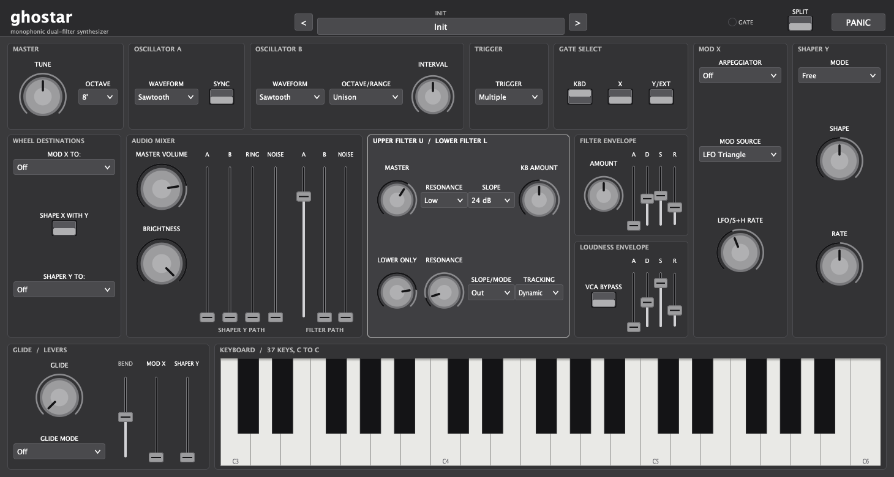

# Ghostar

A circuit-modelled monophonic dual-filter analog synthesizer, built as a
self-contained JUCE project: VST3, Audio Unit and Standalone, universal
`arm64`/`x86_64` on macOS, plus Linux and Windows builds.



Start with the [user guide](Docs/USER_GUIDE.md), see
[customer-facing changes](CHANGELOG.md) and
[privacy information](PRIVACY.md); framework licensing is described in
[third-party notices](THIRD_PARTY_NOTICES.md). Ghostar is at version 0.9.0: a
complete instrument whose remaining voiced constants are named, each with the
evidence that would close it.

Ghostar models the voice architecture of a 1983 monophonic analog synthesizer
— the Crumar Spirit, designed by Jim Scott, Tom Rhea and Bob Moog — block by
block: two bandlimited oscillators with one-directional hard sync and the
panel's exact duty-cycle sets, a triangle-cross ring modulator with its
AC-coupled A carrier and internal null trim, an MM5837 maximal-PRBS noise source at an explicit
75 kHz nominal clock through the service schematic's complete RC/1458
colouring network, and the
signature **series dual filter** — a lower multimode section (parametric boost,
inter-filter overdrive, resonant highpass, or out) sliding against a
12/24 dB upper lowpass, with the frozen-formant tracking mode — feeding two
parallel audio paths with independent VCAs. Modulation is the instrument's
own: MOD X (LFO, patterned and random sample-and-hold, red-noise drift,
Osc B) with the RIPPLE/ARPEGGIO/LEAP arpeggiator, and the SHAPER Y
variable-rate integrator with its four gate modes, both routed through
performance wheels to the panel's destination sets. It is an independent
original implementation, not affiliated with or licensed by Crumar or its
successors, and contains no firmware, ROM data, samples or captured audio.

The hardware shipped no presets: its manual taught eleven **Sound Charts**
instead, drawn panel settings with a lesson attached. Those charts are the
first half of Ghostar's program bank — from the deliberately silent
Preparatory Pattern the lessons all start from, through Fat Filter, Sync and
Sample & Hold, to the Inverted Guitar — behind an Init program that is the
default voice itself. The second half is **seventeen Ghostar Programs**:
playable voicings that make no historical claim, each foregrounding one
mechanism the instrument is known for. Each is gesture- and gain-checked for
audibility, headroom and clipping. Selecting any program writes the whole
panel, so every one is readable as well as playable
([user guide](Docs/USER_GUIDE.md)).

What is modelled from documentation, what is *derived* from it, and what
remains a voiced choice is set out control by control in the
[circuit-modelling research and implementation contract](Docs/circuit-modelling-research.md).
The character-defining control laws are increasingly derived rather than
invented: the resonance curve from the CEM3350's Q scale and panel network,
envelope timing from the 556 circuit, and keyboard tracking from the CV
ladder. The controlled-Upper high-Q limiter now solves its resolved
BA130/TL082/1 nF feedback network implicitly; the fixed Upper stays linear.
Both halves advance in one coupled solve so SLOPE moves the real 1 nF timing
capacitor with retained charge, applies the 1 MΩ 12 dB state bleed and keeps
the tied CEM-input and 101/201 output-gain laws.
Lower now solves all three unbuffered mixer sliders, their 220 kΩ/68 pF arms,
both moving CEM states and the traced C33/BA130 loop together. P1014's unequal
CEM3340 waveform swings and DC offsets survive into both mixers and OSC-B
modulation instead of being normalised away. The current-driven X wheel and
voltage-fed Y wheel retain their opposing loaded travels and each selector
position's distinct pitch/filter depth, at control and audio rate. OVERDRIVE
solves the traced IC12A/BA130 scalar and an explicitly conditional
A3+B7+C10 C34 network from the Lower VLP state; installed-switch continuity
must still resolve that hypothesis and the other RS7 assignments.
The output stage preserves the
hardware's less-obvious details too: an asymmetric 2.56/97.44 Shaper extreme,
the post-VCA passive BRIGHTNESS network, and the normalled rear jack's
frequency-dependent wiper cross-loading. Every constant still voiced is listed as a
standing research task with an explicit evidence gap in
[open questions](Docs/open-questions.md), and the field Ghostar competes in,
its audited standing and the ordered work that closes the gap live in the
[best-in-class plan](Docs/best-in-class-plan.md) — where the alias audit's
worst-case table, the zipper audit's per-travel table, and the reasoning
behind each are quoted in full.

The committed demonstration audio in [Docs/audio](Docs/audio/README.md) is
rendered by `GhostarRenderDemos` from the same engine, so it cannot drift from
what Ghostar actually sounds like.

## Building

The JUCE-free DSP core, tests and demo renderer:

```sh
cmake -S . -B build-dsp -DCMAKE_BUILD_TYPE=Release \
  -DGHOSTAR_BUILD_PLUGIN=OFF -DBUILD_TESTING=ON
cmake --build build-dsp --parallel
ctest --test-dir build-dsp --output-on-failure
./build-dsp/GhostarRenderDemos Docs/audio
```

The same build produces the two measurement tools whose tables the
best-in-class plan quotes — `GhostarAliasAudit` (worst-case aliasing against
a 16x ground truth) and `GhostarZipperAudit` (block-latching residual per
published travel). Both take several minutes at full length; `--smoke` runs
the short version CI uses.

The full plug-in (JUCE 8.0.14 is fetched pinned to its release commit, or
pass `-DGHOSTAR_JUCE_PATH=/path/to/JUCE`):

```sh
cmake -S . -B build -DCMAKE_BUILD_TYPE=Release -DBUILD_TESTING=ON
cmake --build build --parallel
ctest --test-dir build --output-on-failure
```

On macOS, `./scripts/build-macos.sh` drives the same build through Xcode as
a universal binary and renders the committed editor screenshot while the
suite runs.
