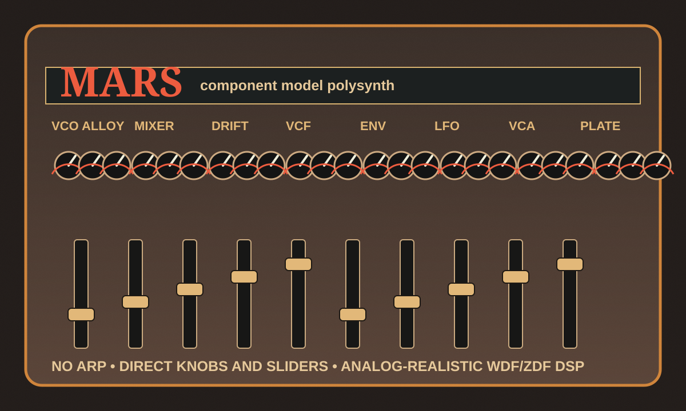

# Mars



Mars is an original vintage-style polyphonic synthesizer plug-in for macOS. It is inspired by the musical priorities of late-1970s and early-1980s polysynths—wide dual oscillators, lively voice cards, sweet ensemble spread, and playable filters—without cloning the panel, circuit, preset list, or identity of any classic instrument.

Mars deliberately has **no arpeggiator** and **no modulation matrix**. Every exposed parameter is a direct knob, slider, or switch so the instrument behaves like a hands-on hardware synth.

## Sound design brief

Mars combines the best traits of several vintage families into a new instrument concept:

- **Jupiter-like authority**: broad oscillators, stable but animated tuning, and polished stereo presence.
- **Juno-like immediacy**: simple controls, fast programming, and sweet one-slider performance changes.
- **Oberheim-like openness**: SEM-flavored state-variable color, wide voice-card offsets, and organic panning.
- **Mars identity**: oscillator-alloy switches, fifth stack mode, component-age drift, and a darker plate bloom that makes the synth feel like an imaginary boutique flagship rather than a replica.

## Analog modeling approach

The research summary is in [Docs/analog-modeling-research.md](Docs/analog-modeling-research.md). Mars chooses a CPU-conscious hybrid: band-limited oscillators, per-voice component variation, nonlinear mixer/VCA stages, and TPT/ZDF filter structures with WDF-inspired component parameters. This avoids the cost of full SPICE transient solving while retaining the audible behavior that matters for a playable polyphonic synth: stable resonance, smooth modulation, oscillator beating, drive, leakage, and voice-to-voice tolerances.

## Controls

| Section | Controls |
| --- | --- |
| Oscillator alloy | `Saturn` / `Phobos` switch for two calibrated oscillator-card characters |
| Voice mode | `Single`, `Stack`, or `Fifth`; no arpeggiator |
| Drift mode | `Free` or `Locked` component-drift behavior |
| Filter type | `Ladder`, `SVF`, or `Poles` color switch |
| Stack depth | Slider controlling the number of independent voice cards in stack modes |
| Knobs | Osc 2 blend, filter resonance, LFO vibrato, component age, stereo width, circuit drive, plate bloom, output |

## Build products

The project builds three products from one JUCE codebase:

- VST3 instrument for hosts such as Ableton Live, REAPER, Cubase, and Bitwig
- Audio Unit v2 music device for Logic Pro and GarageBand
- Standalone application for direct MIDI-keyboard testing

## Requirements

- macOS 11 or newer for running the built products
- A current full Xcode installation selected for command-line use
- CMake 3.22 or newer
- Git and internet access for the default first configure, or a local JUCE 8.0.14 checkout supplied with `MARS_JUCE_PATH`

JUCE 8.0.14 is fetched at configure time and is not vendored into this repository.

## Build on macOS

```bash
./scripts/build-macos.sh
```

Equivalent commands:

```bash
cmake -S . -B build-macos -G Xcode \
  "-DCMAKE_OSX_ARCHITECTURES=arm64;x86_64" \
  -DCMAKE_OSX_DEPLOYMENT_TARGET=11.0 \
  -DMARS_BUILD_UNIVERSAL=ON \
  -DMARS_BUILD_PLUGIN=ON \
  -DBUILD_TESTING=ON

cmake --build build-macos --config Release --parallel
ctest --test-dir build-macos -C Release --output-on-failure
open build-macos/Mars.xcodeproj
```

To avoid the FetchContent download, point the configure at a local checkout of the exact JUCE release:

```bash
JUCE_PATH="$HOME/SDKs/JUCE-8.0.14" ./scripts/build-macos.sh
```

The Release bundles are written to:

| Format | Build artifact |
| --- | --- |
| VST3 | `build-macos/Mars_artefacts/Release/VST3/Mars.vst3` |
| Audio Unit | `build-macos/Mars_artefacts/Release/AU/Mars.component` |
| Standalone | `build-macos/Mars_artefacts/Release/Standalone/Mars.app` |

## Run DSP tests without JUCE

```bash
cmake -S . -B build-dsp \
  -DMARS_BUILD_PLUGIN=OFF \
  -DBUILD_TESTING=ON
cmake --build build-dsp --parallel
ctest --test-dir build-dsp --output-on-failure
```

## Install locally

```bash
mkdir -p "$HOME/Library/Audio/Plug-Ins/VST3"
mkdir -p "$HOME/Library/Audio/Plug-Ins/Components"

ditto build-macos/Mars_artefacts/Release/VST3/Mars.vst3 \
  "$HOME/Library/Audio/Plug-Ins/VST3/Mars.vst3"
ditto build-macos/Mars_artefacts/Release/AU/Mars.component \
  "$HOME/Library/Audio/Plug-Ins/Components/Mars.component"
```

## Validate the plug-in

```bash
auval -v aumu Mar1 Mars
```

```bash
/Applications/pluginval.app/Contents/MacOS/pluginval \
  --strictness-level 10 \
  "$HOME/Library/Audio/Plug-Ins/VST3/Mars.vst3"
```

## Sign, package, and notarize

```bash
./scripts/sign-and-package-macos.sh
```

For public distribution, set Developer ID identities and notarization credentials before running the packaging helper. The placeholder bundle identifier and four-character manufacturer/plugin codes must be replaced with identifiers controlled by the publisher before release.

## Project layout

```text
Assets/                  Vintage panel concept art
Docs/                    Research and design notes
Source/DSP/              JUCE-free synthesis engine
Source/PluginProcessor.* MIDI, parameters, state, and audio bridge
Source/PluginEditor.*    Keyboard and direct-control editor UI
Tests/                   Standalone DSP regression tests
Presets/                 Preset guidance and future factory presets
scripts/                 macOS build and release helpers
```

## Licensing

The original Mars source is offered under the MIT License. JUCE is a separate dependency and is **not** covered by that license. JUCE 8 framework modules are available under the AGPLv3 or a commercial JUCE licence.
