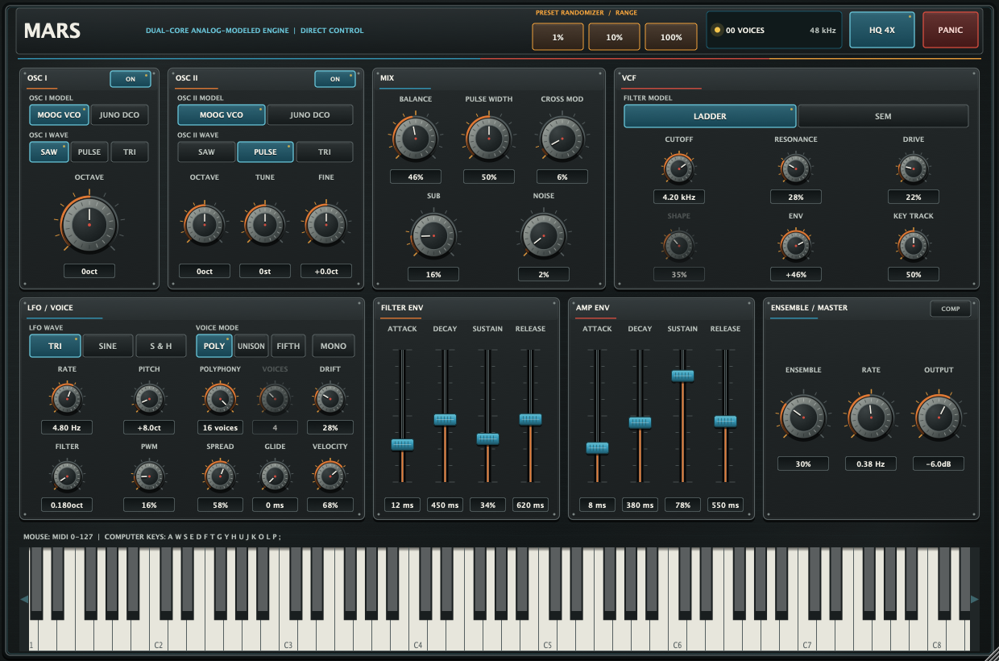

# Mars

Mars is an original virtual-analog polyphonic synthesizer built around a direct,
one-panel workflow. Each oscillator can independently switch between a
Moog-like free-running VCO and a Juno-like clocked DCO. Mars combines those
cores with controlled voice-to-voice movement, a published nonlinear
Moog-ladder model, an SEM-inspired multimode filter, and a global stereo
ensemble. The individual models have named research and hardware references;
Mars does not claim to be a complete clone of any one vintage instrument.

There is **no arpeggiator** and **no modulation matrix**. Every sound parameter
is exposed as a front-panel knob, slider, or switch and as a host-automatable
parameter. The separate HQ oversampling switch is persisted with the plug-in
state but intentionally cannot be automated.



The screenshot is rendered by the actual minimum-size JUCE editor in the
plug-in regression suite; the Standalone, VST3, and Audio Unit use that same
resizable component. Panel materials,
hardware pots, faders, switches, calibration marks, and shadows are drawn as
resolution-independent JUCE graphics, so the background and controls scale
together. Interactive controls remain native components for automation,
keyboard operation, and accessibility. The graphite-and-ivory chassis, orange
signal markings, cyan controls, and restrained red accents nod to early-1980s
Japanese polysynths without reproducing a branded hardware panel.

> **Just want to try it?** The scheduled Nightly workflow publishes the latest
> successful universal build from `main` to the rolling
> [nightly release](https://github.com/voho/vst-instruments/releases/tag/nightly).
> The bundles are ad-hoc signed and not notarized; check the repository's Nightly
> badge for the latest workflow result.

## Sound architecture

- **Two independently modeled oscillators per render slot:** `Moog-like VCO`
  keeps a free-running fundamental with deterministic component calibration and
  seeded, non-periodic thermal wander. Its saw pairs the paper's four-sample
  integrated third-order B-spline PolyBLEP with the matching frequency-dependent
  first-order contour fitted to measured Minimoog Voyager waveforms, remapped
  from 44.1 kHz to the active internal rate. `Juno-like DCO`
  follows the JUNO-106 chain: an 8 MHz master is range-divided to 1, 2, or
  4 MHz, an 8253-style timer holds one integer divisor until the next control
  write and terminal count, and an event-driven MC5534A surrogate generates
  audio. The roughly 4.2 ms control scan holds pitch current and PWM voltage;
  there is no invented adjacent-count dithering. The MC5534A path uses a 12 V
  Miller ramp, finite reset recovery and charge injection, a held-threshold PWM
  comparator with asymmetric output slew, and rate-invariant reconstruction.
  Its sub path is divider-locked to oscillator I's selected clock period. Saw
  reset, both pulse edges, the triangle's square driver, and the derived DCO sub
  all use the same
  fractional-event, four-sample integrated B-spline correction. The LFO runs
  inside the HQ island, and comparator moves that cross the current ramp add
  their own correction instead of becoming untracked PWM steps. All three
  waveform states stay warm and crossfade for 3 ms. VCO and DCO own separate
  clocks; a 2 ms audio crossfade seeds the destination phase, then lets both
  advance at their physical rates during the transition. At a settled endpoint
  the inactive analogue oscillator core is frozen. Triangle remains
  an explicit Mars extension because the MC5534A exposes saw, pulse, and sub,
  not triangle. Each oscillator selects its model independently, so hybrid
  VCO/DCO patches are possible.
- **Independent oscillator mixer switches:** each oscillator can be removed
  from the audible mix without stopping its phase. Oscillator II therefore
  remains available to cross modulation while its audio switch is Off, and
  sub/noise remain independent.
  A lone enabled oscillator runs at unity regardless of `Balance`; changes use
  a short gain ramp rather than a hard sample edge. Oscillator II has octave,
  semitone, and fine tuning, while the mixer adds pulse width, a pulse sub
  oscillator one octave below oscillator I, noise, and bounded II-to-I cross
  modulation.
- **Antialiased nonlinear mixer:** the active oscillator feeds, sub, and noise
  pass through a fixed first-order ADAA soft saturator. This reduces waveshaper
  aliasing without coupling the filter's `Drive` control into multiple stages.
- **Two filter models:** `Ladder` uses a bounded, residual-decreasing damped
  Newton solution of the original implicit bilinear four-stage transistor-
  ladder equations described by D'Angelo and Valimaki. A differential-pair
  nonlinearity remains inside every stage; feedback has no artificial sample
  delay, no state above the documented equation-residual ceiling is committed,
  the full 20 kHz control range remains stable, and `(1 + k)` DC-gain
  compensation restores the severe low-band loss that otherwise accompanies
  rising resonance. `SEM` is a
  nonlinear, two-integrator TPT state-variable design inspired by the Oberheim
  topology; `Filter shape` sweeps low-pass through notch to high-pass. A 3 ms
  transition runs both models to prevent switching clicks; at steady state the
  voice executes only the selected algorithm.
- **Configurable rate-aware oversampling:** HQ is persisted, non-automatable,
  and On by default. At standard production rates it holds the complete
  nonlinear voice, ensemble, VCA, and output-colour island at a minimum
  176.4 kHz: 4x at 44.1/48 kHz, 2x at 88.2/96 kHz, and native at 176.4 kHz
  and above. Each 2:1 return stage is a
  137-tap equiripple half-band FIR with less than 0.0002 dB passband ripple and
  more than 100 dB stopband rejection. The staged path reports 51 host samples
  of latency at 4x and 34 at 2x. The host latency remains fixed for the prepared
  sample rate; when HQ is Off, a transparent bounded delay aligns its native
  path to that contract. A requested change waits until the engine is idle, so
  held notes are never reset.
- **Deterministic voice cards:** 16 render voices carry controlled
  component-like offsets for tuning, cutoff, resonance, drive, envelope time,
  pan, and pulse skew. Two bounded seeded Ornstein-Uhlenbeck processes retain
  continuous slow/fast pitch wander on each card through notes and silence
  instead of restarting a repeating sine with every note. The same state and
  MIDI input render deterministically; there is no simulated-parts-wear control.
- **Dedicated modulation:** separate filter and amplifier ADSRs sit beside a
  triangle, sine, or sample-and-hold LFO with direct pitch, filter, and PWM
  depths. The mod wheel deepens those fixed LFO routes; it does not open a
  hidden routing matrix.
- **Bounded performance controls:** a host-automatable `Polyphony` control caps
  active DSP render voices from 1 to 16 and is enforced immediately when
  lowered. `Poly`, `Unison`, and `Fifth` consume that physical budget in
  different group sizes. The separate `Mono` override uses one continuous
  voice with last-note priority, legato phase/envelopes, glide, held-note
  fallback, overlapping same-pitch hold counts, seamless conversion of held
  layered notes, and fresh-envelope retrigger after the final physical key is
  released. Velocity response, stereo spread, fixed ±2-semitone pitch bend,
  MIDI CC 1 mod wheel, and MIDI CC 64 sustain are implemented. CC 123 follows
  note-off and sustain-pedal semantics; CC 120 and Panic mute immediately.
- **Safe preset mutation:** `1%`, `10%`, and `100%` randomizer buttons move each
  sound-design parameter toward an independent legal target in normalized
  space. One and ten percent are bounded mutations of the current patch; 100%
  is a full-range draw. Output gain, oscillator power, HQ quality, Mono, and
  the polyphony budget are deliberately preserved.
- **Full-range on-screen keyboard:** all MIDI notes 0–127 are reachable with
  scroll controls; key width follows the editor size so the keyboard does not
  terminate in an unused blank panel. The computer-key map is printed on the
  panel.
- **Global stereo ensemble:** two complementary variable-clock BBD paths replace
  a generic interpolated chorus. Each path stores the 128 signal-bearing pairs
  of a two-phase 256-stage device, uses the
  measured Juno-60 fifth-order input/output-filter poles and residues, retains
  the measured +2.3 dB reference gain after a provisionally fitted charge-loss
  curve, and is
  clocked from 26–74 kHz by an antiphase triangle LFO. An O(1) rolling history
  follows clock-dependent charge retention, a BBD-rate pole captures incomplete
  transfer, and independently seeded event noise sits inside each wet line.
  Imperfect cancellation of the MN3009's complementary outputs produces a
  fractional, two-phase clock-feedthrough residue before the physical output
  filter; it is faded before low-rate Nyquist folding. This runs inside the HQ
  island and does not use a fractional-delay read pointer. Clock crossings use
  fractional-time input capture and time-weighted held-output integration, so
  HQ-Off operation does not shift several buckets with one quantized sample.
  `Ensemble mix` and `Ensemble rate` remain direct modern controls. The `COMP`
  switch adds a nominal-gain-matched, click-smoothed NE570-style
  compressor/expander around the BBD as an explicitly non-Juno studio option;
  authentic mode leaves it Off.
  Parasitics fade only after the signal and complete BBD tail disappear, then
  snap to digital zero so hosts can suspend the instrument. A 1.5 Hz output
  servo removes accumulated DC
  without thinning deep notes and sub-octave fundamentals. Mars reports a
  conservative 24-second host tail so maximum-release notes are not truncated
  during offline rendering.

The modeling rationale, primary papers, neural-modeling decision, and precise
claims boundary are in
[`Docs/analog-modeling-research.md`](Docs/analog-modeling-research.md).

## Polyphony, Mono, and slot allocation

Mars owns 16 fixed DSP render slots, and `Polyphony` sets the active physical
budget `L` from 1 to 16. Lowering `L` retires complete groups immediately, so
the audio thread cannot continue above the requested CPU budget. Allocation
depends on `Voice mode`:

| Mode | Slots per note group | Maximum simultaneous groups |
| --- | ---: | ---: |
| `Poly` | 1 | `L` |
| `Unison` | `min(Unison voices, L)`, normally 2–8 | `floor(L / layers)` |
| `Fifth` | `min(2, L)`: root plus fifth when available | `floor(L / layers)` |
| `Mono` override | 1 continuous voice | 1 |

When a new polyphonic group needs room, Mars searches complete released groups
first, then active groups, selecting the lowest current envelope/output energy
from an 8 ms output-power average and using the oldest generation as a
deterministic tie-breaker. A 15 ms attack guard prevents a newly played
articulation from disappearing before it speaks.
Every layer in the selected group is removed together. Retriggers and steals
preserve a fixed 2 ms fading tail to avoid a hard sample discontinuity.
`Unison voices` is active only in
`Unison`; `Mono` overrides all three polyphonic allocation modes without
changing their stored/automated value.

## Exact 48-parameter contract

| Section | Front-panel controls (parameter IDs) |
| --- | --- |
| Oscillator I | Model: Moog-like VCO / Juno-like DCO (`osc1Model`), mixer feed On/Off (`osc1Enabled`), waveform (`osc1Wave`), octave (`osc1Octave`) |
| Oscillator II | Model: Moog-like VCO / Juno-like DCO (`osc2Model`), mixer feed On/Off (`osc2Enabled`), waveform (`osc2Wave`), octave (`osc2Octave`), tune (`osc2Tune`), fine tune (`osc2Fine`) |
| Mixer | Oscillator balance (`oscMix`), pulse width (`pulseWidth`), sub level (`subLevel`), noise level (`noiseLevel`), cross modulation (`crossMod`) |
| Filter | Model: `Ladder` / `SEM` (`filterModel`), cutoff (`cutoff`), resonance (`resonance`), drive (`filterDrive`), SEM shape (`filterShape`), envelope amount (`filterEnvAmount`), key tracking (`keyTrack`) |
| Filter envelope | Attack (`fAttack`), decay (`fDecay`), sustain (`fSustain`), release (`fRelease`) |
| Amplifier envelope | Attack (`aAttack`), decay (`aDecay`), sustain (`aSustain`), release (`aRelease`) |
| LFO | Waveform: triangle / sine / sample & hold (`lfoWave`), rate (`lfoRate`), pitch depth (`lfoPitch`), filter depth (`lfoFilter`), PWM depth (`lfoPwm`) |
| Voice | Mode: `Poly` / `Unison` / `Fifth` (`voiceMode`), Mono override (`monoMode`), physical render-voice ceiling 1–16 (`polyphonyLimit`), unison voices (`unisonVoices`), voice-card drift (`drift`), stereo spread (`spread`), glide time (`glide`), velocity response (`velocity`) |
| Output | Ensemble mix (`chorusMix`), ensemble rate (`chorusRate`), non-Juno studio compander (`chorusCompander`), output level (`output`) |
| Quality | HQ oversampling (`hqOversampling`): persisted, non-automatable, default On |

These are the complete host parameter IDs for version 1.5: 47 automatable sound
and performance controls plus one persisted quality setting. The original 40
IDs retain their order and version hint; `osc1Enabled` and `osc2Enabled` remain
the version-2 additions, and non-automatable `hqOversampling` retains version
hint 3. `osc1Model`, `osc2Model`, `polyphonyLimit`, and `monoMode` are appended
with version hint 4. `chorusCompander` is appended with version hint 5 and
defaults Off, so every previously shipped host parameter keeps its index and
normalized meaning. Legacy states default both models to Moog-like VCO,
polyphony to 16, Mono and the non-Juno compander to Off, both mixer switches to
On, and HQ to On. The three
randomizer buttons are commands rather than host parameters; there are no
hidden sound controls behind a matrix or alternate panel.

## Build products

One JUCE codebase produces:

- VST3 instrument;
- Audio Unit v2 music device on macOS; and
- standalone application.

## Requirements

- macOS 11 or newer for the supported release bundles;
- a current full Xcode installation selected for command-line use;
- CMake 3.22 or newer; and
- internet access on first configure, or a local JUCE 8.0.14 checkout supplied
  through `JUCE_PATH` to the helper (`MARS_JUCE_PATH` at the CMake layer).

JUCE 8.0.14 is pinned to an immutable release archive and checksum. It is not
vendored into the repository.

## Build on macOS

From the `mars` directory:

```bash
./scripts/build-macos.sh
```

Use a local JUCE checkout without a FetchContent download:

```bash
JUCE_PATH="$HOME/SDKs/JUCE-8.0.14" ./scripts/build-macos.sh
```

The helper configures an Xcode project, builds universal `arm64` + `x86_64`
Release products by default, runs the CTest suite, and ad-hoc signs and strictly
verifies the local VST3, AU, and standalone bundles. Set
`BUILD_UNIVERSAL=OFF` for a faster native-architecture development build.

Equivalent configure, build, test, and local-signing commands:

```bash
cmake -S . -B build-macos -G Xcode \
  "-DCMAKE_OSX_ARCHITECTURES=arm64;x86_64" \
  -DCMAKE_OSX_DEPLOYMENT_TARGET=11.0 \
  -DMARS_BUILD_UNIVERSAL=ON \
  -DMARS_BUILD_PLUGIN=ON \
  -DBUILD_TESTING=ON

cmake --build build-macos --config Release --parallel
ctest --test-dir build-macos -C Release --output-on-failure

for bundle in \
  build-macos/Mars_artefacts/Release/VST3/Mars.vst3 \
  build-macos/Mars_artefacts/Release/AU/Mars.component \
  build-macos/Mars_artefacts/Release/Standalone/Mars.app; do
  codesign --force --sign - "$bundle"
  codesign --verify --deep --strict "$bundle"
done
```

| Format | Release artifact |
| --- | --- |
| VST3 | `build-macos/Mars_artefacts/Release/VST3/Mars.vst3` |
| Audio Unit | `build-macos/Mars_artefacts/Release/AU/Mars.component` |
| Standalone | `build-macos/Mars_artefacts/Release/Standalone/Mars.app` |

## JUCE-free DSP build

The synthesis engine and its regression suite do not depend on JUCE:

```bash
cmake -S . -B build-dsp \
  -DCMAKE_BUILD_TYPE=Release \
  -DMARS_BUILD_PLUGIN=OFF \
  -DBUILD_TESTING=ON
cmake --build build-dsp --parallel
ctest --test-dir build-dsp --output-on-failure
```

The DSP tests cover rates through 384 kHz, finite output, release completion,
deep-note and long-triangle stability, deterministic rendering, distinct
VCO/DCO outputs, source-matched VCO saw contour, DCO clock/divider behavior,
held 8253 divisors across the 1/2/4 MHz ranges,
phase-continuous oscillator-model changes, oscillator and filter responses,
the 137-tap return filter's coefficient symmetry, ripple, >100 dB stopband,
exact 34/51-sample latency, the clocked BBD's N/(2*fClock) delay, fractional
multi-crossing capture and +2.3 dB gain, moving-PWM correction, measured
clock-dependent charge retention, deterministic gated feedthrough/noise,
paired compander laws,
high-note oscillator alias suppression, the Ladder's full cutoff range,
bass-gain compensation, and implicit-equation residual/state error against an
independent double-precision reference. They also cover an adversarial ladder
control jump, mixer isolation and clickless switching, cross modulation with
oscillator II's audio feed disabled, deferred HQ changes including large host
blocks, meaningful glide and modulation, dynamic physical-voice limits, Mono
mode-transition, duplicate-hold, legato/fallback/retrigger semantics,
voice-mode allocation, and a CPU guardrail. Plug-in builds additionally test
the 48-parameter order/default/text contract, legacy migration, all randomizer
strengths and safety exclusions, MIDI, state, and editor rendering.

## Install and validate locally

```bash
mkdir -p "$HOME/Library/Audio/Plug-Ins/VST3"
mkdir -p "$HOME/Library/Audio/Plug-Ins/Components"

ditto build-macos/Mars_artefacts/Release/VST3/Mars.vst3 \
  "$HOME/Library/Audio/Plug-Ins/VST3/Mars.vst3"
ditto build-macos/Mars_artefacts/Release/AU/Mars.component \
  "$HOME/Library/Audio/Plug-Ins/Components/Mars.component"
```

Validate the Audio Unit (`aumu`, subtype `Mar1`, manufacturer `Mars`):

```bash
auval -v aumu Mar1 Mars
```

Validate the VST3 with pluginval if it is installed:

```bash
/Applications/pluginval.app/Contents/MacOS/pluginval \
  --strictness-level 10 \
  "$HOME/Library/Audio/Plug-Ins/VST3/Mars.vst3"
```

## Sign, package and notarize

Build first, then run:

```bash
./scripts/sign-and-package-macos.sh
```

With no environment overrides the helper ad-hoc signs the VST3, AU, and app,
then writes a ZIP and unsigned installer package under `build-macos/dist`. The
filename records the architectures actually present (`universal`, `arm64`, or
`x86_64`) so a native development build cannot be mislabeled.
The helper derives its version from the three bundle property lists, rejects a
conflicting `VERSION` override, and includes the Mars license, third-party
notices, and pinned JUCE dual-license notice in the installer tree and inside
each signed bundle.
For distribution, provide `APP_SIGN_IDENTITY`, `INSTALLER_SIGN_IDENTITY`, and
optionally a `NOTARY_PROFILE` created for `xcrun notarytool`. Replace the sample
bundle identifier and manufacturer/plugin codes with identifiers
controlled by the publisher before shipping public binaries.

With `NOTARY_PROFILE` set, the helper submits and staples the installer package.
The ZIP still contains signed bundles but is not itself the notarized
distribution artifact.

## Project layout

```text
Docs/                    Real interface screenshots, research, and modeling decisions
Source/DSP/              JUCE-free synthesis engine
Source/PluginProcessor.* MIDI, automation, state, and engine bridge
Source/PluginEditor.*    Resizable direct-control hardware panel
Tests/                   DSP and plug-in regression checks
Presets/                 Original sound-design recipes
scripts/                 macOS build and distribution helpers
```

## Licensing

The original Mars source is offered under the MIT License. JUCE is a separate
dependency and is **not** covered by that license. JUCE 8 is available under
AGPLv3 or a commercial JUCE licence; confirm the applicable terms before
distributing binaries. In particular, a publisher must establish its own JUCE
commercial or AGPLv3 distribution basis; bundling the notice does not grant or
replace that licence.
