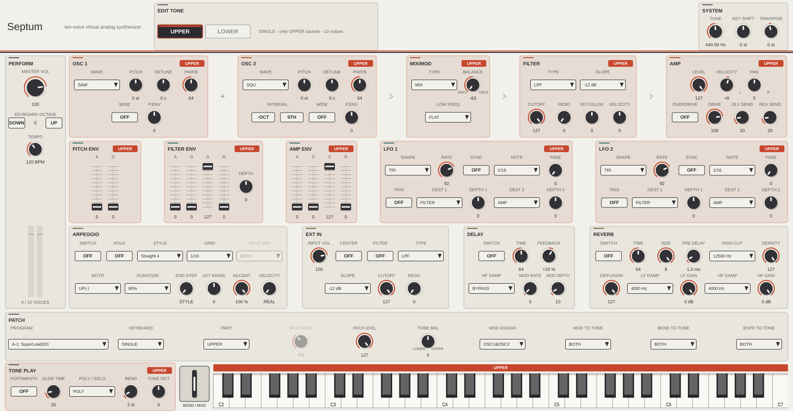

# Septum

A ten-voice virtual-analog synthesizer, built as a self-contained JUCE
project: VST3 and Standalone for macOS, Linux and Windows, plus Audio Unit on
macOS.

Septum models the voice architecture of the Roland SH-201 (2006) block by
block from Roland's own published documents: the owner's manual, the MIDI
implementation's complete parameter address map, and the service notes' block
and circuit diagrams. It is an independent original implementation, not
affiliated with or licensed by Roland Corporation, and contains no firmware,
ROM data, samples, captured audio, or factory patch data. Its panel follows
the modelled instrument's functional layout with independent branding and
project-drawn controls.

The name is Latin twice over: *septum*, a dividing wall, for the two tones —
UPPER and LOWER — that partition every patch; and *septem*, seven, for the
seven detuned sawtooth oscillators that give the instrument its signature
voice.

> **Listen first.** Eleven [rendered demonstrations](Docs/audio/README.md)
> cover the seven-saw SUPER SAW and its spread curve, FB OSC feedback, the
> −24 dB filter into self-oscillation, oscillator sync, ring modulation, PWM
> strings through the chorus delay template, S&H effects, DUAL-mode pads and
> the arpeggiator — each matched to an official real-unit recording for
> by-ear comparison.



## Reading the panel

One patch holds **two complete tones**, UPPER and LOWER, and the panel edits
one of them at a time. That is the single thing worth knowing before touching
anything, so the panel says it in three places at once:

- **EDIT TONE**, at the top of the header, above every control it governs. The
  lit tab is the tone the panel is showing, and the line beside it says what
  the current keyboard mode does with that tone — `DUAL - both tones layered -
  5 voices each`, or `LOWER IS SILENT - SINGLE - only UPPER sounds`.
- **Every per-tone section wears the tone's name on its own title row**, in
  the tone's own colour: warm for UPPER, cool for LOWER. Switching the tab
  repaints that whole half of the panel, and a knob's meaning never depends on
  a control at the other end of it. A hollow grey chip means the tone is being
  edited but the keyboard mode is not letting it sound.
- **Sections with no chip are shared by the patch** — ARPEGGIO, EXT IN, DELAY,
  REVERB, PATCH, SYSTEM and the performance cluster. There are no mixed
  sections: every control belongs to one tone or to the whole instrument, the
  same line the parameter contract draws between the Patch Tone blocks and
  Patch Common.

The band above the keys says which tone each key reaches — one colour in
SINGLE, two stripes in DUAL, and in SPLIT the two zones with the split point
drawn where it actually falls. Three other controls also read UPPER/LOWER and
mean neither of those things: **PART** picks the tone SINGLE plays, **TONE
BAL** crossfades between them, and **MOD/BEND/EXPR TO TONE** name which tone
each physical controller reaches. Controls the current keyboard mode ignores
are dimmed rather than left looking live.

The rest of the panel is laid out so the signal path reads off it: the voice
chain across the top (OSC 1 + OSC 2 → MIX/MOD → FILTER → AMP, with the
connectors drawn in), the modulators beneath it, and the two ends of the
instrument — arpeggiator, external input, delay, reverb — along the bottom.
Every control is the same size wherever it appears and shows its value in the
units the manual prints, so nothing has to be dragged to be read.

## What kind of replica this is

The modelled instrument's sound engine is pure DSP: the service notes show
one Roland custom DSP ("WSP", a Toshiba-fabbed gate array) computing all
synthesis and effects, no PCM wave ROM anywhere in the design, and a
documented analog input/output stage around the codec. A faithful replica is
therefore a *behavioral model of a DSP engine* plus a component-level model
of the analog output path — not an analog circuit simulation. **No hardware
was measured for this project**, so every mechanism carries the evidence it
actually rests on, mechanism by mechanism, in the [research and
implementation contract](Docs/sh201-replica-research.md), whose open questions
each name the measurement that would close them.

Three tiers appear throughout that document and in the inventory below:

- **settled** — a primary Roland document says so.
- **reported** — a published measurement of related hardware, quoted.
- **voiced** — this project's choice, registered in the engine's `mapping`
  namespace and owned by a numbered open question. A voiced constant is one a
  measurement should one day replace; none of them is presented as a fact
  about the instrument.

## What is emulated, and what is not

### Oscillators — two per tone

- **settled.** All nine waveforms in the address map's own order: SAW, SQU,
  PW-SQU, TRI, SINE, NOISE, FB-OSC, SUPER-SAW, EXT-IN. Coarse tune ±36
  semitones, fine tune ±50 cents, one PW/FEEDBACK/SPREAD knob whose meaning
  follows the waveform, per-oscillator pitch-envelope depth ±63. The OSC 2
  INTERVAL buttons are defined against OSC 1, and pressing one twice lands
  OSC 2 on OSC 1's pitch.
- **settled, stored and inert.** PITCH WIDE. The manual says it expands the
  *knob's travel*; a numeric parameter that already reaches ±36 has no travel
  to expand, so it is saved and round-tripped and changes nothing that sounds.
  Like the four D Beam bytes it is published as non-automatable — one rule for
  inert data, not two — so the panel switch still shows and stores what the
  patch holds while no host offers a lane that cannot change what you hear.
- **reported.** SUPER SAW quotes Adam Szabo's JP-8000 measurements verbatim:
  the seven fixed detune offsets, the 11th-degree spread polynomial, phases
  randomised per note, and the pitch-tracked high-pass on the summed stack.
  The SH-201's fixed centre/side mix — it has no MIX knob — is voiced
  (OQ-05), and so is the high-pass's corner and Q (OQ-04); both were taken to
  a listening test and the incumbent was kept.
- **voiced.** FB OSC's mechanism follows the manual's description — "high
  overtones, similar to feedback on a guitar" with one feedback control — as a
  sawtooth into a soft-clipped comb at half the fundamental period. Its four
  loop constants are voiced (OQ-06); the loop's damping is expressed as a
  *time*, so the same patch is the same sound at every host rate. NOISE is
  white until a spectral capture of a real unit closes OQ-03. The pulse-width
  law and its endpoints are voiced under the same question.
- **How it is band-limited.** The classic waves are polyBLEP/polyBLAMP
  band-limited at the host rate. SUPER SAW's saw stack and hard sync's reset
  are deliberately *not*: owners report the instrument's own supersaw
  aliasing, and no source documents band-limiting in its sync.
- **not modelled.** Hard sync does nothing when OSC 1 is SUPER SAW, FB OSC,
  NOISE or EXT-IN. The last two have no cycle to restart; for the first two it
  is a voiced omission, recorded in the contract rather than made silently.

### MIX / MOD

**settled** — TYPE cycles MIX → SYNC → RING, BALANCE crossfades OSC 1 against
OSC 2 with the ring product replacing the OSC 1 leg, and LOW FREQ is
CUT/FLAT/BOOST. **voiced (OQ-07)** — the crossfade law and the low shelf's
corner and gain.

### Filter

**settled behaviour** — LPF/HPF/BPF/BYPASS at −12 or −24 dB per octave; KEY
FOLLOW −200…+200 in the documented steps of ten, pivoting at C4, with +100
tracking 1:1 per the manual's own diagram; resonance reaching the sustained,
bounded self-oscillation the manual warns about. **voiced (OQ-08)** — the
knob-to-Hz curve, the −24 dB path's second stage (fixed and non-resonant
here), the envelope and velocity depths, and the resonance-to-Q taper, whose
shape between two settled endpoints was **chosen by ear** in a documented
listening test. TYPE and SLOPE are crossed rather than switched, so automating
either on a sustaining note does not click.

### Envelopes and LFOs

**settled** — one two-stage pitch envelope per tone with per-oscillator depth,
an ADSR for the filter with its own depth, an ADSR for the amp; two identical
LFOs per tone with all seven shapes (TRI, SIN, SAW, SQR, TRAPEZOID, S&H, RND),
FADE, KEY TRIG, the documented destination lists, ±63 depths that invert the
waveform when negative, and tempo sync against the settled 20-entry note
table. **voiced** — the envelope time tables and segment curvature (OQ-09),
and the LFO rate table and depth scalings (OQ-10).

### AMP and the effects block

**settled** — LEVEL with velocity sensitivity, PAN (L64…63R, centred at 0),
OVERDRIVE as an insertion effect with LEVEL still acting as clean volume, and
a shared block in which the modulation DELAY feeds the REVERB in series with a
per-tone send depth into each. All four damping tables — the delay's 18-entry
HF DAMP, the reverb's 21-entry HIGH CUT and its LF/HF DAMP tables — are
Roland's published frequencies, and each filter built from them turns over at
its own entry. **voiced** — the overdrive's transfer curve (OQ-11: a tanh
clipper under antiderivative anti-aliasing, oversampled so its alias signature
does not depend on the host rate), the delay and reverb time laws and the
reverb's line geometry (OQ-12).

The sixteen settled effect *template names* (Simple Delay … Chorus 2, Room 1 …
Plate 2) exist as voiced parameter sets used to build the shipped programs.
**not modelled:** the panel has no template selector — it exposes the
underlying DELAY and REVERB parameters directly, where the hardware's panel
offers the templates.

### Arpeggiator

**settled** — the 32 × 16 style grid with GRID (shuffled divisions included),
DURATION with tie chains and FUL, all twelve MOTIF values, OCTAVE RANGE,
ACCENT, ARPEGGIO VELOCITY, END STEP, HOLD and SPLIT ARPEGGIO. The motif
mapping reproduces the three worked examples the manual prints, exactly; they
are the test. **voiced (OQ-15)** — the shuffle amounts behind 1/8L…1/16H, the
ACCENT blend, and how a PHRASE style's rows become intervals; the contract
records that the manual's two ACCENT endpoint sentences are reproduced only
when ARPEGGIO VELOCITY is a fixed value.

Roland's 32 factory styles are unpublished data and none ships here — the 16
supplied are original patterns. **not modelled:** the arpeggiator and the
LFOs' tempo sync run from PATCH TEMPO only. There is no host-transport or
MIDI-clock sync, so an arpeggio in a session has to be matched to it by hand.

### External input

**settled** — the rear INPUT jacks with INPUT VOL, CENTER CANCEL and the AUDIO
FILTER: LPF/HPF/BPF/**NOTCH** at −12 or −24 dB, none of it stored in the patch,
exactly as the manual says three times over. The EXT-IN waveform plays the
input through the voice in mono and the direct monitor hands the input over
while it does; the manual's own "sound only when you play the keyboard" recipe
settles that order, and it is a test. **voiced (OQ-14)** — the INPUT VOL taper
and the audio filter's own calibration.

### Voices, keyboard and controllers

**settled** — SINGLE / DUAL / SPLIT with the split point across A0–C8, ten
voices halved to five per tone in DUAL, POLY / SOLO+LEGATO / SOLO, portamento,
pitch bend with a per-tone range, the modulation lever with its documented
assign list, the expression pedal, the hold pedal (CC#64), the sostenuto pedal
(CC#66), and the CONTROLLER DESTINATION for each of them. **voiced (OQ-13)** —
which voice a steal takes: the longest-released, else the oldest sounding.

### MIDI, SysEx and patch storage

**settled** — the control-change map from owner's manual p. 72 for both tones
and the part controllers, including the audio filter's CC#2 and CC#4 and the
printed CC#88 collision resolved to CC#83 as the contract documents; program
change and bank select; the channel-mode messages as the MIDI implementation
separates them (All Sounds Off is a panic, All Notes Off is every key coming
up and leaves what a pedal is holding, Reset All Controllers resets the five
controllers it names); the three Universal Realtime device-control messages,
onto the SYSTEM COMMON parameters the document names for them; and Roland's
documented DT1 System Exclusive framing, which the plug-in **receives** (a
dump sent to it loads the patch) and can **encode** for a host that asks for
it through the API.

**Where the codec is grounded.** Every address, size and range in it is the
MIDI Implementation's Parameter Address Map (v1.00, 2006-03-01, pp. 4–5),
read directly. A patch is the map's 22 blocks — common, the two tones, delay,
reverb, arpeggio common, and one Patch Arpeggio Pattern block per grid row —
at the map's own absolute addresses: Temporary Patch at `10 00 00 00`, User
Patch 001–032 at `20 00 00 00`…`20 1F 00 00`. It ends at offset `00 15 42`,
which is the size the document's own worked RQ1 example asks for, and both of
the finished messages that document prints are test vectors here. `OQ-17`
records what the read corrected, including a tempo encoding that could not
reach the top of its own range and two effect switches that had been sharing
an invented byte. `OQ-18` was the one byte left open — the LFO tempo-sync
switch, which the map prints as `ON, OFF` where all 26 of its other switches
read `OFF, ON` — and it is answered: the reversal is the misprint, and the
switch reads `OFF, ON` like the rest. Roland's own SH-201 Editor binds it to a
latch button that lights on 1, and two of Roland's published demos play
published patches whose LFO carries that byte as 1 and sweeps at the tempo-
synced period it implies.

**not modelled, and what that costs:** RQ1 data requests are rejected and the
plug-in never transmits SysEx of its own, so an Identity Request goes
unanswered. The Active Sensing timeout is deliberately absent: it is a
cable-failure watchdog, and a host that sends one `FE` and then pauses would
have the sound cut out from under it. A received dump restores the whole
parameter surface, the tempo across its full documented 5–300 range, the
arpeggio's settings **and its 32 × 16 grid** — the grid has no plug-in
parameter to live in, so it is kept beside them, plays in place of the
selected template until the style selector is moved, is saved with the
session, and comes back out of a re-export. The one thing a load still drops
is the patch's **name**.

**PATCH REMAIN is not implemented**, and what a program change does to a note
already sounding is a known divergence rather than a choice: the hardware
either cuts those notes or keeps them playing the old sound, depending on that
switch, and this replica does a third thing — the sounding notes take the new
patch's parameters immediately. `OQ-19` records it.

The **64 shipped programs** mirror the instrument's bank layout: 32 original
sounds in the PRESET A-1…D-8 positions and 32 initialised User slots. Roland's
own 64 factory patches are data no public document publishes and none of it
ships here.

### System settings and the output stage

**settled** — SYSTEM COMMON master tune, master key shift, keyboard octave
shift and transpose; and the analog output stage at the service notes'
component values: 22 µF/22 kΩ coupling (0.329 Hz) and the 8.2 kΩ/820 pF and
4.7 kΩ/270 pF RC poles (23.7 kHz, 125.4 kHz), each realised at its own corner
frequency at every host rate, with the 2.5×/2× gain chain normalised to
digital full scale. **not modelled** — the codec's own digital reconstruction
filter, which the host's converters stand in for, and the USB audio topology.

### Hardware the plug-in deliberately does not have

- **The D Beam.** An infrared distance sensor is a control surface, and a
  plug-in has no hand above it. The four Patch Common bytes the beam owns —
  its destination, ACTIVE EXPRESSION, its assign and its polarity — are still
  stored, saved and round-tripped so a dump from a real unit survives the
  trip; they are published as non-automatable and read by nothing that sounds.
  CC#69, the beam's own controller, is accepted and ignored.
- **The step recorder** and **tap tempo**.
- **CLOCK SOURCE**, and with it external MIDI clock: see the arpeggiator
  above.

## Build

Linux/CI (JUCE-free DSP, tests, demo renderer):

```bash
cmake -S . -B build -DCMAKE_BUILD_TYPE=Release -DSEPTUM_BUILD_PLUGIN=OFF -DBUILD_TESTING=ON
cmake --build build --parallel && ctest --test-dir build --output-on-failure
./build/SeptumRenderDemos Docs/audio
```

macOS (full plug-in set):

```bash
./scripts/build-macos.sh
```

The plug-in declares a stereo input bus for the modelled instrument's INPUT
jacks. It is disabled by default, so a host that gives a synthesizer no input
loads Septum unchanged; enable it to feed the AUDIO FILTER and the EXT-IN
waveform.

The full plug-in also builds on Linux and Windows (VST3 + Standalone); CI
exercises all three platforms. A pinned JUCE 8.0.14 is fetched at configure
time, or pass `-DSEPTUM_JUCE_PATH=/path/to/JUCE`.

CI re-renders the committed demo audio from this engine on every run, so it
cannot go stale against a code change, and the renderer aborts rather than
substituting a patch when a demo names one the bank does not have.

## Layout

- `Source/DSP/` — the JUCE-free engine: the parameter contract
  (`SeptumPatch.h`, quoting the documented ranges and tables), the
  engine with every panel-to-physics mapping in one auditable namespace
  (`SeptumEngine.h/.cpp`), the SH-201 SysEx codec (`SeptumSysEx.h/.cpp`), and
  the original preset bank.
- `Source/` — JUCE plug-in processor (APVTS mirroring the parameter
  contract, documented CC map, factory programs) and the panel editor.
- `Tools/RenderDemos.cpp` — renders the committed demo WAVs.
- `Tests/` — engine tests (tuning, enumeration semantics, polyphony rules,
  self-oscillation boundedness, effect tails, SysEx round trips, host-rate
  independence, full-bank rendering at two rates) and plug-in tests (layout,
  MIDI, programs, state, editor snapshot).
- `Docs/` — the research contract, the change log, demo audio, screenshots.

## Licensing

Original code under the MIT license (`LICENSE`). JUCE is used under its own
terms — see `THIRD_PARTY_NOTICES.md`.
