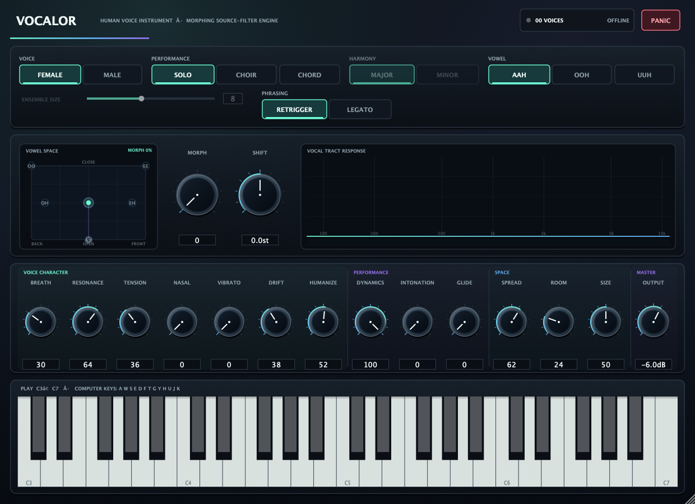

# Vocalor

Vocalor is a real-time vocal instrument for macOS. It turns MIDI notes into
original sung vowels, from a single singer to an ensemble or major/minor chord.
Three preset vowels anchor a **continuous vowel space** that can be morphed,
automated, and played from a draggable pad, and the whole vocal tract can be
lengthened or shortened independently of pitch. The engine is procedural and
runs locally: it does not clone a named singer, load recordings, or contact a
service while rendering audio.

> **Listen first.** Ten [rendered demonstrations](Docs/audio/README.md) cover
> a solo legato phrase, the preset vowels on both voice profiles, the vowel
> space and formant shift on held notes, the twelve-singer ensemble, chord mode
> locking onto just intervals, a choir swelled on the Dynamics control, tension
> and breath closing into a hum, the room at both sizes, and one soprano line
> through the register-aware upper tract. They are rendered by the shipping
> engine, so they cannot drift from what the plug-in does.



The screenshot above was captured from the 1.0 Standalone application and shows
the previous layout. The 1.1 editor added the vowel-space pad, the live
vocal-tract analyser with output meters, and the phrasing and room-geometry
controls; 1.2 added Dynamics, Intonation and Nasal to the same row and regrouped
it into voice character, performance, space and master. 1.3 adds Instability to
that voice-character group. The visual language is unchanged. The repository
screenshot remains the earlier layout; automated editor-rendering tests exercise
the current one. The VST3 and Audio Unit use the same resizable JUCE editor.

The interface remains fully resolution-independent: the layered hardware knobs,
choice states, panel depth, vowel pad, response curve, and complete vocal-range
keyboard are drawn as native JUCE graphics. This keeps labels and interaction
crisp while resizing and avoids bitmap controls that would obscure automation or
focus state.

The project builds three products from one JUCE codebase:

- VST3 instrument for hosts such as Ableton Live, REAPER, Cubase, and Bitwig
- Audio Unit v2 music device for Logic Pro and GarageBand
- Standalone application for direct MIDI-keyboard testing

> **Just want to try it?** The scheduled Nightly workflow publishes the latest
> successful universal build from `main` to the rolling
> [nightly release](https://github.com/voho/vst-instruments/releases/tag/nightly).
> The bundles are ad-hoc signed and not notarized; check the repository's Nightly
> badge for the latest workflow result.

## Interface and controls

Vocalor exposes 24 automatable host parameters. Every parameter keeps its
identifier, range, default, and host ordering, so existing sessions and any
automation written against them recall in place.

**Ensemble size** advertises 2 – 16 but used to quantise to three tiers of 4, 8,
or 12 singers, so ten of its fifteen settings were silently identical to a
neighbour. Every value from 2 to 12 is now rendered exactly. The engine carries
12 singer identities, so 13 – 16 still render 12 — the published range is kept
at 2 – 16 rather than narrowed, because a host stores automation as a normalised
0 – 1 position and renumbering the range would move every existing lane onto a
different singer count.

| Parameter ID | Control | Range | Default | Added |
| --- | --- | --- | --- | --- |
| `profile` | Voice profile | Female / Male | Female | 1.0 |
| `mode` | Performance mode | Solo / Choir / Chord | Solo | 1.0 |
| `vowel` | Vowel anchor | AAH / OOH / UUH | AAH | 1.0 |
| `chordQuality` | Chord quality | Major / Minor | Major | 1.0 |
| `choirSize` | Ensemble size | 2 – 16 (13 – 16 render 12) | 8 | 1.0 |
| `breath` | Breath | 0 – 100 % | 30 % | 1.0 |
| `resonance` | Resonance | 0 – 100 % | 64 % | 1.0 |
| `vibrato` | Vibrato | 0 – 100 % | 38 % | 1.0 |
| `humanize` | Humanize | 0 – 100 % | 52 % | 1.0 |
| `spread` | Stereo spread | 0 – 100 % | 62 % | 1.0 |
| `tension` | Vocal tension | 0 – 100 % | 36 % | 1.0 |
| `room` | Room | 0 – 100 % | 24 % | 1.0 |
| `output` | Output | −24 – +6 dB | −6 dB | 1.0 |
| `legato` | Legato | Off / On | Off | 1.1 |
| `vowelX` | Vowel front-back | 0 – 100 % | 50 % | 1.1 |
| `vowelY` | Vowel open-close | 0 – 100 % | 50 % | 1.1 |
| `vowelMorph` | Vowel morph | 0 – 100 % | 0 % | 1.1 |
| `formantShift` | Formant shift | −12 – +12 st | 0 st | 1.1 |
| `glide` | Glide | 0 – 100 % | 0 % | 1.1 |
| `roomSize` | Room size | 0 – 100 % | 50 % | 1.1 |
| `dynamics` | Dynamics | 0 – 100 % | 100 % | 1.2 |
| `intonation` | Just intonation | 0 – 100 % | 0 % | 1.2 |
| `nasal` | Nasality | 0 – 100 % | 0 % | 1.2 |
| `instability` | Instability | 0 – 100 % | 38 % | 1.3 |

Saved state also carries a hidden voice-model version, not exposed as a host
parameter. A project written before 1.3 restores Instability at 0 % and bypasses
the new automatic register-support gain, so neither the legacy vibrato path nor
the absence of that ±3 dB support law changes on recall; re-saving preserves the
marker. A fresh instance or a newly selected 1.3 factory program uses the
current model. The separately documented LF-source and soprano-tract upgrades
are intentional 1.3 revoicing, not covered by this narrow compatibility switch.

The top row selects the voice profile, the performance mode, the chord quality,
and the vowel anchor. **Ensemble size** renders exactly that many independently
humanised singers, from 2 to 12 — the number of distinct singer identities the
engine models — and Chord renders six singers distributed across the triad.
**Legato** switches between retriggering every note and bending the sounding
voices into the new pitch, with a held-note stack so releasing the top of a
phrase falls back to the note underneath.

The **vowel-space pad** places a morph target anywhere between five cardinal
vowels (front to back on the horizontal axis, close to open on the vertical
axis). **Morph** crossfades from the selected preset vowel to that target, so
at 0 % the pad and its two axes have no effect at all and the vowel anchor
alone decides the tract. **Shift** moves every formant by up to an octave in either
direction without touching the pitch, which is an effective vocal-tract-length
or body-size control; it changes the timbre without doubling as a fader. Next
to the pad, the **vocal-tract response** display draws the live magnitude
response of the five formant resonators of a sounding voice on a logarithmic
axis, marks F1 to F5, and carries the stereo output meters.

Fourteen continuous controls fill the bottom row in four groups. **Voice
character** holds **Breath**, **Resonance**, **Tension**, **Nasal**,
**Vibrato**, **Instability** and **Humanize**; **performance** holds **Dynamics**,
**Intonation** and **Glide**; **space** holds **Spread**, **Room** and room
**Size**; and **master** holds the **Output** level. **Vibrato** is calibrated in
cents rather than in an arbitrary depth — the top of the knob is the ±1 semitone
that defines a sung vibrato. **Instability** adds bounded, deterministic
cycle-to-cycle variation in its period, depth and contour. **Humanize** owns the
between-singer differences in pitch, timing and anatomy, so at zero twelve
singers enter and release exactly together and at full they do not. **Spread**
now places the section rather than panning it, so it moves twelve positions in
a room and not twelve gains. The status display reports
active voices and sample rate, the Panic button mutes immediately, and the
on-screen keyboard is also mapped to the computer keys shown above it. The
editor remains usable at its 1120 px minimum; fourteen equal cells share the
row, while the 1240 px default gives the longer Instability label more room.

## Factory presets

Vocalor ships twelve factory programs, published through the host's own program
interface: Audio Unit factory presets in Logic, the program list in a VST3 host.
Program 0 is the shipping default sound, so a host that opens on the first
program opens on what the plug-in opens on. The rest cover the solo voice
(intimate, pressed, legato, breath), the ensembles (bass choir, cathedral,
closed-mouth hum, small voices, morph pad) and the chord modes (locked major
chorale, airy minor pad).

The table itself lives in
[`Source/DSP/Presets.cpp`](Source/DSP/Presets.cpp), inside the JUCE-free core
rather than in the processor, so the DSP test suite renders every one of them
and checks that each is finite, audible, bounded, releases fully, and carries no
value the engine would clamp away. See
[`Presets/README.md`](Presets/README.md) for the full list.

## Performance expression

Vocalor 1.1 responded to note-on, note-off, and CC 120/123 and discarded every
other MIDI message, pitch bend included. The whole dynamic response of a note
was decided by its note-on velocity and never moved again. 1.2 adds the
continuous performance inputs the instrument is actually played from:

| Message | Effect |
| --- | --- |
| Pitch bend | ±2 semitones on every sounding and subsequent voice |
| CC 1 (mod wheel) | Dynamics |
| Channel pressure | Dynamics — the same control, so a controller with only one of the two is fully expressive |
| CC 11 (expression) | Output trim, applied after the room so a swell shapes the tail with the dry signal |
| CC 64 (sustain) | Holds note-offs; pedal-up delivers each of them through the ordinary release path |
| CC 121 | Lifts the pedal and returns bend, wheel and expression to neutral |
| CC 120 / CC 123 | All sound off / all notes off, as before |

**Dynamics** is the control the instrument is meant to be played from, and it is
not a fader. Falling from full to empty it takes 30.0 dB off the voiced source
but only 7.2 dB off the aspiration, so a soft note is proportionally breathier;
it lowers the vocal effort, which drops the source tilt corner and therefore
dulls the note; it relaxes the glottal pulse toward the lax prototype, which is
a change in the pulse shape rather than a filter over a fixed one; and it
narrows the vibrato. Thirty decibels is what a singer covers between pianissimo
and fortissimo; a mixing fader's 18 dB is not a dynamic range, it is a trim.
Broadband the control spans 33.9 dB on a held middle C at the shipping Breath,
and it still spans 33.2 dB at Breath 60 %, so the aspiration does not floor it.

The band above 1 kHz has to fall faster than the level, and by a stated amount:
Sundberg measures partials above 1 kHz falling about twice as many decibels as
overall SPL. That fixes the shelf gain rather than leaving it to taste — the
source's high-frequency share must fall by exactly the note's own broadband
gain — so what had to be chosen is only the filter that turns a gain into a
slope. One first-order stage cannot: however its corner is placed it moves 3 kHz
at most 6 dB per octave away from 450 Hz, which caps the ratio near 1.44 and
measures 1.29 at best. Two cascaded first-order shelves at 850 Hz ship, unity at
DC by construction so the sung fundamental is left alone. The pair is there for
the slope and not to apply the gain twice, so each stage carries the *square
root* of the note's broadband gain and the cascade's plateau carries it exactly
once; a stage that carried the whole gain would put the square of it above the
corner and make the band fall three times as fast as the level rather than
twice. Measured where the shelf has actually reached that plateau — the
8 – 16 kHz band against the fundamental, over a velocity move — the law lands at
2.08, and the suite asserts it two-sided so the cube is excluded from above as
well as the fader from below.

Nearer the corner the reading is smaller, because the shelf is still in
transition there and a first-order stage leaks: across the full control the
2 – 5 kHz band moves 1.53 dB for every dB of 150 – 800 Hz, and dropping the
dynamic from 100 % to 30 % costs 19.2 dB at the fundamental against 28.7 dB
across 2.4 – 4.7 kHz. Those are transition-region numbers rather than the law,
which is why the law is asserted where the plateau is.

The 1.53 is measured with the breath closed, and the reason is worth stating.
Over the full travel of the control the voiced source falls thirty decibels
while the aspiration falls only 7.2, so at an empty dynamic and the shipping
Breath the aspiration is most of what is left in the 2 – 5 kHz band and the same
band ratio reads about 1.0 — at that point it is measuring the noise rather than
the pulse. Read on the harmonics themselves, which reject that noise, the source
is doing what it should at the shipping Breath: the 19.2-against-28.7 dB pair
above is measured at Breath 30 %.

**Velocity** is no longer a volume fader either. It sets the note's attack time
constant, its source slope and how lax the folds start, so a soft entry is slow,
dull and breathy rather than the same entry turned down; **Attack and onset**
below gives the mechanism and its measurements.

The `dynamics` host parameter owns the level until a mod wheel or channel
pressure message arrives; from the first such message the controller owns it,
and CC 121 hands it back. A session that predates 1.2 recalls with the parameter
at 100 %, which is exactly the 1.1 behaviour.

## Sound engine

The JUCE-free C++20 DSP core uses a low-latency, source-filter vocal model.

**Glottal source.** The excitation is a band-limited Liljencrants-Fant style
glottal flow derivative rather than an arbitrary harmonic roll-off. Tension
interpolates the physical LF parameters from a lax pulse (open quotient 0.78,
speed quotient 2.6, long return phase) to a firmly adducted one (0.46, 3.4,
short return phase). Nine analysed shapes at 12.5 % intervals keep runtime
interpolation within 0.182 dB on H1–H5 of the continuously generated model.
Every derivative and its matching flow envelope is circularly aligned on the
maximum-flow-declination/closure event before interpolation. That alignment is
the important part: the old two-endpoint waveform crossfade summed closures at
different phases and dug non-physical holes into individual harmonics at middle
Tension settings.

The immutable shapes are built once per process, on the heap, into nine
band-limited mip levels and shared by every engine. Each mip has its own
257-point compatibility gain curve, so a one-harmonic high note and a
256-harmonic bass both retain the former source RMS; the worst residual in the
test sweep is below 0.0001 dB, while the reference H1–H24 band stays within
0.024 dB. The former H2/H5 cancellation minima were 0.104/0.350 of their own
endpoint floors; the coherent bank holds H1–H5 to
0.994/0.889/0.708/0.867/0.988 or above without demanding a flat spectrum.
`prepare()` owns the roughly 23 ms cold build and is explicitly non-real-time;
an unprepared engine renders silence rather than allocating in its first audio
callback. A one-pole tilt driven by velocity and tension is applied on top, and
two cascaded first-order shelves at 850 Hz carry the loudness-dependent slope
described under **Dynamics**, which is why a soft note is dull as well as quiet.

**Attack and onset.** A note used to be rendered for its first 50 – 70 ms
through a reduced two-formant tract at 1.75× bandwidth, with the full
five-formant bank crossfaded in over the following 65 – 125 ms. That is not what
an onset is. A vocal tract is a fixed geometry with fixed poles and is fully
formed before the first glottal pulse reaches it, so the singer's formant is
present in the first cycle. The reduced stage is gone and every voice renders
all five formants and the nasal branch from its first sample. Measured on a male
D3 at Tension 90 %, the 2 – 3.3 kHz band sat 17.7 dB below its own sustain share
over the first 10 – 35 ms of a note, and 17.4 dB below at 70 – 95 ms; it now sits
3.44 dB below with the source ramp described next held out of the way, and
3.96 dB below as the instrument ships. Removing the stage is what closes almost all of
it: the tract, and not the source, is what was arriving late.

What does develop at a vocal onset is the source: the folds start abducted and
lax and adduct over the first tens of milliseconds, which is a rise in the
closed quotient and a fall in the breath-to-voice ratio. The engine already
carried that gesture on the aspiration side as an 85 ms exponential puff, so the
LF shape trajectory is driven from the same envelope rather than from a second
one — the puff and the adduction are literally the same gesture. A note begins
0.60 of the way from the block's tension toward the lax prototype at the
reference velocity, which puts the first pulse of a Tension 90 % patch at an
open quotient of 0.665 against the 0.492 it settles on. Measured, the
5 – 18 kHz share over the first 10 – 35 ms is 0.94 dB higher with the ramp than
with it forced out, and the sustain is unchanged to within 0.001 dB in every
band: the ramp is an onset, not a tone control. The old 5.6 dB figure included
the endpoint-crossfade harmonic notch that the coherent source removes.

How long that takes is the note's own. The growth rate of the fold oscillation
follows how far the subglottal pressure sits *above* the phonation threshold, so
the envelope time constant is 3.4 ms divided by that excess, where the pressure
is `0.80 × velocity + 0.20 × tension` and the threshold is a fixed 0.10 offset
rather than a scale — which is why the attack time runs away at the bottom of
the velocity range instead of stretching across the whole of it. It is clamped
to 2 – 120 ms and divided by `1 + 1.8 × Humanize`, so Humanize still loosens an
attack exactly as it used to. On a held middle C at Humanize 0 the 10 – 90 %
rise of a four-period envelope measures 8.85 ms at full velocity and 65.6 ms at
velocity 10 %, a factor of 7.4, where the whole range above the very bottom of
it used to measure 16.6 ms whatever the note was played at;
full Humanize takes the accented attack from 8.85 to 27.2 ms. Velocity reaches
the source-tension ramp as well, so a soft attack is lax as well as slow: the
ramp runs 0.98 deep at velocity 10 % and 0.49 at full.

None of that may arrive as a click. The suite measures the first millisecond of
a note against its own sustain peak on three notes, two tensions and three
velocities; the narrowest of those eighteen entries is 36.6 dB below the sustain
peak. A millisecond is under a quarter of the fastest time constant the engine
produces and under a third of a glottal period at middle C, so the window still
catches a discontinuity without measuring the attack it is supposed to allow.

**Release.** The offset was an accounting change: the aspiration envelope decayed
on the square of the voiced one, so every note got *cleaner* as it died. Real
offsets are the other way round for most of the phonations a singer uses — an
aspirate offset tapers from voice into breath, while a glottal one ends with the
folds still approximated — and which of the two a note gets is not a preference,
it is the phonation the note was already in.

Both components ride the same decaying subglottal pressure, so they now fall
together and the whole of the offset lives in a glottal-area gesture. Its target
is latched at the note-off from the adduction the note was in
(`0.5 (1 − Breath) + 0.5 Tension`, the engine's two adduction controls weighted
alike because there is no third one) and relaxes onto it on a 50 ms one-pole,
which is where a laryngeal abduction gesture's excursion sits. Aspiration
amplitude follows the square of the transglottal flow and the flow follows the
area, so an area ratio of 2 at a full aspirate offset and 1/2 at a full glottal
one reaches the aspiration as 4 and 1/4. A held note is untouched: state and
target are both exactly 1 until the key comes up, and the gesture waits out the
singer's own release delay, so the folds move when she does rather than when the
key does.

Measured on a held middle C, 300 ms after the note-off against the last 25 ms of
the held note: at Breath 100 %, Tension 15 % the air-to-voiced ratio is 9.6 dB
*above* where it sounded, where it used to be 12.9 dB below; at Breath 28 %,
Tension 90 % it is 6.2 dB below, so a pressed note still stops cleanly. Both
tails free their voice in 2.1 s, unchanged, because the voiced envelope was
always the binding one for that.

**Vocal tract.** Five two-pole resonators in parallel model the formants. The
three preset vowels anchor a continuous inverse-distance-weighted vowel space,
and every formant target is resolved once per 64-sample chunk and then shaped
per voice by that singer's tract-length and per-formant dispersion, by
note-dependent formant tuning, and by the shared ensemble drift.

Each formant then glides to that target on its own timescale, because the
articulators that set them differ in mass: the jaw carrying F1 cannot change a
vowel as quickly as the tongue tip and larynx that set the formants above it.
Tension narrows the epilarynx tube, which clusters the upper formants into the
singer's formant rather than brightening the whole tract. **Coarticulation** and
**Singer's formant** below give both mechanisms and their measurements.

Radiation from the lips is not a separate stage. The excitation is already a
glottal flow *derivative*, and differentiating the flow is precisely what lip
radiation does to it, so the model accounts for it once at the source.

Each resonator is normalised to unit gain at its own centre frequency, adjacent
formants alternate in polarity, and the five amplitudes are derived from the
all-pole cascade the same poles would realise, with half of that cascade's
absolute gain compensated. Those three properties are what make the bank behave
like a tract rather than like five independent peaking filters:

- **The level no longer follows the sample rate.** An unnormalised two-pole
  resonator's peak height is proportional to the sample rate. The same patch
  used to measure 12.7 dB louder at 192 kHz than at 44.1 kHz, harmonic for
  harmonic; it now holds to within 0.05 dB across 44.1, 48, 88.2, 96 and
  192 kHz.
- **The vowel pad and the formant shift are timbre controls.** Peak height also
  ran inversely with centre frequency, so the level fell monotonically as the
  formants rose: the pad swung 16 dB across its corners and shifting an octave
  up cost 17.5 dB against an octave down. The trend is gone. On a middle C the
  pad now spans 7.5 dB and the two octave extremes differ by under 1 dB; what
  remains is the genuine interaction between the fundamental and where F1
  happens to land, which is note dependent rather than a fader.
- **The bank no longer cancels between its formants.** Summed with a common
  sign, adjacent resonators are close to antiphase in the valley between them.
  On a close front vowel that dug a 64 dB notch between F1 and F2, tens of dB
  deeper than any vocal tract produces; alternating the polarity brings it to
  32 dB. Cascade-derived amplitudes are also why a front vowel now sounds
  front: F2 and F3 of /i/ are carried nearly as strongly as F1 instead of
  sitting 22 dB below it.

**Singer's formant and soprano register.** Vocal tension used to raise the
amplitude of F3 by 12 % and of F4 by 6 % and leave them where they were. Three
formants 700 Hz apart with a little more gain each are still three formants: the
spectral peak at 2.5 – 3.5 kHz that lets an unamplified lower voice carry over
an orchestra comes from narrowing the epilaryngeal tube until F3, F4 and F5
converge. Tension now does that on the male profile — it pulls the three upper
formants toward 2.9 kHz, scaled with the formant shift like the rest of the
tract, and narrows their bandwidths together. Vocal effort strengthens the
same configuration, so the dynamic reaches it as well.

On a held male D3 the F3-to-F5 span closes from 1860 Hz to 1065 Hz as Tension
goes from 0 to 95 %, and the share of the output between 2.05 and 4 kHz rises
8.7 dB. At Tension 0 the upper formants sit exactly where the vowel puts them.

A soprano is different. Weiss, Brown and Morris measured broad low/middle
reinforcement, usually at least 2 kHz wide, and no ordinary singer's-formant
band at their 932 Hz high pitch ([Journal of
Voice](https://www.sciencedirect.com/science/article/abs/pii/S0892199701000467)).
The female profile therefore uses one quarter of the lower-voice convergence —
an engineering mapping that uses broad outer-pole coverage as a structural
proxy for that *aggregate* region, not a claim that any individual pole is
2 kHz wide — then smoothly releases even that residual from E-flat5 (622.25 Hz)
to B-flat5 (932.33 Hz) on a logarithmic pitch axis. The AAH F3–F5 outer coverage
stays broad at C4, 2337 Hz relaxed and 2094 Hz at Tension 95 %. At B-flat5 the
cluster is fully released; after the pitch-related resonance movement below,
both tension endpoints cover 2023 Hz rather than collapsing into one 3 kHz peak.

Direct broadband tract excitation also found a small systematic register rise:
R3 moved by 0.48 ± 0.39 Hz and R4 by 0.46 ± 0.38 Hz for each hertz of f0, with
no evidence that either locked to a harmonic ([Joliveau, Smith and
Wolfe](https://newt.phys.unsw.edu.au/~jw/reprints/Joliveauetal.pdf)). The female
profile therefore adds those mean slopes above C4. Humanize applies one shared,
bounded anatomical draw to both modes — preserving the reported spread without
letting independent extremes collapse the opposite-polarity poles — and the
twelve identities span 0.145–0.788 for R3 and 0.134–0.760 for R4. The movement
follows intentional portamento and pitch bend but excludes vibrato and jitter;
it scales with Formant Shift, leaves R5 untouched, stays linear through B5, and
smoothly reaches its C6-sized saturation by C-sharp6 rather than extrapolating
through the non-human remainder of MIDI. All five vowel-pad anchors retain at
least one mean bandwidth between R3, R4 and R5 at both Formant Shift extremes.

Frequencies, bandwidths, cascade-derived amplitudes and both pole coefficients
now belong to each voice. A simultaneous C4 and B-flat5 can therefore hold the
broad low-register reinforcement and the released high-register tract behind
one parameter state; the editor publishes that same voice's complete tuple.
The five amplitudes are recalculated from the actual five poles rather than
from a nominal chunk tract, including after F1 tuning and singer anatomy. This
also fixes a subtler mismatch that predated the soprano work.

`Female` still serves the **Intimate Alto** preset, although classical altos can
retain a genuine cluster. An explicit voice-class/fach dimension is the honest
future solution; pitch alone cannot tell the engine whether a singer is an alto
or a soprano. Male clustering is deliberately retained in this pass, and the
broader changes measured at male register extremes remain future work.

**Coarticulation.** A vowel change is a jaw and a tongue moving. The formant
glides ran on 16, 9, 5, 4 and 3 ms time constants, which put a whole vowel
switch inside about 50 ms — a de-zipper rather than an articulation, where a
sung vowel-to-vowel transition runs 100 – 200 ms. Each formant now has a speed
rather than a deadline: a move of a quarter of that formant's own nominal
frequency or more takes the full jaw-and-tongue time, and anything smaller is
proportionally quicker, so the transition also accelerates as it closes on the
target instead of crawling into it. The lower formants stay the slowest, since
they follow the larger cavity adjustments.

Stepping the pad from the close-front corner to the open one on a held A3 gives
10 – 90 % rise times of 117 ms for F1, 92 ms for F2, 28 ms for F3 and 21 ms for
F4. F3 and F4 are quicker because their targets move 500 and 250 Hz where F1
moves 540 and F2 1570 — a small adjustment is a small adjustment. A 6 % pad
nudge takes F1 45 ms rather than the full 117.

**Nasal branch.** A parallel bank of poles does have zeros, but they land
wherever its sections happen to cancel; there is no way to place one. That ruled
out the nasal branch, and therefore ruled out a hum — the most common choir
colour after "ah". **Nasality** opens the velum: it adds a murmur pole at the
nasal cavity's own resonance (280 Hz, heavily damped at 150 Hz of bandwidth),
places a notch at 950 Hz where the closed mouth loads the tract, and drops the
oral formants to 45 %, because a closed mouth is a side branch rather than the
radiator. Both frequencies scale with the formant shift, since the nose belongs
to the same head as the tract.

The notch is a matched pole-zero pair rather than Klatt's bare antiresonator.
That antiresonator is normalised to unity at DC, which for a zero this low
leaves 48 dB of gain at Nyquist and would make a hum the brightest sound the
instrument produces; the matched pole returns the response to unity either side
of the notch, so the branch removes only the band it names. A trim for the
nostrils — a far smaller and more damped aperture than an open mouth — keeps the
control from doubling as a fader.

Measured on a held male A2 with the velum fully open: 880 – 1100 Hz falls
28.0 dB, 220 – 330 Hz rises 7.5 dB, 1.65 – 2.2 kHz falls 11.0 dB, and the
overall level moves 1.0 dB.

**Intonation.** An a cappella ensemble does not sing equal temperament. It
narrows the major third and widens the minor one until the overtones align,
which is the "ring" of a locked chord. Chord mode stacked equal-tempered
semitones, so a one-finger triad beat where a real section locks. **Just
intonation** blends each sounding voice from equal temperament toward the
five-limit interval it makes with the lowest sounding root: 13.7 cents narrow
for the major third, 15.6 wide for the minor, 2.0 wide for the fifth. The
octave is left alone, because it is the same either way.

It applies to played polyphony as well as to chord mode, and the reference
follows the bass: play the third and the fifth first and add the root
underneath, and the two upper voices re-tune onto it. They do not snap — the
adjustment glides over about 90 ms, which is roughly how long a singer takes to
hear the beating and move. The control defaults to 0 %, so a session written
before it existed recalls in equal temperament.

**Formant tuning.** A speech tract keeps F1 where the vowel puts it; a singer
cannot. Once the fundamental climbs past F1 the whole spectrum sits above the
lowest resonance, the radiated power collapses and the timbre breaks, which is
why sopranos open the jaw and take F1 up with the pitch. The 1.1 engine raised
F1 by a flat 0.32 % per semitone above A4, so a female OOH at C6 kept F1 at
367 Hz with the fundamental at 1047 Hz. The engine now resolves F1 per voice
against that voice's own pitch: below the fundamental the vowel is returned
untouched, the strategy fades in as the fundamental comes up on F1 and is
complete 15 % above it, and F1 stops at the highest one that jaw reaches
(1.55 × the profile's open vowel, scaled with the formant shift, because a
shortened tract reaches proportionally higher). F2 is pushed clear of a tracked
F1 rather than being crossed by it, which is why a soprano's vowels lose their
identity at the top — as real ones do.

Two things follow, both asserted by the test suite:

- **The vowel no longer decides whether the top octave exists.** At C6 the
  close anchor measured 25.1 dB below the open one and 20.1 dB below itself at
  C4. With the per-voice tract and register support it is now 0.6 dB below the
  open anchor and 1.0 dB above itself at C4: both vowels place F1 on the
  fundamental, while their remaining formants still describe different vowels.
- **The resonance it wins is spent on efficiency, not on volume.** Putting the
  fundamental exactly on F1 is worth 7 – 12 dB, which would leave the top octave
  shouting over the middle. A singer uses that to reduce subglottal pressure
  instead, so the voice gain is trimmed in proportion to how far F1 actually had
  to move: nothing while F1 has not moved, and about 6.9 dB once it has moved by
  a fifth or more. The extra 0.9 dB hands back the gain exposed when cascade
  amplitudes began following each voice's tuned poles exactly.

That F1 gesture cannot cover the entire register. Even with the jaw model
settled, a harmonic passing through F1 or F2 can make two equal-velocity notes
jump several decibels while the source itself changes smoothly. This is a
physical source–filter interaction, but a singer does not hold subglottal drive
fixed while it happens. Recent controlled modelling likewise finds vocal
intensity to be a joint result of source, f0 and tract tuning, with high-pitch
formant alignment producing fluctuations above 5 dB ([Zhang, JASA
2025](https://www.surgery.medsch.ucla.edu/spl/papers/2025JASA09_FormantTuning.pdf)).

**Register support** is the engine's bounded breath-support response to that
interaction. For each voice it evaluates the exact LF source weights and the
current five-pole tract at the first eight harmonics, then compares that power
with eight midpoint probes spread across one harmonic interval. It returns
only half of the inferred amplitude correction, clamps it to ±3 dB, and glides
the target over 40 ms. The analysis follows intentional pitch and articulation,
not vibrato or jitter; it multiplies only the voiced drive, so aspiration and
spectral shape are not normalised away. This is an explicit engineering model
of support, not a claim that a singer performs the calculation.

On the equal-velocity C4–C6 demonstration line, the raw steady-note span falls
from 11.68 to 6.48 dB and the largest adjacent-note change from 7.37 to 4.67 dB.
The full correction would erase sung colour, while a fader written into the demo
would merely disguise the model defect; the bounded half-law leaves both audible.

**Resonance** sets the formant bandwidths and nothing else. Because narrower
formants make the cascade peakier, it now widens the contrast between the
formant amplitudes instead of simply raising the output level.

**Aspiration.** Breath noise is injected at the glottis and passes through the
same tract as the voiced excitation, which is both more faithful than a separate
noise filter and two resonators per voice cheaper. A small unfiltered component
keeps the consonantal air audible. The noise is scaled by the square root of the
sample rate so its density in the audio band, rather than its power per sample,
is what the Breath control sets.

It is also modulated by the glottal cycle, which decides whether it is heard as
the voice's breath or as a separate source sitting behind the voice. Turbulence
is generated by flow through the glottal constriction, so its envelope is the
glottal flow itself: it rises through the open phase and is extinguished while
the folds are closed. The engine builds a second table for it at `prepare()`
time — the exact integral of the same two Liljencrants-Fant prototypes the
source wavetables are the derivative of. The same nine closure-aligned physical
shapes and adjacent interpolation are used on both sides, so the window's open
quotient follows the Tension knob and the onset ramp without being told, and the noise is multiplied by it *before* the
pre-emphasis differentiates it, which is the same single radiation accounting
the voiced source gets.

An interpolation of two unit-mean-square shapes is not itself unit mean square.
The bank stores the mean of every flow and the overlap of every adjacent pair;
the exact quadratic compensation is resolved once per control update, so the
per-sample cost stays one multiply and the level remains a redistribution in
time. Measured at middle C, Breath 100 %, Tension 30 %, the isolated aspiration
folded onto the glottal period runs 10.46 dB peak to trough where stationary
noise reads 0.26 dB, peaks at phase 0.604, and sits 3.51 dB below its own peak
while the folds are closed. The isolated aspiration is 27.81 dB below the full
signal at Breath 100 % but 40.73 dB below at the 28 % default.

**Sample rate.** Every filter coefficient in the engine is derived from a corner
frequency or a time constant at `prepare()` time: the room damping and low cut,
the aspiration pre-emphasis, the source tilt, the shimmer and pitch-jitter
smoothers, the control-rate formant glides, the offset's glottal-area gesture,
and the envelope and drift
rates. Correct coefficients are only half of it. A one-pole smoother driven by
white noise settles at output variance `c / (2 - c)`, so once `c` is tied to the
sample rate the shimmer and the pitch jitter arrive with the right spectrum at
the wrong depth: uncompensated they measured 6.5 dB and 6.2 dB smaller at
192 kHz than at 44.1 kHz. Both drives are renormalised against a 48 kHz
reference, as is the unsmoothed aspiration noise.

Two tests cover this, because one cannot. The five-rate render measures the
tract alone — its patch sets humanisation to zero, so it says nothing about the
shimmer or the jitter — and compares the overall level and individual harmonic
magnitudes. A second test holds a note at full humanisation and measures both
halves of the problem at 44.1, 48, 96 and 192 kHz: the standard deviation of the
shimmer's modulation depth and of the jitter's pitch deviation, which agree to
within 0.6 dB, and their autocorrelation at a fixed 4 ms lag, which agrees to
within 0.025 and is what pins the spectrum. With the old fixed per-sample
coefficients that correlation ran from 0.33 at 44.1 kHz to 0.003 at 192 kHz.

**Parameter smoothing.** Resonance and formant shift reach the pole radius,
which cannot be smoothed after the filter has run, so both are smoothed at the
chunk rate before the coefficients are built; the bandwidth scale reads the
per-sample breath smoother at the same chunk boundary. Formant targets, breath,
tension, room mix and output gain are smoothed downstream of that. The placement
taps are the one thing that is not smoothed and does not need to be: they are
resolved only when Spread or room Size has actually moved, and the direct-path
delay does not depend on either, so a sweep of both moves a soloist's pitch by
0.0047 cents.

The laryngeal vibrato gain is ramped across each control period rather than
stepped for the same reason the phase increment is: a modulation applied as a
control-rate staircase leaves audible sidebands whatever its depth.

**Vibrato.** Sundberg's definition of a sung vibrato is 5 – 7 Hz at an extent of
about ±1 semitone. The twelve singer identities were seeded across
4.71 – 5.29 Hz, below that band at every point of it, and the extent was a
literal 20 cents scaled by the knob, so the engine's own default produced
±9.1 cents — under the roughly 10 cents below which a vibrato is heard as
unsteadiness rather than as vibrato, with every factory preset below that again.

The identities are reseeded over 5.6 – 7.0 Hz and land on 5.72 – 6.84 Hz. The
extent is `100 × knob^1.75` cents: the top of the knob is the definition, and
the exponent is fixed by requiring the compatibility engine default of 42 % to
land at 21.9 cents rather than by taste. Before the singer's own depth, the
published 38 % setting is 18.4 cents, 42 % is 21.9 and 46 % is 25.7. That curve
is why the control could be rescaled without re-dialling
the bank — eleven of the twelve presets sit at or below 44 %, and a linear
rescale would have taken every one of them to a soloist's full vibrato.

A section does not sing a soloist's extent, but what a section imposes is a
limit and not a scale: a singer sings the gesture she would sing alone until it
is wider than the section tolerates, which is what makes the same knob position
mean the same thing in every mode. Choir and Chord therefore carry a hyperbolic
soft limiter with its knee at half the 40-cent section extent — exact below the
knee, asymptotic above — so the top of the knob keeps moving instead of going
dead. Solo reaches ±108.6 cents on the first identity's own depth; the twelve
section extents land between ±27.8 and ±40.0 cents.

A sung vibrato is not only a pitch modulation. The same laryngeal gesture moves
airflow and intensity, while harmonics sweeping static formant skirts contribute
only 0.10 dB on a held C5. Instability-zero sessions retain the established
0.0020-per-cent, in-phase gesture and pure sinusoidal contour. Fresh sounds use
the natural path instead. Each singer's airflow-linked gain leads F0 by a
bounded 45–150 degrees, a conservative interior of the 34–197-degree range
reported by [Nandamudi and Scherer](https://pubmed.ncbi.nlm.nih.gov/30190093/),
and its coefficient moves toward 0.0011 per cent with a 0.18 ceiling. Each of
the two presence shelves carries the square root of that gesture, so together
they apply it once; with the direct source, the upper band follows the intended
2:1 movement rather than accidentally receiving three copies.

Every target is ramped across the control period, including the hand-off between
cycle draws. In a nine-second control-domain measurement, the actual fresh patch
(Vibrato 38 %, Instability 38 %) moves 0.575 dB peak to peak at the direct source
and 1.150 dB in the upper band. The solo demo's 50/44 % setting measures
0.922/1.845 dB, and the full 100/100 % corner remains bounded at
2.933/5.866 dB. The upper band therefore follows the intended 2:1
spectral law without the old, perfectly phase-locked pulse.

**Instability.** Vibrato owns the intended extent; Instability controls how
perfectly the gesture repeats. At zero the legacy sinusoid is exact. Above zero,
each singer makes bounded cycle-to-cycle changes to period and depth and blends
toward a mildly asymmetric contour instead of tracing the same ideal LFO
forever. The dimensions are deliberately unequal: at full Instability the
measured period/extent coefficients of variation are 7.622/20.585 %, the mean
rate remains 5.92 Hz, and the pitch rise takes 0.825 times the fall duration.
That follows [Horii's cycle analysis](https://pubs.asha.org/doi/10.1044/jshr.3204.829),
which found rate more regular than extent, predominantly linear contours and a
faster F0 rise than fall. Correlated draws retain a tendency for several cycles,
then depth and contour cross smoothly into the next gesture over its first
18 %. The pseudo-random stream belongs to the voice and is seeded from the note
sequence, so repeated renders are deterministic even though neighbouring cycles
and neighbouring singers differ. Parameter changes are smoothed before they
reach a sounding voice.

**Humanisation.** Humanize owns ensemble identity: the slowly moving pitch,
spectral and breath differences, vocal-tract anatomy, position, and note-entry
and release timing that keep singers from collapsing into one oscillator. Pitch
jitter runs through two nested smoothers for a 1/f-like spectrum, and ensemble
and chord modes instantiate independent singers. Humanize also multiplies each
note's attack time constant and scales the ensemble's entry and release scatter,
so at zero the section is locked in pitch *and* in time. It is deliberately not
a second control for the cycle-to-cycle extent set by Instability.

**Ensemble dispersion.** How far apart twelve singers sit is what separates a
section from one thick voice, and Vocalor's section used to be far too tight.
Each singer carried a uniform ±5.6 cents of static detune — 3.2 cents of
standard deviation for the distribution it drew from, and 4.4 cents measured
across the twelve identities at full Humanize. Jers and Ternström measured
25 – 30 cents of dispersion between real choir singers, and listeners were
reported to tolerate 14 cents of standard deviation, so the section was running
at roughly a third of what it was allowed and a quarter of what a real one does.

The static detune is now drawn from a triangular distribution — two hashes
averaged, which concentrates the section near the target rather than spacing it
evenly across the extremes, as a real one does — and each singer carries two
incommensurate slow wanders instead of one, so the section never returns to the
same relative configuration. Twelve singers now measure 12.7 cents of standard
deviation at full Humanize and the largest singer moves 10.5 cents over nine
seconds. Humanize is the dial between the two: at zero the section is perfectly
locked, at its 52 % default it sits at about 6 cents, and at full it is a
rehearsal room.

Formant dispersion is deliberately *not* widened with it. Ternström and Sundberg
measured the inter-subject scatter of the three lowest formants as smaller in
singing than in speech, so the per-singer tract dispersion stays where it is;
what a section is loose in is pitch, timing and position.

**Ensemble timing.** A section is loose in time as well as in pitch, and
Vocalor's was not loose in time at all. The twelve entry offsets were constants
drawn once at `prepare()` and merely scaled by Humanize, so three identical
note-ons produced the same twelve delays to the sample and the same twelve
vibrato phases to four decimals — every repeat of a chord was the same attack.
One engine-wide release coefficient then made every voice begin releasing on the
same sample, so a chord that entered loosely stopped as one.

An ensemble's asynchrony is a stable habitual offset per singer plus a
trial-to-trial variability around it, and the two are seeded differently because
they cost differently. The habitual term is *seeded* across a 38 ms window on a
stride coprime with the singer count rather than drawn: twelve independent draws
realise only 0.455 of the spread an ideal uniform would, so reaching the same
scatter by drawing needs a 45 ms window and puts the mean entry 31 ms behind the
key — audible latency bought for dispersion the section never gets. The stride
also stops the section entering left to right, since the singer index sets the
pan as well. On top of that each note draws ±2.5 ms, and the initial vibrato
phase is drawn the same way. Both draws come from the note's own hash of
generation, root and singer index rather than from a running random walk, so the
render stays a pure function of the note sequence and does not depend on how the
host splits its buffers.

The release gets the same treatment: the engine-wide coefficient is gone, each
voice carrying its own release time constant latched at note-on from the
singer's breath support and its own release start delay over a 55 ms window on a
different stride, because an ictus and a cut-off are different gestures. The
offset gesture under **Release** waits out that delay.

Measured in Choir/12 at full Humanize, on the audible onset — the entry delay
plus the direct-path delay the singer's position gives her, which is what an ear
actually hears: three successive identical note-ons scatter the twelve entries by
12.17, 11.34 and 12.10 ms of population standard deviation, where the constant
table gave 4.10 ms every time, and no two takes repeat a delay or a vibrato
phase. Swept over all 128 roots and 64 takes each the standard deviation stays
inside 10.0 – 13.1 ms and no singer is ever more than 42.5 ms behind the
earliest, which is what keeps a wide entry from becoming a flam. After a common
note-off, 189.7 ms separates the first and the last voice to fall 40 dB. A
soloist is exempt from all of it, and at Humanize 0 the entry scatter is exactly
zero.

**Placement and room.** Each singer used to be a mono point split by a square-root
pan law from her own pan position, and the whole section was mixed to stereo
before the reverb saw it. That is an intensity pan rather than a room: the L/R
correlation measured 0.88 and was flat to within 0.006 across five octaves,
which no physical arrangement of sources is, and twelve *fully independent*
sources through those same pan positions still cap at 0.839, so no amount of
humanisation could have widened it.

Every singer identity has a position instead, and the rest follows from the
geometry rather than being drawn. Azimuth comes from Spread across a 50°
half-angle. Distance is drawn once per identity and ranked onto 1.5 – 6 m, which
is 4.4 – 17.5 ms of propagation difference; it belongs to the identity and not
to the note, because a distance is a delay and a delay that follows a note-on is
a pitch shifter — the twelve lines are shared by every voice a singer is
carrying. The direct path is `r / 343 m/s` in time and 1/r in level. Four
first-order images — the two side walls, the floor and the ceiling of the
shoebox the Room size control already implied — give each singer her own
early-reflection pattern at image distances through the same 1/r. All five taps
are resolved onto a near-coincident pair of cardioids 0.17 m apart at ±55°. Each
tap is an integer read plus a first-order allpass for the fraction rather than a
linear interpolation, because a linear interpolator is a lowpass whose depth
follows the fractional offset, and the direct path now carries every singer
through one.

The delay lines are per singer identity — twelve of them — and not per voice:
ninety-six lines long enough for 17.5 ms at 192 kHz would be 1.3 MB of engine
state against 161 kB for twelve. Voices that share a singer are summed into one
position before the delay, which is what a singer standing in one place means
anyway. Section level is normalised against the sum of 1/r² over the identities
in use, so putting the section in depth redistributes it rather than changing how
loud it is, and one singer is left exactly where a soloist already sat.

The recirculating four-tap network is then fed from that image sum rather than
from the finished stereo mix, with the send held constant with distance, so a
far singer is wetter than a near one because her direct term fell and her send
did not. The network itself is as it was: interpolated, slowly modulated taps
that break up the metallic ringing a static comb produces on sustained vowels, a
gentle low cut keeping the tail out of the low mids, room size scaling both the
tap geometry and the feedback so a large room spaces its reflections further
apart and rings far longer than a booth, reaching exactly the historical
geometry at its 50 % default, and a damping corner anchored in hertz so the tail
decays at the same rate at every sample rate.

Measured on twelve singers at full Spread with the room at zero, so it is the
placement and not the tail that is doing it: L/R correlation is 0.518 / 0.264 /
0.232 / 0.233 across 150 – 400, 400 – 1200, 1200 – 3000 and 3000 – 8000 Hz,
against 0.954 / 0.958 / 0.971 / 0.970 with the pan law reinstated, and it now
varies by 0.285 across those bands where the pan law varied by −0.016. Turning
the room up to 50 % moves no band by more than 0.040. The twelve direct arrivals
span 4.955 – 16.448 ms (1.700 – 5.642 m), the worst pairwise departure from 1/r
is 0.174 dB, and the twelve delays are bit-identical across a second note-on on
a live root and across a Spread and Size sweep — a soloist's pitch moves
0.0047 cents through that sweep, where a per-note distance would have moved a
shared line by up to 13.1 ms in one control period.

The early field is the half the engine had none of. The nearest singer counts 9
arrivals in the 40 ms after her direct sound at the 50 % room size, the first of
them 5.458 ms behind it; the shared network's first arrival was 29.67 ms, with
two in the window. On Cathedral Ensemble it is 14.333 ms with 4, against
60.81 ms with none — four rather than more because at that size only the floor
and the near side wall are still inside a 40 ms window, which is the geometry
and not a tuning choice. The nearest and the farthest singer differ by more than
1 ms in every one of their first four arrivals. The tail is unchanged by all of
it: RT60 measured by Schroeder backward integration of the network's own impulse
response, T20 extrapolated, is 0.231 s at Size 50 % / Room 50 % and 0.817 s on
Cathedral, and the recirculating tail sits within 0.5 dB of the level it had
under the pan law. This is a geometry, not a new reverb.

This is a synthesizer, not a speech model or voice-cloning system. It is suited
to sustained vowels and expressive musical parts; it does not generate words.

## Performance

The peak-normalised formant bank is a strictly more expensive filter than the
one it replaces — every voice now derives its own feed-forward gain per
formant — and the engine is still slightly faster than before, because the work
that was being repeated needlessly was removed at the same time. Measured with
an offline benchmark on one core, `-O3`, 48 kHz, 128-sample blocks, best of four
two-second runs:

| Case | Before | After | Change |
| --- | --- | --- | --- |
| Solo, one note | 46.6 ns/sample | 45.0 ns/sample | −3.4 % |
| Solo, six notes | 161.2 ns/sample | 157.6 ns/sample | −2.2 % |
| Choir, 12 singers | 290.9 ns/sample | 288.4 ns/sample | −0.9 % |
| Choir, 12 singers × 4 notes | 1100.4 ns/sample | 1075.9 ns/sample | −2.2 % |
| Chord, 6 singers × 3 notes | 437.8 ns/sample | 426.8 ns/sample | −2.5 % |
| Fully idle | 2.5 ns/sample | 1.6 ns/sample | −36 % |

The savings come from resolving the tract only when one of its inputs actually
moves (a held note re-ran seven exponentials and a five-by-five cascade
evaluation every 64 samples for an answer that had not changed), from sampling
the ensemble-drift oscillators once per chunk instead of once per voice control
update, from advancing drift only for the singer identities a note actually
uses, from caching the vocal-effort and pan coefficients against their inputs,
and from folding the formant amplitude, polarity and peak normalisation into a
single per-resonator coefficient so the render loop multiplies once instead of
twice per formant per sample.

Earlier work that still stands: voices render voice-major over aligned 64-sample
chunks, the oscillator reads only the two adjacent shapes it interpolates from
the compact nine-shape mip bank, the aspiration path runs through the tract
rather than through its own filter, and the process-wide immutable bank is built
from one shared sine table. The larger bank takes about 23 ms on its one cold
build and roughly 0.1 ms on later prepares; that work is explicitly outside the
audio callback.

Chunk boundaries are aligned to the absolute sample position, and every drift
oscillator and every per-note draw is a pure function of the note sequence
rather than of a running random state, so how a host splits its buffers does not
change what the instrument plays. The test suite asserts both halves of that:
buffer sizes that are multiples of the 64-sample render chunk reproduce a
single-block render bit for bit, and splits that land inside a chunk agree with
it to within 1.3e−6 peak on the general timing fixture and 2.9e−6 through the
soprano register fixture — rounding residuals of the chunk boundary itself,
smaller than it was before the per-note draws were added. The twelve entry
delays and vibrato phases a note draws are identical at every buffer size,
including for a second note-on that happens inside a render.

The recursive filter states are kept out of denormal range by a vanishingly
small DC bias on the tract excitation rather than a per-tick compare, which is
worth about a third of the per-voice budget on its own, and the room network
clears itself once its tail is provably inaudible.

**What 1.2 costs.** The table above predates it and has not been re-measured,
because the offline benchmark that produced it is not in this repository. What
can be compared is the test suite's own twelve-singer 96 kHz render, which runs
the same harness on both engines: best of three, 493.6 ns/sample before against
500.5 after, or about 1.4 % — the difference is close to the run-to-run spread.

That is deliberate. The dynamic response is resolved once per chunk and its two
gains are folded into the per-sample voiced and aspiration level arrays that
already existed, so the render loop is unchanged. Formant tuning and the
epilarynx cluster are control-rate arithmetic and the efficiency trim is folded
into a per-voice gain the loop already reads. Coarticulation added a multiply
against a precomputed reciprocal rather than a division. The nasal branch is the
one addition that costs per-sample work — a biquad and a resonator per voice —
and it is skipped entirely on a chunk-constant branch while the velum is closed,
which is its default.

**What the performance-realism work costs.** The attack, offset, vibrato and
placement work is not free, and its cost is recorded per change rather than left
to a guardrail that is loose enough to hide a doubling. Each figure below is the
same twelve-singer 96 kHz render measured back to back with and without that one
change; absolute numbers are not comparable between rows, because the box is
shared and the whole instrument drifts several hundred nanoseconds a sample
between sessions.

| Change | Cost |
| --- | --- |
| Source-tension onset ramp | +13 ns/sample, 2.8 % |
| Two presence shelves per voice | +43.6 ns/sample, 8.4 % |
| Pitch-synchronous aspiration window | about +25 ns/sample, 3.6 % |
| Laryngeal vibrato modulation | below the machine's noise floor |
| Per-singer placement, five taps at two receivers | +97.1 ns/sample, 25.6 % |

Each was taken when that change landed, on the engine as it stood then. The
aspiration window's figure is the one that could not be reproduced later: on a
box sharing four cores with five other builds, the same binary spreads
697 – 1054 ns/sample between runs, which swallows it in both directions. The
suite's own 20× guardrail passes throughout and proves nothing on its own, which
is why the numbers are here.

Placement is the expensive one and was expected to be: twelve positions times
one direct path and four images at two receivers is sixty fractional-delay reads
per sample against the four the shared network did, on top of twelve writes. It
is bounded by making each read an integer load and a one-multiply allpass rather
than an interpolation, by giving the lines to the twelve singer identities
instead of to the ninety-six voices, and by skipping the ten reads entirely once
a singer's line has run dry. The offset gesture, the per-voice attack and the
vibrato modulation are all control-rate arithmetic; the release loop lost an
engine-wide coefficient rather than gaining one.

The 1.3 source follow-through is the one deliberate regression: interpolating
nine physical LF shapes reads two full mip tables instead of one interleaved
endpoint pair. In the same twelve-singer 96 kHz fixture, the pre-bank binary
measured about 355–359 ns/sample and the completed bank about 404–408
ns/sample, roughly 14 % more source work but still only 0.039× real time on one
core. A duplicated adjacent-pair layout recovered less than two percent while
costing another half megabyte, so the compact shared bank is retained.

The register-support analysis adds a modest cost to that completed-bank fixture.
Its target is evaluated about every 5.3 ms, uses eight harmonics and eight offset
probes, and the resulting gain is interpolated per sample; keeping the refresh
clock in seconds also avoids doing twice as many analyses at 96 kHz. The unbounded
all-harmonic reference changes the chosen correction by no more than 0.14 dB in
the low-register probes used to set that budget. Three optimized runs measure
440, 454 and 444 ns/sample (0.043× real time at the median), about 9 % over the
completed LF bank rather than a rate-proportional cost.

## Requirements

- macOS 11 or newer for running the built products
- A current full Xcode installation selected for command-line use
- CMake 3.22 or newer
- Internet access for the default first configure, or a local JUCE 8.0.14
  checkout supplied through `JUCE_PATH` to the helper
  (`VOCALOR_JUCE_PATH` when configuring CMake directly)

JUCE 8.0.14 is fetched at configure time and is not vendored into this
repository.

## Build on macOS

The helper creates an Xcode build, compiles universal `arm64`/`x86_64`
binaries, and runs the DSP tests:

```bash
./scripts/build-macos.sh
```

Equivalent commands, useful when opening and developing in Xcode, are:

```bash
cmake -S . -B build-macos -G Xcode \
  "-DCMAKE_OSX_ARCHITECTURES=arm64;x86_64" \
  -DCMAKE_OSX_DEPLOYMENT_TARGET=11.0 \
  -DVOCALOR_BUILD_UNIVERSAL=ON \
  -DVOCALOR_BUILD_PLUGIN=ON \
  -DBUILD_TESTING=ON

cmake --build build-macos --config Release --parallel
ctest --test-dir build-macos -C Release --output-on-failure
open build-macos/Vocalor.xcodeproj
```

To avoid the FetchContent download, point the configure at a local checkout of
the exact JUCE release:

```bash
JUCE_PATH="$HOME/SDKs/JUCE-8.0.14" ./scripts/build-macos.sh
```

For a native-only development build, use `BUILD_UNIVERSAL=OFF`. Override
`BUILD_DIR`, `CONFIG`, or `MACOSX_DEPLOYMENT_TARGET` in the environment when
needed.

The Release bundles are written to:

| Format | Build artifact |
| --- | --- |
| VST3 | `build-macos/Vocalor_artefacts/Release/VST3/Vocalor.vst3` |
| Audio Unit | `build-macos/Vocalor_artefacts/Release/AU/Vocalor.component` |
| Standalone | `build-macos/Vocalor_artefacts/Release/Standalone/Vocalor.app` |

## Run the DSP tests without JUCE

The core is deliberately independent of JUCE. This gives a quick test path on
any C++20 development machine without downloading the application framework:

```bash
cmake -S . -B build-dsp \
  -DCMAKE_BUILD_TYPE=Release \
  -DVOCALOR_BUILD_PLUGIN=OFF \
  -DBUILD_TESTING=ON
cmake --build build-dsp --parallel
ctest --test-dir build-dsp --output-on-failure
```

The test executable renders solo, choir, major-chord, and minor-chord notes at
44.1, 48, and 96 kHz. It checks that held and released notes produce finite,
non-silent audio, that the release decays, and that a short offline render does
not exceed a generous performance guardrail. It also covers the vowel-space
model and the display maths, proves that the vowel pad is inaudible while morph
is at zero, checks the formant-shift scaling, the glide and legato note stack,
the room tap geometry and tail length, the absence of denormal state during a
long release, the behaviour under non-finite parameters, and that a full-range
parameter jump glides instead of stepping.

Full five-pole tract fidelity is specified from 44.1 through 192 kHz. The core
also accepts 8 and 16 kHz for analysis/offline compatibility; at those rates
upper resonances above the representable band deliberately coalesce at the
Nyquist guard. Dedicated fixtures require that degraded geometry, its gains and
its rendered coefficients to remain finite and mutually coherent rather than
pretending five independently ordered upper modes fit below 4 or 8 kHz.

The formant bank has its own checks, since it is where the audible defects were:
the rendered level and the individual harmonic magnitudes must agree across
44.1, 48, 88.2, 96 and 192 kHz; the depth *and* the correlation time of the
shimmer and of the pitch jitter must likewise agree across rates, measured with
humanisation at full so the noise-driven smoothers are actually running; the
vowel pad and the formant shift
must not move the level more than a bounded amount; every resonator must measure
unit gain at its own centre frequency for every bandwidth and sample rate; the
bank must not cancel between F1 and F2 at any of three vowel corners; an
ensemble of *n* must render *n* singers; and a resonance or formant-shift jump
must glide the pole radii rather than step them.

Every control and every performance behaviour is asserted numerically rather
than described, because each of them is one that could easily have been a fader
or a constant instead:

- an unprepared engine must ignore notes and return digital silence rather than
  cold-build its shared source bank on the audio thread; all prepared engines
  must share that immutable bank, and every harmonic mip must reproduce the
  legacy endpoint-crossfade RMS while the physical shape interpolation avoids
  destructive H1–H5 holes and remains smooth across all 257 Tension steps
- the dynamic must roll the 2.4 – 4.7 kHz band off by more than it drops the
  fundamental, and must raise the aspiration-to-voiced ratio as it falls; a
  ±2 semitone bend must produce the ±2 semitone frequency ratio; the sustain
  pedal must hold a note through its note-off and release it on pedal-up;
  expression must reproduce the same render at half the amplitude sample for
  sample; and the mod wheel must take the dynamic over for good the first time
  it moves
- F1 must track the fundamental once the fundamental passes it, stop at the
  jaw's ceiling, and leave the vowel alone below that; the level at C6 must
  neither collapse against C4 nor shout over it
- register support must cut the equal-velocity C4–C6 level span materially
  without exceeding ±3 dB, changing the normalised spectrum, following vibrato,
  or acquiring a host-buffer or sample-rate dependency; its 40 ms target must
  move through a legato register change rather than step at the note event
- the just intervals must measure their own ratios to within a cent, in chord
  mode and in played polyphony, and must re-tune when a bass arrives after them,
  gliding rather than stepping
- twelve singers must disperse inside the band real choirs measure, lock
  perfectly at zero Humanize, and drift without running away
- the nasal branch must cut its own band by 20 dB or more, raise the murmur
  band, leave the overall level alone, and stay stable at every coupling
- a full vowel step must produce 10 – 90 % formant rise times inside a stated
  window, ordered by the cavity that carries each formant, and a small step must
  settle in a fraction of the time
- the epilarynx must contract the F3-to-F5 span and raise the 2 – 4 kHz share,
  and must leave the vowel's own upper formants alone at rest
- the female C4 reinforcement must remain about 2 kHz wide, then release
  monotonically between E-flat5 and B-flat5; simultaneous low and high notes
  must keep different bandwidths, each rendered gain must be derived from that
  voice's own poles, and the transition must remain sample-rate-invariant;
  64-sample-aligned host blocks are bit-exact, while arbitrary sub-chunk splits
  stay below one 16-bit PCM step; above C4 the female R3/R4 slopes must recover
  0.48/0.46 Hz/Hz at Humanize zero, spread coherently by identity at Humanize
  one, follow glide and bend but not vibrato, saturate above the evidence range,
  leave Male/R5 unchanged, and preserve at least one mean bandwidth between
  every upper pole across all vowel anchors and Formant Shift extremes
- the singer's-formant band must be present in the first 10 – 35 ms of a note
  with the source ramp forced out, so it is the tract and not the source that
  arrives complete; the ramp must then make the onset measurably breathier than
  a note started at the block's tension while leaving the sustain identical in
  every band; and no note may put a discontinuity in its first millisecond
- an accented attack must reach amplitude inside the window a hard onset takes
  and a soft one inside the far longer window a near-threshold onset takes, with
  velocity — not Humanize — as the ratio between them, and velocity must reach
  the source-tension ramp as well as the envelope
- the dynamic must span at least 28 dB broadband and must move the presence band
  at least 1.40 dB per dB of level on both the velocity and the Dynamics axis;
  an empty dynamic must be 30 dB down on the voiced source
- a breathy, lax note must end breathier than it sounded and a pressed one must
  still stop cleanly, both from the same gesture and neither at the cost of a
  voice that never frees its slot
- the aspiration folded onto the glottal period must run at least 8 dB peak to
  trough, must peak in the open phase and be extinguished in the closed one, and
  must not change the broadband breath level by more than 1 dB
- the solo vibrato and all twelve section rates must sit in the 5.5 – 7.2 Hz band
  a sung vibrato occupies, the extent must reach a soloist's at the top of the
  knob and a section's in Choir and Chord, and the vibrato must carry more than a
  decibel of amplitude modulation at its own rate, which the passive
  formant-skirt contribution alone cannot reach
- repeated identical note-ons must produce different entry delays and different
  vibrato phases every time, inside a two-sided scatter window and under a span
  ceiling so a loose entry does not become a flam; the section must let go
  raggedly and enter exactly together at Humanize 0; and every one of those
  draws must be identical at every buffer size, including for a note-on that
  lands inside a render
- the section's L/R correlation must fall well below what a pan law can reach and
  must vary with frequency; the twelve arrival times must be a geometry — inside
  the stated distance range, obeying 1/r, and frozen against a second note-on and
  a Spread and Size sweep; every singer must have her own early reflections
  inside the first 40 ms; and the reverb tail must not have got louder
- every factory preset must carry values the engine does not clamp away, render
  finite, audible, bounded audio on a held note and a held interval, release
  fully, and render within 1 dB of the level it was voiced at

This catches regressions; it is not a substitute for listening tests, host
automation tests, or profiling on the oldest supported Mac. The suite also
smoke-tests the demonstration renderer. The JUCE-side test, which builds only on
macOS, additionally covers the new MIDI messages reaching the engine and the
factory bank reaching the host parameters.

## Regenerate the demonstration audio

```bash
cmake --build build-dsp --parallel --target VocalorRenderDemos
./build-dsp/VocalorRenderDemos Docs/audio
```

The render is deterministic and the tool rewrites the level table in
[`Docs/audio/README.md`](Docs/audio/README.md) in place, so the committed audio
and its documented levels stay in lockstep with the code. See that file for the
full manifest.

## Install locally

For per-user installation, copy only the formats you need:

```bash
mkdir -p "$HOME/Library/Audio/Plug-Ins/VST3"
mkdir -p "$HOME/Library/Audio/Plug-Ins/Components"

ditto build-macos/Vocalor_artefacts/Release/VST3/Vocalor.vst3 \
  "$HOME/Library/Audio/Plug-Ins/VST3/Vocalor.vst3"
ditto build-macos/Vocalor_artefacts/Release/AU/Vocalor.component \
  "$HOME/Library/Audio/Plug-Ins/Components/Vocalor.component"
```

Standard discovery locations are:

| Scope | VST3 | Audio Unit |
| --- | --- | --- |
| Current user | `~/Library/Audio/Plug-Ins/VST3/` | `~/Library/Audio/Plug-Ins/Components/` |
| All users | `/Library/Audio/Plug-Ins/VST3/` | `/Library/Audio/Plug-Ins/Components/` |

The standalone app can be copied to `/Applications` or launched directly from
the artifacts directory. Quit and reopen the host after installing. If Logic
retains an older AU cache during development, log out and back in or restart
the Audio Component Registrar before rescanning.

## Validate the plug-in

Run the DSP tests first, then validate the actual bundles. The AU component IDs
configured by this project are type `aumu`, subtype `Vcl1`, and manufacturer
`Vclr`:

```bash
auval -v aumu Vcl1 Vclr
```

With [pluginval](https://github.com/Tracktion/pluginval) installed, validate
the VST3 at the highest strictness level:

```bash
/Applications/pluginval.app/Contents/MacOS/pluginval \
  --strictness-level 10 \
  "$HOME/Library/Audio/Plug-Ins/VST3/Vocalor.vst3"
```

Also test note overlap, rapid note-off, parameter automation, project-state
recall, sample-rate changes, and buffer sizes from 32 to 2048 samples in at
least two hosts. A validator passing does not guarantee musical or host-level
correctness.

## Sign, package, and notarize

For local testing, the packaging helper uses ad-hoc signing by default:

```bash
./scripts/sign-and-package-macos.sh
```

It stages the VST3, AU, and standalone app, verifies their signatures, and
creates a ZIP and installer package under `build-macos/dist/`. The current
helper's filenames use the `macOS-universal` suffix, so run it only after the
default universal build and confirm all three executables report both `arm64`
and `x86_64` with `lipo -archs` before publishing.

For public distribution, first import valid `Developer ID Application` and
`Developer ID Installer` certificates. Store notarization credentials once in
the login keychain; do not put credentials in this repository:

```bash
xcrun notarytool store-credentials vocalor-notary \
  --apple-id "developer@example.com" \
  --team-id "YOURTEAMID" \
  --password "APP-SPECIFIC-PASSWORD"
```

Then sign, package, submit, wait for Apple's result, and staple the ticket in
one command:

```bash
APP_SIGN_IDENTITY="Developer ID Application: Your Company (YOURTEAMID)" \
INSTALLER_SIGN_IDENTITY="Developer ID Installer: Your Company (YOURTEAMID)" \
NOTARY_PROFILE="vocalor-notary" \
./scripts/sign-and-package-macos.sh
```

With `NOTARY_PROFILE` set, the helper submits and staples the installer package.
The ZIP still contains signed bundles but is not itself the notarized
distribution artifact.

Before publishing, verify the package from a clean user account and inspect it:

```bash
pkgutil --check-signature build-macos/dist/Vocalor-1.1.0-macOS-universal.pkg
spctl --assess --type install --verbose=4 \
  build-macos/dist/Vocalor-1.1.0-macOS-universal.pkg
```

The placeholder bundle identifier and four-character manufacturer/plugin codes
must be replaced with identifiers controlled by the publisher before a public
release. Once released, do not change those identifiers: hosts use them to
recall the correct plug-in.

## Project layout

```text
Source/DSP/              JUCE-free synthesis engine
Source/PluginProcessor.* MIDI, parameters, state, and audio bridge
Source/PluginEditor.*    Keyboard and editor UI
Tools/RenderDemos.cpp    Renders the committed demonstration WAVs
Docs/                    Rendered demonstrations, screenshots, documentation
Tests/                   JUCE-free DSP regression tests
Source/DSP/Presets.cpp   Factory preset table, rendered by the test suite
Presets/                 Factory preset documentation
scripts/                 macOS build and release helpers
```

## Licensing

The original Vocalor source is offered under the MIT License. JUCE is a separate
dependency and is **not** covered by that license. JUCE 8 framework modules are
available under the AGPLv3 or a commercial JUCE licence. Distributing a closed-
source or otherwise AGPL-incompatible binary generally requires an appropriate
commercial JUCE licence. Confirm the current terms for the publisher and use
case before shipping; see `THIRD_PARTY_NOTICES.md` and JUCE's official licence.

No neural model weights, voice datasets, samples, or third-party presets are
included. If those are added later, document their provenance and redistribution
rights before committing or packaging them.
