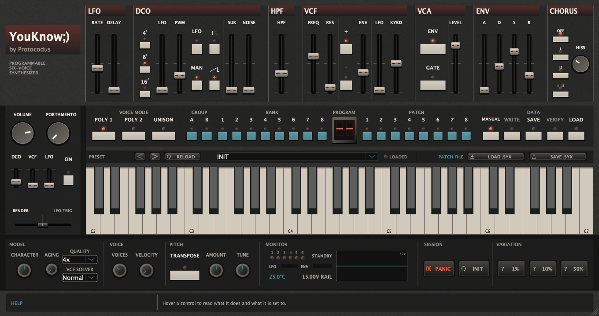

# YouKnow106

A six-voice circuit-modelled DCO polysynth: VST3, Audio Unit and Standalone,
universal `arm64`/`x86_64` on macOS 11 or later, published by
[Protocodus](https://protocodus.cz).



YouKnow106 models the voice architecture of a 1984 six-voice polysynth — the
Roland Juno-106 — block by block, from its integer-divided note timers through
its four-pole transconductor filter to its uncompanded bucket-brigade chorus:
a scanned control converter with per-hold slew and 7-bit patch digitisation,
firmware envelopes with exponential decay into a measured quasi-linear
amplifier, an implicitly solved resonance loop with input-side compensation, a
non-stealing key assigner, and a two-line MN3009 chorus with authentic
saturation and noise.

It is an independent original implementation, not affiliated with or licensed
by Roland Corporation, and contains no firmware, ROM data, samples or captured
audio. It does include the original 128 factory tone-memory states as
functional 18-byte parameter data, independently decoded and checksum-verified;
no Roland Cloud content was extracted. Its panel follows that instrument's
functional geometry and 1980s colour vocabulary while retaining independent
branding, typography and project-drawn controls.

Contact [protocodus@proton.me](mailto:protocodus@proton.me).

## Audio demos

Ten maintained takes, rendered by
[`Tools/RenderDemos.cpp`](Tools/RenderDemos.cpp) through the same JUCE-free
engine the plug-in runs — the classic pad and PWM strings, the 16' bass, the
self-oscillating filter, the chorus modes, unison glide, the delayed vibrato,
the high-pass ladder and the deterministic Unit Character profile.

<!-- peaks-table-begin: regenerated by YouKnow106RenderDemos; edits between the markers are overwritten -->
| File | What it is | Length | Rendered peak | Normalisation |
| --- | --- | ---: | ---: | ---: |
| `01-chorus-pad.wav` | Saw and sub through the mode-I chorus: the classic pad, hiss and all | 21.9 s | −15.0 dBFS | +12.0 dB |
| `02-pwm-strings.wav` | Pulse-width-modulated strings in the faster mode-II chorus | 15.3 s | −14.5 dBFS | +11.5 dB |
| `03-sixteen-foot-bass.wav` | A 16' bassline: the exponential envelope segments doing the punch | 13.8 s | −27.1 dBFS | +24.1 dB |
| `04-filter-brass.wav` | Resonant filter-envelope stabs, ending on a full bender push | 10.3 s | −24.5 dBFS | +21.5 dB |
| `05-self-oscillation.wav` | The filter played as a voice at full resonance and key follow | 12.9 s | −28.0 dBFS | +25.0 dB |
| `06-chorus-modes.wav` | The same pad with the effect off, in mode I, then in mode II | 15.8 s | −16.3 dBFS | +13.3 dB |
| `07-unison-glide.wav` | Six-voice unison lead with constant-rate portamento | 11.5 s | −10.9 dBFS | +7.9 dB |
| `08-delayed-vibrato.wav` | The modulator's two-stage delay fading vibrato onto a held chord | 9.6 s | −22.1 dBFS | +19.1 dB |
| `09-high-pass-ladder.wav` | One bright chord through all four high-pass switch positions | 10.6 s | −15.1 dBFS | +12.1 dB |
| `10-unit-character.wav` | A six-voice chord at nominal zero Unit Character, then at full amount | 12.9 s | −23.0 dBFS | +20.0 dB |
<!-- peaks-table-end -->

## How it works

### Sources

**Primary documentation and parts.** Roland JUNO-106 Service Notes, First
Edition (31 July 1984) — two byte-identical circulating scans, read at page
level, with pixel-measured reads of p. 8 (timing chart) and p. 9 (module
drawing); the Owner's Manual; two Roland Service Information bulletins
(100222, 100229). Hash-identified firmware images (voice/main B-2, assigner
A-5) analysed behaviourally, alongside published clean-room assigner reverse
engineering and a pinned [unofficial partial IC29 disassembly](https://github.com/ErroneousBosh/j106roms/blob/26926a04ff1939106820313e71e34b4ca2f67070/ic29.txt)
used only as corroboration. Datasheets for the Panasonic MN3009 and MN3101,
NEC µPC1252H2, Toshiba TA75558, TC4051/4052/4053B and 2SK30A, Hitachi
HD14051B, [OKI MSM82C53](https://www.bitsavers.org/components/oki/_dataBooks/1986_OKI_Microprocessor_Databook.pdf)
and Intel 8254/8253, NEC µPD7810/7811, TI TL072/TL082, Rohm BA6110 and Alfa
AS3109/AS662; and [Nippon Chemi-Con's aluminum-electrolytic voltage-bias guidance](https://www.chemi-con.co.jp/en/faq/detail.php?id=alBiasVoltageChara).
A1QH80017A VCF/VCA module teardown photographs, the
Open80017a/dksynth module reconstruction, and published DCO charge-circuit
analysis.

**Measurements and archives.** KR-106 (click-timing chorus series, measured
code-to-frequency and sustain tables, archival tone transcription); ModWiggler
and Gearspace measurement threads read at post level; the Alpes Machines
One-O-Six kit guide; the atosynth reconstruction; Cornutt workbench pages;
Analogue Renaissance service notes. Sibling JUNO-60 Service Notes and chorus
measurements are labelled comparison only — the JUNO-60's 1.682 mode-rate
ratio must not return; this instrument's own is 1.6234799.

**Literature.** Zavalishin (TPT, `1/(4−k)`); Stilson & Smith; Huovilainen;
D'Angelo & Välimäki; Välimäki, Pekonen & Nam (BLEP residuals); Holters &
Parker (BBD modelling, DAFx-18); Gabrielli, D'Angelo & Squartini (DAFx-25,
BGA/SGA and BBD polyBLEP); Danish, Bilbao & Ducceschi (DAFx-21, the basis of
a rejected solver candidate).

### What is modelled

Each mechanism carries an evidence class, defined and tracked per constant
below: **anchored** (service
documentation, datasheet, firmware analysis or calibrated measurement),
**ROM-resolved** (exact for one hash-identified firmware image),
**derived** (arithmetic from anchors), **product policy** (a plug-in
decision, no hardware claim) or **voiced** (provisional, inside a range the
evidence bounds but does not fix). "Exact" never means an arbitrary
forty-year-old unit will null against the plug-in.

**Digital control system**

- Pitch is one 8 MHz reference divided by a 16-bit integer count. The recovered
  B-2 path uses one unsigned 8.8 coordinate, clamps its high byte to table
  indices 0..102, and truncation-interpolates a paired timer count and 12-bit
  DCO-CV code. Those mechanics are ROM-resolved; compact smooth anchor
  generators avoid embedding the proprietary 104-word tables and stay within
  four timer counts (1.272 cents over the complete coordinate) and one CV code
  of the hash-matched image (derived). RANGE changes IC35's synchronous preset,
  not the PIT count: the current count completes, the latest stable preset
  loads on the existing synchronous reload edge following terminal carry,
  and subsequent TP5 periods use the new ÷2/÷4/÷8 cadence (anchored).
- One 12-bit converter scans 23 sample-and-hold destinations — 18 per-card,
  5 shared — over a 4.2 ms pass in the service chart's exact write order,
  on a fractional scheduler with per-destination smoothing constants
  (anchored order and constants; the intra-pass offsets are compatibility
  policy, with a pixel-measured chart-geometry profile selectable).
- Envelope recurrence, sustain mapping, DAC truncation, the onset-scaled LFO
  reaching DCO and VCF, and the portamento glide law are the exact digital
  behaviour of the hash-identified B-2 firmware. PWM separately reads the raw
  accumulator, forms and pass-latches B-2's exact 12-bit DAC code, and preserves
  its seven-bit overrange (ROM-resolved); key assignment — including note
  dropping instead of stealing, the momentary POLY contacts and Solo Unison —
  is ROM-resolved for the A-5 assigner image.
- The portamento knob passes through its loaded 50KB pot law (derived).

**Oscillator**

- A straight Miller-integrator constant-current ramp with finite reset, a
  comparator-based pulse against the shared scanned PWM threshold, and a
  divide-by-two sub (anchored topology). Roland's
  [DCO drawing and text](https://www.synfo.nl/servicemanuals/Roland/ROLAND_JUNO-106_SERVICE_NOTES_1st.pdf#page=9)
  give an approximately 12 Vpp Miller ramp; its PWM anchors are consistent
  with a nominal 0 to approximately +12 V excursion. B-2's [PWM arithmetic](https://github.com/ErroneousBosh/j106roms/blob/26926a04ff1939106820313e71e34b4ca2f67070/ic29.txt#L1144-L1197)
  and [12-bit converter write](https://github.com/ErroneousBosh/j106roms/blob/26926a04ff1939106820313e71e34b4ca2f67070/ic29.txt#L1292-L1302)
  reproduce the full −0.8 to +6 V calibrated path. The uniquely loaded
  [PWM panel pot](https://www.synfo.nl/servicemanuals/Roland/ROLAND_JUNO-106_SERVICE_NOTES_1st.pdf#page=11)
  normally stops near stored byte 101 and the printed 95% point; raw values
  above that physical travel remain accessible through the seven-bit patch
  format and can pin the comparator high. The internal custom-IC reset curve
  remains unmeasured. The scan-and-slew amplitude transient on
  pitch changes is rendered in the slope of each rise. Ramp charge follows the
  paired DAC-code × active-divider product about the B-2 `0x5400` centre
  anchor, retaining its small settled ripple and the real level loss after the
  CV table saturates instead of normalising every pitch back to unity (derived).
- All six DCOs free-run behind their closed VCAs with staggered phase; a
  note opens a card that already has history. Oscillator edges are
  bandlimited (BLEP/BLAMP) as a numerical product mechanism.

**Mixer and noise**

- Sources mute, legs never switch: saw and pulse arrive summed on one WAVE
  node, the sub joins as a diode-gated half-cycle current, one shared Tr21
  noise source with its own 33.9 Hz–4.8 kHz band shaping feeds every voice
  (anchored topology and shaping; the level coordinates remain voiced).
- C56/C50 couple the mixer into the filter, keeping duty-dependent DC out
  of the signal path (anchored).

**Filter and voice amplifier**

- Four transconductor stages with the 68 kΩ/560 Ω attenuation, solved
  directly as their continuous nonlinear equations at fixed cost; cutoff is
  summed in converter counts (1143/octave) and anchored on the service
  calibration point — code 6272 self-oscillates at 248 Hz, which the model
  *predicts* within a cent from a derived harmonic balance rather than
  fitting (anchored law; the upper knee is voiced pending OQ-18).
- The R-2R converter's real mid-scale carry error, the resonance input-side
  compensation Roland's own module drawing prints, self-oscillation trimmed
  where the service manual trims it, and the printed ±10-cent trim
  acceptance windows at the two check points (anchored; the shipped
  panel-to-loop-gain curve follows the traced linear CV-to-BA662 path above
  its junction onset, while the exact onset and compensation await OQ-09).
- Each voice VCA is a current-controlled BA662 behind C59 coupling, with a
  quasi-linear compatibility law above conduction (anchored topology;
  transfer law awaits the OQ-19 measurement).

**Bus and output**

- Six voices sum at 0.1 each; one continuous C14 state feeds the
  four-position high-pass (derived shelf and cut corners, MNA-qualified);
  the stored VCA LEVEL byte drives the common µPC1252H2 through its derived
  gain law and 9.08 ms control settling (anchored/derived).
- The final TA75558 summer mixes dry 100/47 and wet 100/39. Its provisional
  ±13.5 V loaded-swing asymptote sits inside the ±15 V supplies; output AC
  coupling and the nominal-linear dual 10K volume law with its real internal
  loading follow (anchored/derived). Digital full scale is referred to that
  model asymptote so it adds no lower digital ceiling (product policy, OQ-05).
- Power-rail droop under load is computed and measurably inert (0.1 cents
  across the full one-to-six-voice change) — reported, not tuned into
  audibility.

**Chorus**

- Two uncompanded 256-stage MN3009 lines driven anti-phase by one triangle
  whose rates (0.5533/0.8983 Hz) and mode ratio are derived from this
  instrument's own oscillator circuit; the 1.4–6.4 ms sweep endpoints are a
  third-party measurement of a designator-faithful build (below the
  anchoring bar; OQ-01).
- BBD write nonlinearity fitted to the MN3009's typical 0.3%/0.78 Vrms table
  point and approximately 2%/2 Vrms curve while retaining its 2.5% input-swing
  guarantee and saturation rail; explicit zero-order hold plus residual
  charge-transfer loss at the datasheet anchor; and full support-filter chains.
  HISS 100% retains the part's 0.2 mVrms maximum, while the shipped 29.86%
  default is the quieter 59.7 uVrms end inferred from its typical 88 dB S/N;
  mode II keeps the reported +3.95 dB relative lift (anchored/derived;
  installed-unit absolute noise PSD is OQ-03).

**Instrument-level extensions** (product policy): Unit Character scales
every modelled tolerance from calibrated-nominal (0) through "matches real
hardware" (100%) to exaggerated (200%); Aging drifts the instrument away
from a fresh service along one documented recalibration; Velocity,
Transpose, Master Tune, Chorus Noise (HISS), Polyphony 1–16, the Quality
ladder and the VCF numerical-kernel settings described under
[performance controls](#performance-and-quality).

### Voices, character and aging

The first six slots are persistent physical voice-card models. The Exact
reference path keeps each DCO, filter, comparator and card-noise source running
behind a closed VCA; the faster tanh modes retain the free-running DCO,
sub-divider and noise state but use the documented idle-card approximation.
The shared converter still visits its 23 destinations sequentially, so a
unison stack is never artificially phase-locked. There is no six-oscillator
detune generator; the LFO and envelope generator are shared and digital,
exactly as in the hardware.

At **Unit Character** 0% the engine is the deterministic calibrated-nominal
model. At 100% — the default, the "matches real hardware" reference — a
fixed-seed profile enables the full span of every modelled tolerance:
per-card ramp-current, comparator-threshold, VCA and sub/noise-level
errors (±3% class), VCF trim residuals bounded by the service manual's own
±10-cent acceptance at its two check points, per-stage input offsets and
capacitor staggering, slow cutoff wander, the R-2R carry error, and the
chassis warm-up law `25 + 15(1 − e^{−t/900})` °C with its spatial gradient
across the cards. Everything scales linearly with the knob, seeds are
fixed, and the same patch renders identically every launch. These spans are
voiced sound design, not measured population statistics — OQ-10 owns the
data that would replace them.

**Aging** sits beside Unit Character: zero is a freshly serviced
instrument; raising it drifts each voice's filter trim flat by its own
share of up to a quarter tone and lifts the noise source by up to 3.5 dB,
following one documented four-year recalibration. It describes the
instrument, not the patch, so randomisation, program recall and INIT leave
it alone.

### Interface

The interface keeps the reference instrument's control inventory **and its
reading order** in a 1360×718 opening window. The synthesis strip is LFO,
DCO, HPF, VCF, VCA, ENV and CHORUS; VOLUME and PORTAMENTO live in the left
performance cheek with the bender-depth faders, portamento switch and
spring lever; the 61-key keyboard begins beside that cheek. Below the strip
is the hardware programmer tier: POLY 1/2 plus UNISON, A/B group, BANK and
PATCH keys, the recessed red display, MANUAL, WRITE and tape
SAVE/VERIFY/LOAD — the immutable factory bank makes WRITE and VERIFY
explanatory disabled controls, while selection, MANUAL and SysEx SAVE/LOAD
are live.

Plug-in-only controls stay close to their hardware families: UNISON
completes the VOICE MODE group, HISS sits inside CHORUS, VELOCITY and
VOICES share the lower VOICE group, Transpose and tuning sit under the DCO,
and the global CHARACTER/AGING/QUALITY controls sit beneath the left cheek
with the Voice Monitor beside voice allocation. PANIC, INIT and the graded
VARIATION actions occupy the lower bay. The visual language is planar warm
charcoal with restrained oxblood and teal, project-drawn controls and
independent branding.

Hovering any interactive element updates the fixed help strip below the
keys immediately — explanation plus the control's current value in its own
units — and the same strings are exposed as accessibility metadata. The
oscilloscope ranges itself and prints its gain. The bender lever is live
performance input (pitch left/right, modulation up, spring to zero); it
drives the same controller scan as external Pitch Wheel and CC 1 and does
not enter patches or automation. The host preset rail recalls the factory
bank with a stepper, name list, RELOAD and a LOADED/EDITED indicator, in
sync with the host's own program state.

### Original factory bank

YouKnow106 includes all 128 original tone-memory states in the physical
instrument's order, A11–A88 then B11–B88 — each the hardware's complete
18-byte state with no corrective gain, hidden EQ or per-preset rebalancing.
The bytes were mechanically decoded and cross-checked with zero mismatches
across the public [Hinzen tape/PAT archive](http://www.hinzen.de/midi/juno-106/),
the [Jarvik7 librarian factory library](https://www.jarvik7.net/juno-106/)
and the [KR-106 archival transcription](https://github.com/kayrockscreenprinting/ultramaster_kr106/tree/bc15caee5843ab238a25d0969e68d57db2b1615f/tools/preset-gen);
Roland independently describes the historical 64+64 set. The test suite
locks the payload checksum, slot order and a round-trip for every tone. No
Roland Cloud content was downloaded or extracted.

What each preset carries besides its bytes is a VR1 volume shaft position —
the one control a player moves when one patch arrives hotter than the last.
The `YouKnow106AuditFactoryPresets` tool renders all
128 tones through the shipping engine and enforces two contracts as build
failures: no preset peaks above −1 dBFS and none exceeds −31 dBFS gated
RMS. The trims are attenuation only, and below those ceilings the level
differences are measurements, not targets — the quiet noise sweeps are
quiet because the instrument makes them quiet.

The hardware stores positions, not names; labels such as "Brass Set 1" are
conventional archival descriptions shown for navigation, not Roland-authored
text. Host/patch-bar recall restores the full playing setup; hardware MIDI
Program Change and SysEx keep their narrower authentic semantics and move
only the 18-byte tone. Loading a pre-schema-3 session preserves every saved
parameter but resets the selector to an edited INIT panel rather than
attaching an unrelated factory name. See
[third-party notices](THIRD_PARTY_NOTICES.md) for provenance.

### MIDI

The on-screen keyboard matches the physical 61-key C2–C7 span; host MIDI
outside the keybed is not discarded. YouKnow106 receives external pitch
bend, modulation (CC 1), hold (CC 64 — split at zero exactly as the owner's
MIDI chart prints it, so any nonzero value holds), all-notes-off (mode
messages 123–127 are all recognised, as the chart specifies) and the
reference instrument's Patch Selection Program Changes (0..63 → A11..A88,
64..127 → B11..B88, consumed rather than echoed). The modelled keybed is
not velocity sensitive, so incoming velocity reaches the engine only
through the VELOCITY extension. There are no MIDI CC assignments for the
synthesis panel; host automation reaches every stored parameter through the
plug-in's parameter list. YouKnow106 does not transmit performance data or
Program Changes.

#### System exclusive

The SysEx codec reads and constructs the hardware's own format in both
directions:

| Message | Bytes | Codec support |
| --- | --- | --- |
| Patch data | `F0 41 30 0n <18 tone bytes> F7` | decode and encode |
| Parameter change | `F0 41 32 0n <parameter> <value> F7` | decode and encode |

An incoming patch dump moves the whole panel; an incoming parameter change
moves only the controls its byte names. Foreign manufacturers, other
opcodes and wrong-length bodies are ignored rather than partially applied.
Patch files carry the same messages: LOAD (or dropping a `.syx` on the
editor) applies the first patch dump in the file, SAVE writes the current
tone as one hardware-valid dump. Performance controls stay out of the
file, exactly as they stay out of the hardware's tone memory. The chorus
field has exactly the hardware's three states — Off, I, II; sessions from
older builds carrying the invented both-buttons state canonicalise to II.

### Performance and quality

The QUALITY selector offers a 1×/2×/4× internal-rate ladder applied as a
ceiling against what the host rate needs; engine cost tracks the applied
factor nearly linearly, and the worst audited six-voice resonant scenario
measures 0.85× realtime at 4× on one Apple M1 Max core (0.23× at 1×). New
instances ship at 4× because the BBD and VCF domains pass their absolute
numerical gates only there; 1× and 2× remain available for lower CPU use.

The VCF SOLVER selector descends a solver ladder (Max/High/Normal) for the
nonlinear filter. Normal — the cheapest rung, roughly half the filter's
CPU — ships as the default, chosen by a blind listening test (2026-08-23)
that returned no audible difference between any rung, beside measured
whole-file nulls of −88…−110 dBc. The engine's own default stays the
reference Merson kernel, so every frozen fingerprint keeps testing it. Two
further machine settings (VCF Tanh, VCF Fast Early) select the solver's
nonlinear kernels. Fresh instances use Poly/Cubic, the CPU-first pair retained
after a blind comparison found no audible difference; Exact/Hermite preserve
the reference forms. None of these is part of a patch.

The plug-in reports a fixed 41-host-sample latency covering oscillator
reconstruction and decimation only. A quality change waits until the
instrument is idle. Quality and solver rungs do not move a modelled physical
quantity; the faster tanh modes additionally enable the documented idle-card
and settled-chorus work skips, while Exact retains the always-running reference
path. Noise density and the warm-up clock are normalized to elapsed time. A
host transport stop is treated as a stop, not a power cycle: the modelled
chassis stays warm, while a new `prepare()` starts cold.

### Settled guardrails

Not to be reopened without contradictory primary evidence:

- Chorus modes are Off/I/II only and mutually exclusive; obsolete
  both-buttons states canonicalise to II. Off mutes the wet return only. The
  Exact reference keeps the oscillator and BBDs running; faster tanh modes may
  rebuild the inaudible wet history on engagement. Normal output is dry plus
  wet.
- Chorus balance is dry 100/47, wet 100/39: the wet leg is the hotter one, by
  1.62 dB.
- The chorus modulator is a straight symmetric triangle and line 2 is its
  exact negative.
- The two-phase BBD output is one sample per clock period — a full-period
  composite hold, never a 2·fcp output stage.
- The voice summer is 0.1 per voice (33 kΩ into 3.3 kΩ feedback), then C14 and
  the shared HPF, C12/R36 into the common VCA, chorus, IC6, VOLUME.
- The C14/HPF boundary — placement, parts, control routing, Boost/Flat
  endpoints, the 225.8/720.5 Hz cut anchors, deselected decays and the
  MNA-qualified selected-Cut load — is settled.
- Converter ownership and ordinal order (23 writes: RES/VCA/SUB, DCO 1–6,
  PWM, VCF/VCA 1–6, NOISE) are settled; the `ordinal/23` placement is the
  declared compatibility profile.
- Pulse-off pins the comparator output high at about −0.8 V.
- POLY 1 + POLY 2 is Solo Unison: six equal-frequency free-running voices,
  unnormalised, with no programmed detune. The POLY switches are momentary
  firmware inputs, and both-off is not a stable state.
- Mains ripple is not modelled by derivation (≈0.03 cents of cutoff), and
  neither ripple nor rail droop may ever be routed to DCO pitch — pitch is
  integer division of a crystal-derived clock.
- Main VOLUME is the nominal-linear `10KB×2` law with its fixed internal
  loads, not a generic squared taper.
- The noise calibration point (4.0 Vpp at TP8 via VR32) exists.
- Published selector levels L −30 / M −15 / H 0 dBm stand.
- The output-reference convention — −18 dBFS RMS, floating samples, no
  limiter — is settled.

## Known gaps

Deliberate, each with its reason recorded:

- **No pitch drift and no inter-voice detune.** Pitch is integer division
  of a crystal-derived clock: temperature, supply and ageing have no term
  in that arithmetic, so six voices on one key are always exactly in tune
  and unison carries no detune generator. The crystal's whole tolerance
  budget sits below the pitch quantisation step.
- **No mains ripple.** Derived at ~0.03 cents of cutoff through the
  regulators — below audibility; and neither ripple nor rail droop may ever
  be routed to pitch.
- **No invented behaviour where evidence is missing.** Mechanisms whose
  magnitude the sources cannot fix either ship voiced and labelled (mixer
  level coordinates, resonance onset/compensation, upper cutoff knee, noise
  distribution) or are left out entirely until measured: the pulse-off
  switching transient, chorus wet-mute click and leakage, HPF mode-change
  transients, converter charge injection, envelope/LFO physical timing
  against a real unit.
- **Removed on review**, with reasons recorded: a voice-VCA thump
  heuristic, a switchable-leg mixer model, a BBD clock-scaled smear
  multiplier, wet-mute distortion ~44 dB too strong, a sub-driver
  amplitude asymmetry that is really an edge-timing effect, and the unsourced
  C14 voltage-coefficient default, which current general aluminum-electrolytic
  bias guidance does not support; plus several numerically unstable or
  double-counting candidates.
- The twenty-one [open questions](#open-questions) below name the hardware
  evidence that would close each remaining gap.

### Open questions

Twenty-one standing items name the hardware evidence that would close each
remaining gap. Most need calibrated captures from an identified, serviced
unit; the priority column is this project's own ranking of audible impact.

| # | Open | Priority |
| --- | --- | --- |
| OQ-01 | Absolute chorus timing. Topology, waveform and scale are derived from the instrument's own schematic — a µPC062 integrator plus Schmitt comparator giving a symmetric triangle at 0.5532934 / 0.8982608 Hz, ratio 1.6234799 from the mode switch's T-network. The shipped 1.4–6.4 ms sweep endpoints come from a third-party measurement of a designator-faithful build, which sits below the anchoring bar | P0 |
| OQ-03 | Chorus noise and SNR under calibrated conditions. Mode I keeps the MN3009's 0.2 mVrms max A-weighted row at HISS 100%; the 29.86% default is an explicit new-part policy inferred from its 88 dB typical S/N and 1.5 Vrms guaranteed swing, not a specified typical-noise row. Mode II ships the reported ~3.95 dB delta as a relative factor. Installed-unit absolute noise PSD is open | P0 |
| OQ-05 | Loaded TA75558S IC6 and High-output clipping swing. Device identity, resistor gains and ±15 V supply rails are settled. The traced maximum-volume, no-external-load midband impedance is about 8.22 kΩ; an approximate symmetric reading of the datasheet's 25 °C typical Vop-p graph is roughly ±13.9 V around 8–9 kΩ. The modelled ±13.5 V asymptote is therefore plausible and about 0.4 V below that typical curve, but is not a guaranteed limit. The exact installed-unit swing and knee remain open | P0 |
| OQ-15 | Oscillator-mixer levels and filter-drive calibration. Node anchors are settled (saw/pulse ≈12 Vpp, noise 4.0 Vpp at TP8, the 68 kΩ/560 Ω core attenuator) and the mixer topology is designator-complete; the level coordinates remain voiced | P0 |
| OQ-06 | Absolute output-reference calibration. The product convention is settled and not reopenable; only the physical reference value is open. Roland's L −30 / M −15 / H 0 dBm selector spec fixes the intended steps but not the reference impedance | dependent |
| OQ-07 | Converter hold topology and time constants. Ownership and inventory are closed — 23 used 0.01 µF holds over a 4.2 ms pass, per-destination smoothing designator-complete. Roland identifies the DCO mux as Hitachi HD14051BP, explicitly excluding Toshiba; its loaded acquisition and injection remain open | P1 |
| OQ-08 | Exact intra-pass timing and DCO pitch-write staging. The 23-write ordinal order is settled; the normalised `ordinal/23` offsets are compatibility policy, not timestamps. Roland's [CPU/clock drawing](https://www.synfo.nl/servicemanuals/Roland/ROLAND_JUNO-106_SERVICE_NOTES_1st.pdf#page=8) and [IC29/IC35 drawing](https://www.synfo.nl/servicemanuals/Roland/ROLAND_JUNO-106_SERVICE_NOTES_1st.pdf#page=13), the recovered B-2 [running](https://github.com/ErroneousBosh/j106roms/blob/26926a04ff1939106820313e71e34b4ca2f67070/ic29.txt#L732-L741), [reset](https://github.com/ErroneousBosh/j106roms/blob/26926a04ff1939106820313e71e34b4ca2f67070/ic29.txt#L783-L794) and [converter-output](https://github.com/ErroneousBosh/j106roms/blob/26926a04ff1939106820313e71e34b4ca2f67070/ic29.txt#L1292-L1302) paths, and NEC's [instruction timing table](https://datasheet4u.com/pdf/298676/UPD7810.pdf#page=17) close the nominal no-interrupt relationship to the existing pitch-converter timestamp `T`. Treating `T` as the start of `ANI PA,$EF`, running LSB instruction start is `T-334` states (83.50 us), both paths' MSB instruction start is `T-323` (80.75 us), and reset-control instruction start is `T-389` (97.25 us); reset control-to-LSB remains 55 states and LSB-to-MSB 11. The engine captures the paired count, reset decision and DCO-CV target at `T-389`, applies the modelled control/LSB/MSB events at those instruction anchors, and commits only that captured CV when the converter cursor reaches `T`, so later host edits cannot splice two scans together. The matching [OKI Mode-3 specification](https://bitsavers.org/components/oki/_dataBooks/1986_OKI_Microprocessor_Databook.pdf#page=186) anchors the OUT polarity, odd-count split and delayed CE transfer; Roland maps only positive-going OUT to C54 discharge and the sub clock. IC29's 12 MHz resonator and IC35's separate 8 MHz resonator prove there is no fixed CPU-to-PIT phase to recover; deterministic initial phase and exact-tie order are product policy. IC35's [installed-part truth table](https://www.synfo.nl/servicemanuals/Roland/ROLAND_JUNO-106_SERVICE_NOTES_1st.pdf#page=17), the firmware's [`$C0/$40/$00` range writes](https://github.com/ErroneousBosh/j106roms/blob/26926a04ff1939106820313e71e34b4ca2f67070/ic29.txt#L246-L273), and Toshiba's [compatible-counter specification](https://toshiba.semicon-storage.com/info/TC74HC161AF_datasheet_en_20140301.pdf?did=10907&prodName=TC74HC161AF#page=2) close the range handoff: DCBA presets 14/12/8 make ÷2/÷4/÷8, a PF edit cannot truncate the current count, and the latest stable preset is loaded on the existing synchronous reload edge following terminal carry. ADC service cannot reach the DCO transaction; semantic Voice On/Off instead discard their interrupt return and restart the voice-board loop. The engine reproduces that restart at its logical command boundary, preserving protected PIT writes and completed port stores while cancelling abandoned CPU/CV work. What remains open is each physical converter/mux timestamp, serial wire phase and installed-NMOS automatic-entry timing, plus C54 reset shape and installed MC5534A saturation. Roland's [DCO drawing and text](https://www.synfo.nl/servicemanuals/Roland/ROLAND_JUNO-106_SERVICE_NOTES_1st.pdf#page=9) give an approximately 12 Vpp Miller ramp and identify C54 as 0.001 µF with 390/200/100 kΩ range resistors, but the custom IC's internal amplifier/discharge-transistor values are unpublished; the renderer therefore retains its finite-linear discharge and scale-aware +15 V ideal-supply bound as compatibility policy rather than a measurement claim | P1 |
| OQ-09 | Resonance byte-to-loop-gain law. Topology and mechanism are settled, including the Roland-printed input-side compensation from the p. 9 module drawing; the drawing prints no component values, so the 0.2296 coefficient stays voiced | P1 |
| OQ-11 | Pulse-off pinned-leg mixer behaviour. About −0.8 V holds the comparator output high, represented by a provisional hard-zero audio gate; what the coupling network does — DC shift, residual bleed, loading, the switching transient — is untraced | P1 |
| OQ-19 | Voice BA662 gain, knee and deadband. Topology is settled, supporting the shipped quasi-linear compatibility law; the transfer law itself awaits measurement | P1 |
| OQ-02 | Installed common-VCA tolerance. The nominal law is fully derived and an identified unit's endpoints sit within 0.8 dB of it; installed component spread is open | P2 |
| OQ-04 | Loaded post-BBD support-chain transfer. Topology is anchored at designator level on both sides of the BBD and the charge-transfer coefficient to the datasheet's 40 kHz/12 kHz row; the loaded tap-summing pole is open | P2 |
| OQ-12 | Envelope physical timing and firmware-revision scope. The digital law is ROM-resolved for B-2; the printed spec endpoints reconcile with the model under stated threshold conventions | P2 |
| OQ-13 | LFO and delay physical timing. ROM-resolved for B-2: the [holdoff-crossing pass also performs the fade's first add](https://github.com/ErroneousBosh/j106roms/blob/26926a04ff1939106820313e71e34b4ca2f67070/ic29.txt#L577-L607), giving exact state-completion spans of 8.4 ms to 4.3512 s; the [late-loop PWM calculation](https://github.com/ErroneousBosh/j106roms/blob/26926a04ff1939106820313e71e34b4ca2f67070/ic29.txt#L1144-L1197) reads the raw accumulator, bypasses that onset byte, and stores the exact next-loop PWM word. The doubled depth, partial-product truncation and discarded DAC low bits are now reproduced exactly; Roland's [panel network](https://www.synfo.nl/servicemanuals/Roland/ROLAND_JUNO-106_SERVICE_NOTES_1st.pdf#page=11) and [93–97% service window](https://www.synfo.nl/servicemanuals/Roland/ROLAND_JUNO-106_SERVICE_NOTES_1st.pdf#page=19) bound the loaded physical slider while retaining raw SysEx overrange. The printed 30 Hz top inverts to the same pass period within 0.8 %. One standing contradiction remains: the printed 0.1 Hz floor is unreconcilable with rate byte 0 at any pass period | P2 |
| OQ-14 | Portamento pot/ADC transfer. ROM-resolved for B-2 and designator-complete from p. 16 — a 50KB linear pot loaded by 47 kΩ, the off switch pinning the ADC at the ROM's raw-0 code | P2 |
| OQ-16 | Main noise spectrum and self-oscillation startup. Level is settled; the shape class is settled from designators (33.9 Hz high-pass, 4822.877 Hz pole), independently corroborated by a restorer's description | P2 |
| OQ-18 | Upper cutoff-converter saturation law. The exponential audio-range law is confirmed by measurement (3.46–3.49 oct/1000 codes against the model's 3.500; the 248 Hz anchor within 3 cents); the 50 kHz cap is declared product policy | P2 |
| OQ-20 | Chorus wet-mute switching transient and leakage. Off mutes wet only and the wet-return devices are identified; the static wet-level error is at most −0.184 dB worst case, below audibility and left unmodelled | P2 |
| OQ-21 | Coupled C14 and switched high-pass transfer. Parts, placement and control are settled and the nominal network is qualified against independent long-double MNA to 0.011 dB / 0.056° | P2 |
| OQ-10 | Post-calibration voice dispersion and thermal wander. The calibrated-nominal model is settled policy: zero inter-voice spread, zero drift, with all seeded variation living in Unit Character as voiced sound design | P3 |
| OQ-17 | Main VOLUME tracking and output-selector transfer. The nominal law is settled and the ladder's ideal taps land within 1.2 dB of the published steps | P3 |

OQ-08's `T-389`, `T-334` and `T-323` values are proven no-interrupt
**instruction-start** anchors, not external-pin timestamps. NEC specifies
seven states for STAX but publishes only [write-cycle relationship
limits](https://datasheet4u.com/pdf/298676/UPD7810.pdf#page=12), not an exact
clock-to-`/WR` edge; its 20-state ANI description likewise does not locate the
PA output-latch write. The recovered firmware proves that PB/PC are written
while PA4 inhibits IC24, then `ANI PA,$EF` enables the selected hold. Roland's
[parts list](https://www.kiwitechnics.com/downloads/Kiwi-106/Roland%20Juno-106%20Service%20Manual.pdf#page=3)
identifies IC24 as HD14051BP and explicitly excludes Toshiba. A later Hitachi
[same-family switching table](https://akizukidenshi.com/goodsaffix/hd14051b_e.pdf#page=3)
gives 0.850 us typical / 2.125 us maximum enable at 5 V and 25 C, but only into
50 pF with 10 kΩ and with no minimum. That is not a settling specification for
the board's 10,000 pF hold, cascaded TL082 source or negative-signal path;
there is no defensible fixed acquisition delay without a hardware capture.

`DI` still prevents an interrupt from splitting the PIT bytes, but the exact
boundary is now closed at the semantic handler timestamp. On the running path
it begins 13 states after `T-389`, with 42 of the 55 LSB-delay states left; a
Voice On/Off accepted earlier can abandon the transaction, while one at or
after that boundary must let LSB and MSB complete. Reset control and every
awaiting-MSB state are already protected. The engine completes the reset
path's four-state DI-to-control gap from the old voice state before applying
the serial command, and commits any DAC/mux write already performed at a
fractional sample position. The exact boundary tie uses declared PIT-first
policy. Those voice handlers then [replace SP and jump to the fresh
main loop](https://github.com/ErroneousBosh/j106roms/blob/26926a04ff1939106820313e71e34b4ca2f67070/ic29.txt#L204-L244),
so the engine restarts the one shared converter scan at the logical note
command, preserves completed PIT/port state and discards only unfinished CPU
and captured-CV work. A mid-pass restart repeats the fresh loop's early
LFO-delay/onset recurrence while preserving the abandoned pass's later
oscillator and PWM state; an already-due boundary leaves that recurrence to
the normal pass start instead of executing it twice.

ADC is no longer an OQ-08 jitter source. Its 172-state handler [masks ADC again
before returning](https://github.com/ErroneousBosh/j106roms/blob/26926a04ff1939106820313e71e34b4ca2f67070/ic29.txt#L116-L135),
and firmware does not [rearm it](https://github.com/ErroneousBosh/j106roms/blob/26926a04ff1939106820313e71e34b4ca2f67070/ic29.txt#L1061-L1066)
at least 2,442 CPU states before the next DCO `DI`; the four-channel scan takes
at most 768. Thus its possible insertion in the PIT/DAC region is exactly zero.
Returning serial handlers take 94–396 states; semantic Voice Off takes 169 or
207 handler states and Voice On 287–357. Reaching fresh-loop PC `02EC` adds
four states after the restart target, plus the installed NMOS part's
unpublished automatic-entry time. A [later CMOS-family
manual](https://www.renesas.com/en/document/mah/87ad-series-upd78c18-users-manual#page=183)
documents 16-state entry but warns of internal timing differences, so it is
not promoted to an NMOS fact. Serial wire phase, entry delay and a probability
law remain unknown; the engine does not invent random jitter.

The nominal B-2 conversion on either side of those timing anchors is now
closed as well. The recovered firmware builds one unsigned 8.8 pitch word,
clamps high bytes below `0x30` and at or above `0x97`, and uses the remaining
fraction to truncation-interpolate the paired PIT count and 12-bit DCO-CV code
([pitch conversion](https://github.com/ErroneousBosh/j106roms/blob/26926a04ff1939106820313e71e34b4ca2f67070/ic29.txt#L682-L780),
[DAC write](https://github.com/ErroneousBosh/j106roms/blob/26926a04ff1939106820313e71e34b4ca2f67070/ic29.txt#L1292-L1302)).
The proprietary 104-word tables are not distributed: compact derived anchor
generators reproduce the complete hash-matched coordinate within 1.272 cents
and one DAC code while preserving the exact clamp, truncation, CV saturation
and upper-bound count discontinuity. Ramp charge is expressed without guessed
volts as DAC code times the active divider, referenced to the centre pair
`0x0100 * 0x1dfb`. This exposes the hardware's approximately 6.02 dB/octave
high-note level loss once the CV reaches 4095. MASTER TUNE now maps the host's
continuous +/-50-cent control onto B-2's signed 1/256-semitone byte, including
its asymmetric +49.609375-cent hardware endpoint. DCO pitch bend now follows
the assigner's 14-bit-to-byte reduction and B-2's truncating multiply/shift
path ([assigner reduction](https://github.com/ErroneousBosh/j106roms/blob/26926a04ff1939106820313e71e34b4ca2f67070/ic1.txt#L1068-L1087),
[B-2 arithmetic](https://github.com/ErroneousBosh/j106roms/blob/26926a04ff1939106820313e71e34b4ca2f67070/ic29.txt#L1006-L1059)).
That gives the real two-high-byte centre dead zone and +/-3063 pitch units
(+/-11.96484375 semitones) at full sensitivity instead of an ideal continuous
12-semitone multiplier. DCO-LFO pitch now follows B-2's nonlinear
[128-position depth law](https://github.com/ErroneousBosh/j106roms/blob/26926a04ff1939106820313e71e34b4ca2f67070/ic29.txt#L1765-L1773)
and truncating [panel-delay/CC1 arithmetic](https://github.com/ErroneousBosh/j106roms/blob/26926a04ff1939106820313e71e34b4ca2f67070/ic29.txt#L541-L560).
A compact generator avoids distributing ROM bytes. The panel path is gated by
the eight-bit delay value, CC1 is not, their sum saturates to one byte, and the
shared signed pitch word tops out at 1019 units (+/-3.98046875 semitones)
rather than adding two independent four-semitone spans. This closes the known
upstream integer adapters feeding the paired pitch conversion.
For plug-in notes and modulation outside the physical keybed, the final word
saturates at 0/65535 rather than reproducing the firmware's unsigned wrap; that
is a deliberate host-safety policy for the instrument's expanded MIDI range.

## Release history

### 1.1.0 — unreleased

- Universal macOS 11+ VST3, Audio Unit and Standalone distribution, with a
  signed, notarized, stapled PKG release path carrying bundled licence and
  user documentation, a build manifest and SHA-256 checksums.
- The complete 128-program factory bank, host preset navigation, edited-state
  indication and exact reload behaviour; hardware-format `.syx` patch import,
  drag-and-drop and export; MIDI Program Change mapping, modulation, sustain,
  pitch bend and host-automatable synthesis controls.
- Model and performance extensions: Unit Character, Aging, velocity, variable
  polyphony, unison, master tune, transpose and chorus noise; contextual
  control help, live output display, panic, reset and patch randomisation.
- Replaced instantaneous DCO timer programming with explicit M82C53 Mode-3
  OUT/count staging, the recovered µPD7810 control/LSB/MSB timing relative to
  each pitch-converter poll, and the synchronous IC35 range handoff. PIT count,
  reset and compensation-CV decisions now form one atomic firmware transaction
  beginning 97.25 us before that poll. This changes pitch-step, retrigger and
  live RANGE transients. RANGE changes the shared clock and selected ramp
  resistor without entering the compensation CV, so a range-only scan no
  longer fabricates a hold step. Semantic Voice On/Off now restart B-2's one
  shared converter loop, cancelling pre-DI CPU work but completing protected
  PIT bytes and preserving every external write already made. Mid-pass
  restarts repeat only the fresh loop's LFO-delay/onset calculation, not its
  later oscillator/PWM update; already-due boundaries retain their single
  normal pass step. ADC is proven unable to enter this region; physical mux
  timestamps, installed-NMOS entry timing and serial wire phase remain open
  under OQ-08, while the separate CPU/PIT oscillators rule out one fixed
  inter-clock phase.
- Replaced the ideal nearest-count pitch conversion and frequency-normalized
  ramp hold with the recovered B-2 unsigned 8.8 paired PIT/DCO-CV mechanism.
  Policy-safe derived anchors stay within 1.272 cents and one DAC code of the
  hash-matched image without distributing Roland's tables; exact truncation,
  clamps, upper-count discontinuity and CV saturation now drive the existing
  atomic pitch transaction and its audible high-note level taper. The shifted
  physical pitch grid also exposed a 44.1 kHz reconstruction transition
  corner; the same-size kernels now keep the expanded matrix at or below
  -71.62 dBc alias, with at most 0.0026 dB error through 15 kHz and 0.144 dB
  at the worst near-20 kHz line, without adding latency or hot-loop work.
- MASTER TUNE now uses the recovered signed B-2 byte in 1/256-semitone units:
  the continuous host control still spans +/-50 cents, while its hardware top
  code correctly stops at +49.609375 cents instead of fabricating +50 exactly.
- DCO pitch bend now uses the recovered assigner/B-2 integer path: the
  scan-held 14-bit wheel reduces to the hardware's signed command with its
  two-bin centre, and the sensitivity product tops out at +/-11.96484375
  semitones rather than an ideal continuous twelve. VCF bend remains on its
  existing independent path.
- DCO LFO pitch now uses B-2's nonlinear 128-position depth law and exact
  truncating panel-delay/CC1 products. CC1 remains independent of the panel
  delay, the two paths saturate before a single scan-held pitch-word multiply,
  and combined vibrato tops out at +/-3.98046875 semitones instead of the old
  additive eight-semitone span.
- The LFO delay fade now begins on the same 4.2 ms converter pass that crosses
  the holdoff threshold, matching B-2 instead of inserting a silent extra pass;
  its exact state-completion range is 8.4 ms to 4.3512 s.
- PWM now follows B-2's raw LFO accumulator independently of LFO DELAY and
  uses the exact pass-latched partial-product/DAC code. The loaded hardware
  slider reaches the printed 50–95% range near byte 101, while the preserved
  seven-bit overrange can enter the comparator-pinning region; the onset byte
  continues to gate DCO and VCF modulation only. Four affected plug-in-only
  factory VR1 positions were minimally lowered to retain the fixed loudness
  contract.
- Promoted the resonance law derived from the traced grounded-base CV stage
  and BA662 linear-gm path, retaining the same service-calibrated
  self-oscillation endpoint and adding no DSP work.
- Corrected the MN3009 transfer fit to follow its typical distortion curve
  instead of treating a guaranteed input-swing limit as a typical point; new
  instances use the inferred typical-S/N chorus floor while HISS 100% retains
  the datasheet maximum. Eight plug-in-only factory VR1 trims were minimally
  lowered to keep all 128 tones inside the established loudness contract.
- A three-level 1×/2×/4× QUALITY control with fixed reported latency; new
  instances now default to the fidelity-qualified 4× mode, while saved
  sessions retain their stored choice and 1×/2× remain available.
- Disabled the unmeasured C14 voltage-coefficient candidate by default. Its
  internal comparison switch is not serialized, so restored sessions also use
  the evidence-conservative default; the opt-in comparison renderer retains it
  pending a level-swept installed-part measurement under OQ-21.
- Added a VCF SOLVER control beside QUALITY, choosing how much arithmetic the
  filter's solver spends per internal sample. New instances use Normal, which
  roughly halves whole-engine CPU; High and Max cost more, and Max is what
  every earlier release ran. All three keep the same filter, resonance
  calibration and self-oscillation, a blind listening test found no audible
  difference between them, and the setting applies immediately without waiting
  for an idle instrument or adding latency.
- Roughly halved whole-instrument CPU again and cut an idle instance by about
  ninety percent: the host-visible VCF Tanh selector gained a `Poly` kernel
  (worst-case transfer error 4.3e-7, self-oscillation amplitude and pitch
  preserved to six decimals and 0.003 cents) that also lets fully silent voice
  cards and a settled, switched-off chorus skip work they cannot make audible.
  New instances start on it with the `Cubic` Fast Early form; selecting
  `Exact` restores the previous engine behaviour exactly, sessions that chose
  a kernel keep it, and sessions from before the selectors existed still
  restore the exact forms.
- Reduced per-sample work in the chorus and the voice loop with no change to
  the audio: the demonstration renders are bit-identical.
- Batched adjacent settled voice filters taking one full RK4 step in the FP64
  SIMD lanes. At 48 kHz/4x, the faster of the two bracketing baselines versus
  the candidate cut median thread CPU by 21.61% to 23.91% across the six-voice
  low-cutoff, plain and resonant dry audits; every arm64 raw-float audio
  fingerprint stayed bit-identical, as did the complete scalar/SIMD cascade
  state on arm64 and x86_64. Extending that same path to the ten optional
  product-extension slots cut the 16-voice full-mixer/Chorus-II audit from the
  faster 433.047 ms bracketing baseline to 339.764 ms at 48 kHz/4x, a 21.54%
  median thread-CPU reduction with the raw-float fingerprint still identical.
- Batched the settled filters that Normal must escalate to the two-half-step
  Merson solve in those same FP64 lanes. At 48 kHz, conservative A-B-A medians
  fell from 486.740 to 353.439 ms for six voices/2x (27.39%), from 251.685 to
  187.959 ms for six voices/1x (25.32%), and from 1223.575 to 879.607 ms for
  sixteen voices/2x (28.11%). Raw-float fingerprints and complete cascade state
  remain bit-identical on arm64 and x86_64; the existing 4x RK4 path's control
  run was 0.60% slower with the same fingerprint.
- Preserved historical Audio Unit parameter ordering while adding QUALITY, and
  moved quality-dependent chorus coefficient work out of the audio callback.
- Kept the modelled instrument warm across a transport stop, so the chassis
  warm-up runs as intended instead of restarting whenever playback stops, and
  retired the voice lamps, meters and oscilloscope whenever the host bypasses
  or deactivates the instrument.
- Fixed Chorus I and II so host automation of one no longer writes the other,
  which previously made the rendered chorus mode depend on whether the plug-in
  window was open.
- Fixed sustain (CC 64) to latch on any non-zero value instead of only at 64
  and above, matching the original's MIDI implementation chart, which prints
  hold off at zero and hold on for 1–127. A half-pressed pedal now holds.
- Fixed the channel-mode messages CC 124–127 so they release the keyboard like
  all-notes-off, which the same chart says the instrument does with every mode
  message from 123 up. They were previously ignored, leaving notes hanging in
  hosts that end playback with an omni or poly message rather than CC 123.
- Fixed the pitch-bend lever so holding one axis with the keyboard survives
  releasing the other.
- Panel and layout fixes: text that could truncate (monitor voice readout,
  PANIC key, voice-lamp numbers above nine voices), dimmed disabled keys, knob
  tick marks kept inside their controls at large editor sizes, help text that
  could be cut short, key legends squeezed at the smallest window size, and
  three VOICE MODE keys that sat a few pixels above the programmer keys beside
  them. The factory/custom patch rail was clarified and the oscillator
  controls widened for cleaner alignment at every supported editor size.
- Hardened host operation across transport reset, standard bypass, variable
  block sizes, concurrent state saves and synchronous state-save callbacks.
- Finalized the Protocodus bundle and package identifiers for v1 and
  documented migration from the earlier public Pluto Audio nightly builds.

## Build

The JUCE-free DSP core, tests, demo renderer and audit tools:

```bash
cmake -S . -B build-dsp -DCMAKE_BUILD_TYPE=Release \
  -DYOUKNOW106_BUILD_PLUGIN=OFF -DBUILD_TESTING=ON
cmake --build build-dsp --parallel
ctest --test-dir build-dsp --output-on-failure
./build-dsp/YouKnow106RenderDemos Docs/audio
```

The same build produces the audit tools whose numbers this README quotes —
oversampling-domain, BBD, VCF, noise-source, high-pass, passive-hold, DCO-scan
and factory-preset audits. Each takes several minutes at full length;
`--smoke` runs the short version CI uses.

The full plug-in (JUCE 8.0.14 is fetched pinned at configure time, or pass
`-DYOUKNOW106_JUCE_PATH=/path/to/JUCE`):

```bash
cmake -S . -B build -DCMAKE_BUILD_TYPE=Release -DBUILD_TESTING=ON
cmake --build build --parallel
ctest --test-dir build --output-on-failure
```

On macOS, `./scripts/build-macos.sh` drives the same build through Xcode as a
universal binary and renders the committed editor screenshot while the suite
runs. `./scripts/sign-and-package-macos.sh` and `./scripts/release-macos.sh`
produce the signed, notarized distribution.

## Licensing and privacy

Original code under the MIT license (`LICENSE`). JUCE and the other
third-party components are used under their own terms — see
`THIRD_PARTY_NOTICES.md`, which also records the factory-tone provenance.
YouKnow106 collects and transmits nothing; see `PRIVACY.md`.
